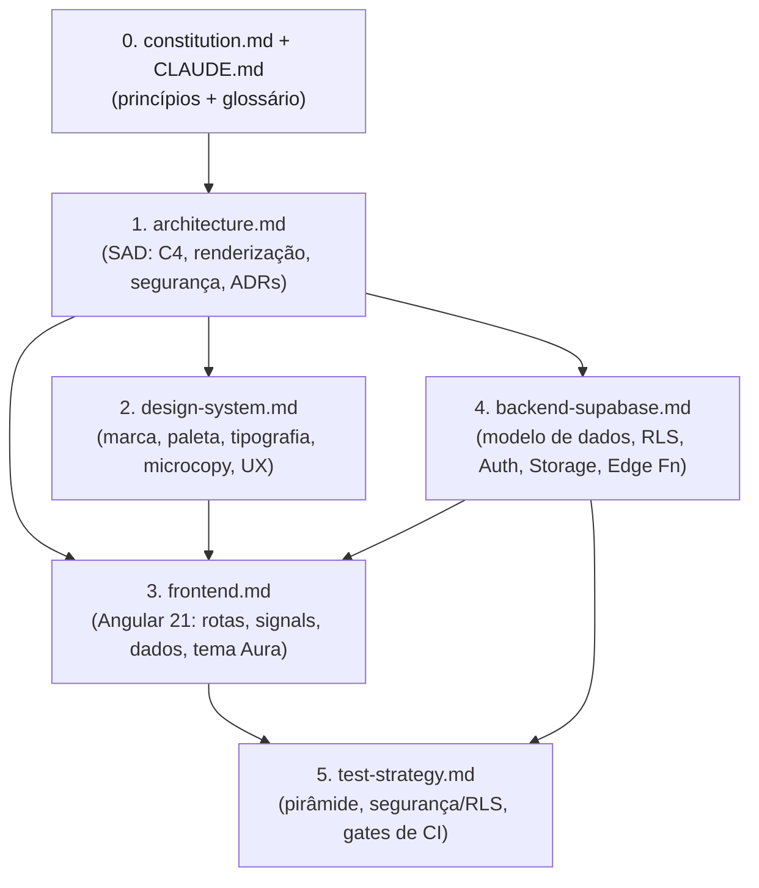
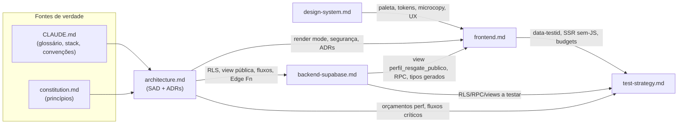

# Documentação do Faro — Índice de Leitura

> **Faro** é um web app SaaS (assinatura) para tutores cuidarem da saúde/hábitos de seus pets,
> com uma **página pública de resgate** acessível por QR Code na coleira. Mercado: Brasil (PT-BR).
>
> Este índice organiza os documentos de arquitetura/produto do MVP: **ordem de leitura recomendada**,
> **como os documentos se relacionam** e a **seção de decisões em aberto** (o que ainda depende dos sócios).

---

## Fontes de verdade (leia ANTES de tudo)

Estes dois documentos **prevalecem** sobre todos os demais. Em qualquer conflito, eles vencem.

| Ordem | Documento | O que é | Por que primeiro |
|---|---|---|---|
| 0a | [`../.specify/memory/constitution.md`](../.specify/memory/constitution.md) | **Constituição** — princípios inegociáveis (Rescue-First, LGPD, RLS-first, SSR híbrido, MVP-first, observabilidade) | É a lei do projeto; os 5 docs de `docs/` derivam dela |
| 0b | [`../CLAUDE.md`](../CLAUDE.md) | **Guidance de runtime** — stack ativa, estrutura de pastas, convenções de dados/segurança, **glossário canônico** | Define os nomes e convenções que todos os docs usam |

> Os 5 documentos abaixo declaram explicitamente que **não contradizem** a constituição nem o `CLAUDE.md`.

---

## Ordem de leitura recomendada

A sequência vai do **panorama** para o **detalhe técnico** e, por fim, ao **plano de qualidade**.

| # | Documento | Papel | Para quem |
|---|---|---|---|
| 1 | [`architecture.md`](architecture.md) | **Arquitetura de Solução (SAD)**: contexto C4, estratégia de renderização SSR/CSR, arquitetura de segurança (RLS + projeção pública), fluxos de dados (onboarding, resgate), deploy/ambientes, ADRs (001–008), mapa de módulos. | Todos. É o **hub** que liga os demais. |
| 2 | [`design-system.md`](design-system.md) | **Design System & identidade verbal**: fundamentos de marca, tom de voz, paleta (C selecionada; A/B como alternativas), tipografia, logo, iconografia, princípios de UX, tokens, mapeamento ao tema **PrimeNG Aura**. | Design, frontend, produto. |
| 3 | [`frontend.md`](frontend.md) | **Arquitetura de Frontend (Angular 21)**: estrutura de projeto, roteamento e render mode por rota, signals + zoneless, camada de dados (`core/`), integração do tema Aura, PWA/i18n, performance/a11y, ganchos de teste. | Devs frontend. |
| 4 | [`backend-supabase.md`](backend-supabase.md) | **Arquitetura de Backend/Dados (Supabase)**: modelo de dados (ERD + colunas), RLS por tabela, Auth/papéis, Storage, Edge Functions, pool de códigos opacos, migrations/seeds/ambientes. | Devs backend/dados. |
| 5 | [`test-strategy.md`](test-strategy.md) | **Estratégia de Testes (QA)**: pirâmide + "diamante" de segurança, testes de RLS/anti-enumeração, aceitação por user story (P1/P2/P3), não-funcionais (perf/a11y/LGPD), dados/ambientes, gates de CI, cobertura por feature. | QA e todos os devs. |

**Atalhos por papel:**
- **Sócio/produto:** constituição → `architecture.md` §1, §9 → `design-system.md` §1–2, §9 → seções [Decisões tomadas](#decisões-tomadas-fonte-única) e [Decisões em aberto](#decisões-em-aberto-precisam-de-você) deste índice.
- **Dev frontend:** `architecture.md` §2–3, §8 → `design-system.md` §3, §8 → `frontend.md` (inteiro).
- **Dev backend:** `architecture.md` §3–4 → `backend-supabase.md` (inteiro) → `test-strategy.md` §3.
- **QA:** constituição → `architecture.md` §3–4, §6 → `test-strategy.md` (inteiro).

---

## Como os documentos se relacionam

**Contratos compartilhados (pontos onde os docs se "encaixam"):**

| Contrato / conceito | Definido em | Consumido por |
|---|---|---|
| **Glossário canônico** (Tutor, Assinatura, Pet, TagCode, RegistroDeSaude, PerfilDeResgate, ScanEvent…) | `CLAUDE.md` | todos (`models/` no frontend; tabelas no backend) |
| **Render mode por rota** (público SSR/prerender, painel CSR) | `architecture.md` §2.1 | `frontend.md` §3.1 (`app.routes.server.ts`) |
| **`perfil_resgate_publico`** (view de projeção pública whitelisted) | `backend-supabase.md` §3.5 | `frontend.md` §5.3 (`rescue-public.service`); `test-strategy.md` §3.3 |
| **RPC `claim_tag`** (claim atômico) | `architecture.md` §4.1 / `backend-supabase.md` §7.3 | `frontend.md` §5.2; `test-strategy.md` 005 |
| **Roteamento de alerta por status** (Rescue-First / ADR-003) | `architecture.md` §4.2 / `backend-supabase.md` §6.2 | `test-strategy.md` §3.5 (regressão) |
| **Porta de billing** (`BillingPort`, ADR-002) | `architecture.md` ADR-002 | `frontend.md` §5.4; `backend-supabase.md` §6.1 |
| **Orçamentos de performance** (LCP/TTFB/JS) | `architecture.md` §6.4 | `frontend.md` §9.1; `test-strategy.md` §5.1 |
| **Tema Aura / paleta (Opção C — Índigo + Lima)** + tokens `--faro-*` | `design-system.md` §3.3, §8 | `frontend.md` §6 |
| **`data-testid` / cenários críticos** | `frontend.md` §10 / `test-strategy.md` §2.3 | suíte E2E |

---

## Resumo de consistência

Os cinco documentos estão, no geral, **fortemente alinhados** entre si e com a constituição/`CLAUDE.md`:
mesma estratégia de renderização (SSR público / CSR painel), mesmo modelo de segurança (RLS deny-by-default +
projeção pública whitelisted + códigos opacos com dígito verificador), mesmo desacoplamento resgate↔assinatura
(Rescue-First / ADR-003), mesma estrutura de pastas e o **glossário canônico** respeitado em `models/` e tabelas.

As divergências encontradas eram **pequenas** (nomenclatura/coerência), não arquiteturais, e foram **reconciliadas** nesta revisão. Veja abaixo.

### Conflitos / inconsistências — resolvidos nesta revisão

Os pequenos desalinhamentos de nomenclatura/coerência identificados foram **reconciliados** (edições cirúrgicas):

1. **Status de `TagCode`** — conjunto canônico **`available | assigned | blocked`** (já em `CLAUDE.md` e
   `backend-supabase.md` §2.2). Os demais docs citam `available`/`assigned` apenas no fluxo de claim (consistente).
2. **Nomes de pastas de feature padronizados em inglês** — `architecture.md` §8 passou a usar
   `pets`, `health-records`, `subscription`, `reminders`, `admin` (e `public`), casando com `frontend.md` §2 e `CLAUDE.md`.
3. **Import da landing separado** — `frontend.md` §3.1 e a estrutura §2 agora apontam para
   `features/public/landing/` (separado de `features/public/rescue-page/`).
4. **Atributo de teste padronizado** — **`data-testid`** com nomenclatura `<feature>-<elemento>` em todos os docs
   (`test-strategy.md` §2.1/§2.3 alinhado a `frontend.md` §10; ex.: `rescue-whatsapp-cta`).

Pontos que permanecem em aberto (rastreados na tabela de decisões abaixo):

- **`security_invoker` da view vs RPC endurecida.** `backend-supabase.md` §3.5 apresenta `GRANT SELECT` na view
  e a alternativa RPC `SECURITY DEFINER`. Decisão tomada: **view pública por RPC `SECURITY DEFINER`** (a confirmar
  detalhe de implementação na spec 006).
- **Decisões antes repetidas como "pendentes" em vários docs** (hospedagem, pagamento etc.) têm agora **fonte única**
  neste índice (seções abaixo).

### Lacunas (a fechar em specs dedicadas)

- **Política de retenção/anonimização** de `scan_events`, `auditoria` e `ip_hash` (LGPD) — **sem janela definida**
  (`backend-supabase.md` §10.9, `test-strategy.md` §5.3/§8.5). A definir na spec **009-privacidade-lgpd**.
- **Export e exclusão de dados do titular (LGPD)** — mencionados (RPCs de export/exclusão), **sem contrato/fluxo
  detalhado**. A definir na spec **009-privacidade-lgpd**.
- **Parâmetros de rate limit** (janela/limite por IP e por código) — necessários para anti-enumeração; hoje
  conceituais (`backend-supabase.md` §7.5, `test-strategy.md` §3.4/§8.6). A fixar na **spec 005**.
- **Algoritmo do dígito verificador** — citado (mod-37/Damm) mas **não fixado** (`backend-supabase.md` §7.1;
  `test-strategy.md` §8.8). A fixar na **spec 005**.

---

## Decisões tomadas (fonte única)

> Este índice é a **fonte única** das decisões do Faro. Os demais docs **derivam** desta seção; em divergência
> de detalhe, vale o que está aqui (respeitando a constituição, que prevalece sobre tudo).

**Princípios da constituição (travados):**
- **Rescue-First** — a página pública de resgate e o WhatsApp funcionam **sempre**. Com **freemium**, o piso é o tier
  **Grátis** (o tutor sempre recebe ao menos o alerta in-app de scan); alertas enriquecidos (e-mail/push) são do plano
  pago, e o **roteamento ao Admin** é rede de segurança para contas inalcançáveis/abandonadas.
- **LGPD por design** — só expõe o consentido; minimização; geo consentida e rotulada.
- **RLS-first** — toda tabela com RLS `deny-by-default`; acesso público só via projeção/RPC whitelisted; segredos no servidor.

**Modelo de negócio (Freemium híbrido):**
- **Receita** = tag física (compra única, logística do sócio) + **assinatura Pro/Família** (recorrente) + marketplace de prestadores (Fase 2).
- **Tiers**: **Grátis** (1 pet; resgate completo + modo perdido + WhatsApp + alerta in-app + última localização no mapa + flyer básico + 1 contato; diário só com vacinas) · **Pro** ~R$ 19,90/mês (até 3 pets; diário completo + lembretes e-mail/push + anexos + histórico/endereço de scan + múltiplos contatos + flyer personalizado + compartilhar com vet) · **Família** ~R$ 34,90/mês (até 10 pets + co-tutores). Trial de 14 dias do Pro.
- **Estados**: sem Pro → **volta pro Grátis** (nunca read-only/bloqueio). Provedor de pagamento ainda em aberto (porta agnóstica).
- **Incorporado da análise de concorrência (HeyBuddy)**: flyer de pet perdido, reverse-geo + histórico de scans, múltiplos contatos (specs 006/003) e compartilhar prontuário com o vet (spec 004).

**Infraestrutura para crescimento:** manter **Vercel + Supabase** (suficiente até dezenas/centenas de milhares de usuários; lógica isolada para portabilidade — extrair worker conteinerizado só se/quando necessário).

**Identidade visual:**
- **Paleta de cores = C "Faro Noturno"** — primária **Índigo `#3A4FD6`**, accent de marca **Verde-Lima `#7FBF3F`**.
  Semânticas: success `#157A3F`, warn `#946005`, info `#1F6FB2`, danger `#C23A2B`. Faixa do modo perdido =
  **âmbar** de urgência calma (`--faro-lost-band`), nunca a primária nem danger. (A e B documentadas como alternativas.)
- **Tipografia = Poppins (títulos) + Inter (texto/UI)**, self-host, subset `latin`+`latin-ext`.

**Defaults técnicos:**
- **Hospedagem do SSR = Vercel.**
- **Região do Supabase = São Paulo (BR).**
- **Papel admin = `is_admin()`** (sem custom claim no MVP — YAGNI).
- **View pública = RPC `SECURITY DEFINER`** (projeção whitelisted, endurecida para prod).
- **Mapa da página de resgate = Leaflet + OpenStreetMap** (sem chave no cliente).
- **Runner de testes = Vitest.**
- **Boundaries enforcement = eslint `no-restricted-imports`** (impede `features/public` de puxar o painel).
- **`registros_saude.dados` = `jsonb`.**
- **Cron de lembretes = `pg_cron`.**
- **Tema da página pública = claro fixo** (dark mode do painel = fase posterior).
- **Cobertura de CI = 80% global / 90% em `core/` e em policies.**

| Domínio | Decisão | Onde está documentada |
|---|---|---|
| Paleta | **C — Índigo `#3A4FD6` + Verde-Lima `#7FBF3F`** | DS §3.3/§8/§9, FE §6.1 |
| Tipografia | **Poppins + Inter** | DS §4/§9, FE §6.2 |
| Hospedagem SSR | **Vercel** | arch §5.4 (ADR-005) |
| Região Supabase | **São Paulo (BR)** | arch §5.2 |
| Papel admin | **`is_admin()`** | BE §4.4 |
| View pública | **RPC `SECURITY DEFINER`** | BE §3.5 |
| Mapa | **Leaflet + OpenStreetMap** | arch §9.7, FE §11.5 |
| Test runner | **Vitest** | FE §11, QA §2.1 |
| Boundaries | **eslint `no-restricted-imports`** | FE §2/§11 |
| `registros_saude.dados` | **`jsonb`** | BE §10.6 |
| Cron | **`pg_cron`** | BE §10.8 |
| Tema público | **claro fixo** | FE §6.3 |
| Cobertura CI | **80% global / 90% core+policies** | QA §6.3 |

---

## Decisões em aberto (precisam de você)

> Itens ainda **não decididos**. Cada um já está isolado por uma porta/abstração nos docs, então o desenvolvimento
> não fica bloqueado — mas o adaptador/contrato/parâmetro final depende deles. Quando aplicável, indica-se a spec
> onde a decisão será resolvida.

| # | Decisão (em aberto) | Opções | Onde se resolve | Impacto |
|---|---|---|---|---|
| 1 | **Provedor de pagamento** (`TODO(BILLING_PROVIDER)`) — modelo **Freemium já decidido**; **provedor** não será implementado agora; estrutura agnóstica (porta de billing + webhook) `[NEEDS CLARIFICATION]` | Stripe vs Asaas | **spec 002** | adaptador `billing-webhook` + campos `provedor_*` em `assinaturas` |
| 2 | **Conceito de logo** — entre identidade **amigável/arredondada** e **séria/formal** | A Pata-Farol/Pin · B Focinho+sinal · C Casa-coleira (candidatos) | identidade visual (pós-MVP) | favicon/app icon PWA |
| 3 | **Provedor de Geo-IP** | ipinfo / MaxMind / ipapi | spec **006** | `GEO_API_KEY` + custo/residência (LGPD) |
| 4 | **Provedor de e-mail transacional** | Resend / SendGrid / SES vs SMTP próprio | spec **007** | `send-email` + templates de Auth |
| 5 | **Política de retenção/anonimização** (scan_events / `ip_hash` / auditoria — LGPD) | definir janela e regra | spec **009-privacidade-lgpd** (e view pública na **006**) | conformidade LGPD + testes |
| 6 | **Parâmetros de rate-limit** (janela/limite por IP e por código) | definir valores | spec **005** | determinismo do teste anti-enumeração |
| 7 | **Algoritmo do dígito verificador** | mod-37 / Damm / outro | spec **005** | gerador + validação anti-enumeração |
| 8 | **Preços finais dos planos** | **Freemium**: Grátis (1 pet) · Pro ~R$19,90 (3) · Família ~R$34,90 (10), trial 14d — valores a confirmar | spec **002** | `planos.max_pets`/`preco_centavos` |
| 9 | **Domínio/marca exibida** | confirmar grafia "Faro" e `faropet.com.br` | identidade visual | assinatura visual + OG/rodapé do resgate |
| 10 | **Data fetching** | `resource()`/`rxResource` vs `async load()` | decisão de implementação (FE §11.7) | refactor futuro (baixo risco) |

> **Legenda das referências:** arch = `architecture.md`, DS = `design-system.md`, FE = `frontend.md`,
> BE = `backend-supabase.md`, QA = `test-strategy.md`.

---

## Roadmap de specs (a gerar via Spec Kit)

Os docs acima são **transversais**. As features entram por specs versionadas em `specs/NNN-nome/` (constituição §IV):

`001 auth-contas-tutor` · `002 assinaturas-planos` · `003 cadastro-pets` · `004 registros-saude` ·
`005 tags-qr-codigos` · `006 pagina-resgate` · `007 lembretes-notificacoes` · `008 backoffice-admin` ·
`009 privacidade-lgpd`. _(Fase 2: `010 marketplace-prestadores`.)_

O mapeamento spec → módulos (frontend/Supabase) está em `architecture.md` §8; a cobertura mínima de teste por spec
está em `test-strategy.md` §7.

---

*Última atualização deste índice: 2026-06-05 (decisões: modelo **Freemium híbrido**, infra **Vercel + Supabase**, features da análise HeyBuddy; antes: paleta C, Poppins+Inter, defaults técnicos). Constituição em v1.1.0. Em conflito, a constituição vence.*
