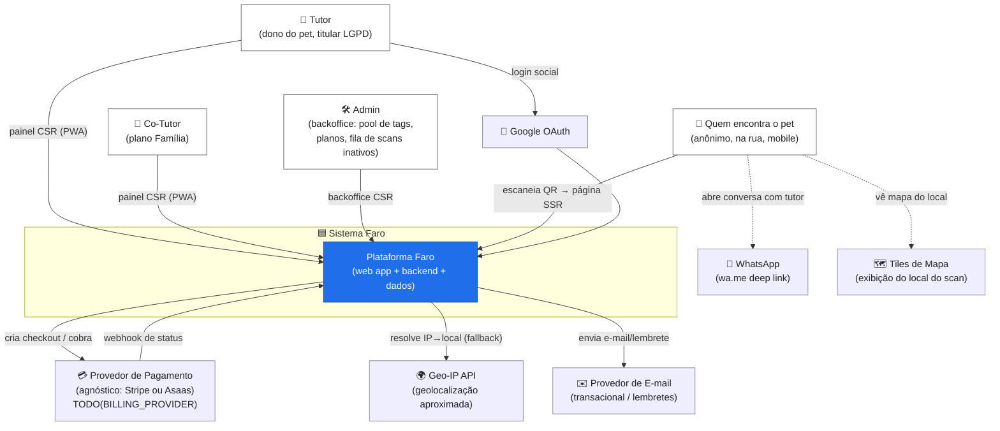
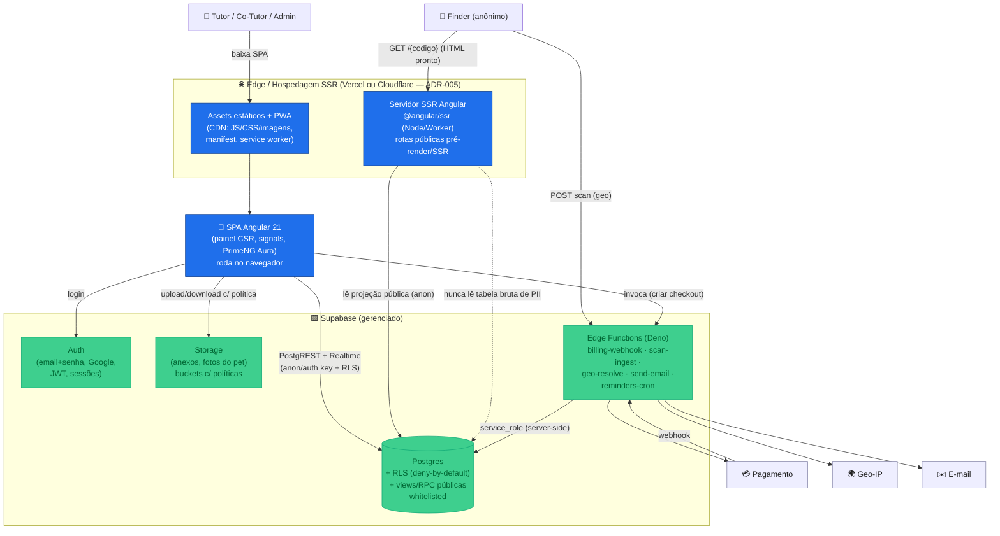
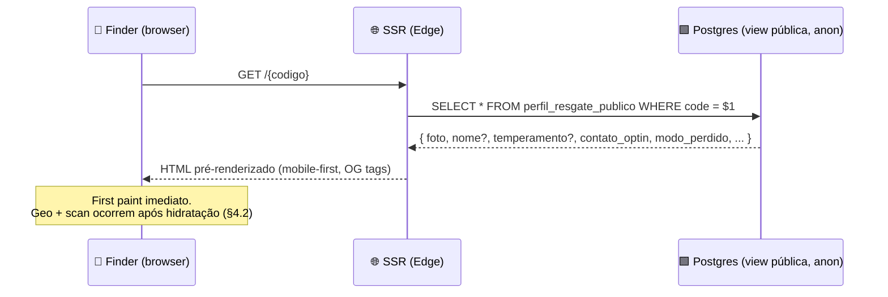
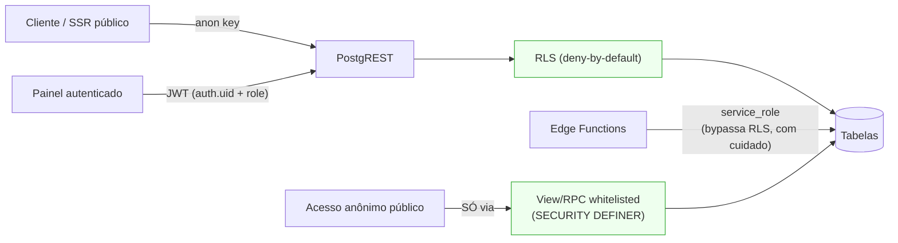
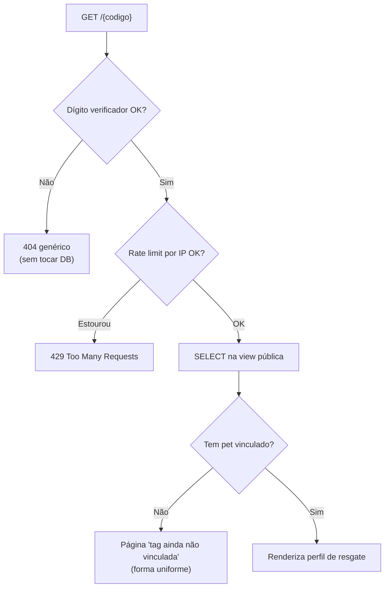
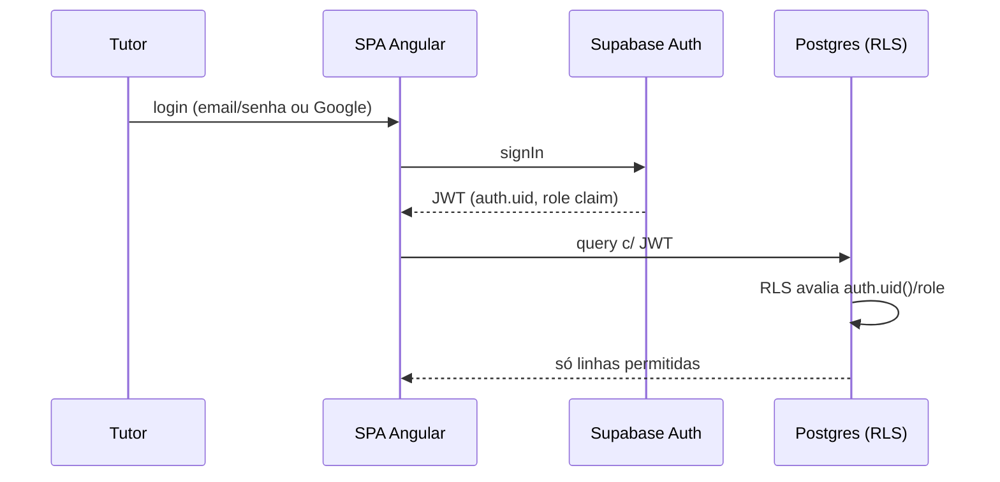
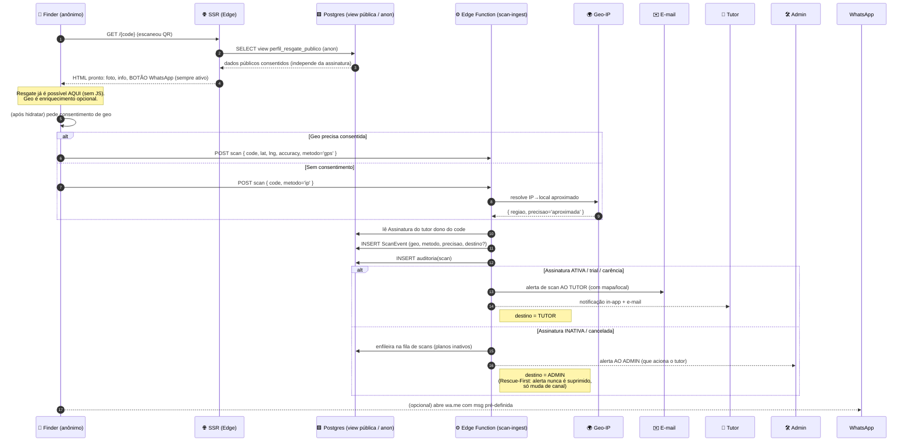
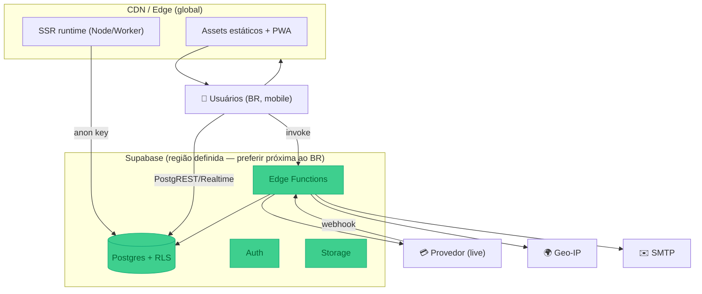
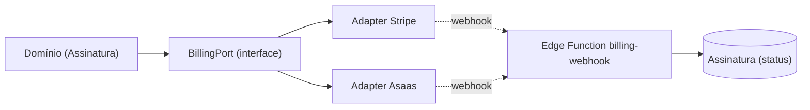

# Arquitetura do Sistema — Faro

> **Documento de Arquitetura de Solução (SAD)** do Faro — SaaS de cuidado, saúde e **resgate de pets** via QR Code.
>
> **Status**: v1.0 (rascunho de referência do MVP) · **Data**: 2026-06-03 · **Autor**: Arquitetura de Soluções
>
> **Fontes de verdade que este documento NÃO contradiz** (em caso de conflito, elas vencem):
> - `.specify/memory/constitution.md` (princípios inegociáveis — Rescue-First, LGPD, RLS-first, etc.)
> - `CLAUDE.md` (guidance de runtime, stack ativa, convenções de dados/segurança, glossário)
>
> Este documento descreve **COMO** o sistema é estruturado tecnicamente. O **O QUÊ/POR QUÊ** de cada feature vive nas specs (`specs/NNN-nome/`). Decisões técnicas detalhadas por feature vivem nos respectivos `plan.md`.

---

## Índice

1. [Visão geral e contexto (C4)](#1-visão-geral-e-contexto-c4)
2. [Estratégia de renderização](#2-estratégia-de-renderização)
3. [Arquitetura de segurança](#3-arquitetura-de-segurança)
4. [Fluxos de dados principais](#4-fluxos-de-dados-principais)
5. [Topologia de deploy e ambientes](#5-topologia-de-deploy-e-ambientes)
6. [Preocupações transversais](#6-preocupações-transversais)
7. [Decisões arquiteturais (ADRs)](#7-decisões-arquiteturais-adrs)
8. [Mapa de módulos e pastas](#8-mapa-de-módulos-e-pastas)
9. [Questões em aberto](#9-questões-em-aberto)

---

## 1. Visão geral e contexto (C4)

### 1.1 O que é o Faro (resumo de uma frase)

O Faro é um web app SaaS por assinatura em que o **Tutor** monitora a saúde/hábitos de seus **Pets** e cada pet carrega uma **tag QR** na coleira; quem encontra um pet perdido escaneia o QR e abre uma **página pública de resgate** com as informações consentidas e um caminho de contato — esse fluxo de resgate funciona **mesmo com a assinatura inativa** (Princípio I — Rescue-First).

### 1.2 Diagrama de Contexto (C4 — Nível 1)

Atores e sistemas externos ao redor do Faro:



**Notas de contexto:**

- **Quem encontra o pet (Finder)** é um usuário **anônimo**, em rede móvel, possivelmente lenta. É o ator mais crítico para latência e disponibilidade (Princípio V) — a página de resgate é "internet aberta".
- **Provedor de pagamento** é tratado de forma **agnóstica**: o Faro fala com uma *porta de billing* e recebe **webhooks** que alimentam a `Assinatura`. Trocar Stripe↔Asaas não deve vazar para o domínio (ADR-002).
- **Geo-IP** é apenas **fallback** rotulado como aproximado; a geolocalização precisa vem do navegador, com consentimento.
- **WhatsApp e Mapas** são integrações *client-side* leves (deep link / tiles) — não há segredo envolvido.

### 1.3 Diagrama de Contêineres (C4 — Nível 2)



**Contêineres e responsabilidades:**

| Contêiner | Tecnologia | Responsabilidade | Segredos? |
|---|---|---|---|
| **Servidor SSR** | `@angular/ssr` em Node/Worker na Vercel/Cloudflare | Renderiza rotas públicas (`/{codigo}`, landing) com HTML pronto; lê **somente** projeção pública via chave `anon` | Não (apenas `anon key`) |
| **Assets/PWA + SPA** | Angular 21 standalone + PrimeNG Aura | Painel autenticado (CSR), service worker, manifest | Não |
| **Postgres + RLS** | Supabase Postgres | Fonte de verdade; RLS deny-by-default; views/RPC whitelisted para `anon` | — |
| **Auth** | Supabase Auth | Identidade, JWT, papéis via claims/tabela | — |
| **Storage** | Supabase Storage | Anexos e fotos, com políticas por bucket | — |
| **Edge Functions** | Deno (Supabase) | Tudo que precisa de segredo/servidor: webhook de pagamento, ingest de scan + roteamento de alerta, geo por IP, e-mail, cron de lembretes | **Sim** (`service_role`, chaves de pagamento, API geo, SMTP) |

> **Princípio aplicado (III):** segredos **nunca** chegam ao cliente nem ao SSR público; vivem apenas nas Edge Functions / env do servidor.

---

## 2. Estratégia de renderização

Angular 21 com **render mode por rota** (`@angular/ssr`). A regra geral:

- **Rotas públicas de resgate** → **SSR** (ou **pré-render** quando o conteúdo permitir).
- **Painel autenticado** (tutor, co-tutor, admin) → **CSR/SPA**.

### 2.1 Mapa de render mode por rota

| Rota | Render mode | Por quê | Dados que lê |
|---|---|---|---|
| `/` (landing/marketing) | **Prerender** (estático) | SEO, carga instantânea, sem dados dinâmicos | nenhum |
| `/{codigo}` (página de resgate) | **SSR** | Carga rápida em rede móvel + preview de link em redes/WhatsApp; conteúdo varia por pet/estado | **projeção pública** (view/RPC) via `anon` |
| `/{codigo}/perdido` (modo perdido) | **SSR** | Mesma justificativa; estado dinâmico (recompensa/destaque) | projeção pública (com flag de modo perdido) |
| `/app/**` (painel tutor) | **CSR** (client) | Pós-login, interativo, dados sensíveis; sem ganho de SSR | PostgREST autenticado + RLS |
| `/app/assinatura/**` | **CSR** | Idem; invoca Edge Function de checkout | Edge Function + DB |
| `/admin/**` (backoffice) | **CSR** | Interno, autenticado, alta interatividade | DB autenticado + RLS de admin |
| `/auth/**` (login/callback) | **CSR** | Fluxo de auth no cliente (Supabase Auth) | Supabase Auth |

### 2.2 Por que SSR (e não só prerender) na página de resgate

A página `/{codigo}` **não pode ser totalmente pré-renderizada em build** porque:

1. O vínculo `codigo → pet` muda em runtime (claim/ativação, realocação de tag pelo admin).
2. O **modo perdido** e a projeção de visibilidade mudam por ação do tutor.
3. O preview social (Open Graph) precisa refletir o pet atual.

Logo, o servidor renderiza o HTML por requisição lendo a **projeção pública** (nunca a tabela crua). Resultado: HTML pronto e leve chega ao Finder; a captura de geolocalização e o registro do scan acontecem **depois**, via chamada à Edge Function (ver §4.2), para não bloquear o *first paint*.



### 2.3 Diretrizes de implementação (Angular 21)

- **Standalone + signals**; zoneless quando viável (Princípio de stack).
- **`provideClientHydration()`** com hidratação incremental; a página de resgate deve ser útil **sem** JS (HTML do SSR já mostra info + link de contato) — JS só enriquece (geo, mapa).
- O **botão de WhatsApp** e a info essencial vêm no HTML do SSR (não dependem de JS) → resgate resiliente em conexões ruins (Princípio I + V).
- Separar **transfer state**: o que o servidor já buscou não é re-buscado no cliente.
- O bundle do painel (`/app`, `/admin`) é **lazy** e **não** é carregado na rota pública.

---

## 3. Arquitetura de segurança

Segurança em profundidade (Princípio III): a regra é imposta **no banco**, não só na UI. Camadas:



### 3.1 RLS-first

- **Toda** tabela com dado de usuário nasce com `ENABLE ROW LEVEL SECURITY` e **sem** policy permissiva — ou seja, **deny by default**.
- O Tutor enxerga apenas `tutor_id = auth.uid()`. Pets compartilhados (co-tutoria, plano Família) entram por uma policy que cruza uma tabela de associação `pet_cotutor`.
- O **Admin** tem policies específicas baseadas em `role` (claim no JWT ou tabela `perfis`/`roles`) — nunca um "bypass" amplo no cliente.

Exemplo de policy (ilustrativo — a versão final vive nas migrations):

```sql
-- Tutor só vê/edita os próprios pets
ALTER TABLE pets ENABLE ROW LEVEL SECURITY;

CREATE POLICY pets_owner_select ON pets
  FOR SELECT TO authenticated
  USING (
    tutor_id = auth.uid()
    OR EXISTS (
      SELECT 1 FROM pet_cotutor pc
      WHERE pc.pet_id = pets.id AND pc.cotutor_id = auth.uid()
    )
  );

CREATE POLICY pets_owner_modify ON pets
  FOR UPDATE TO authenticated
  USING (tutor_id = auth.uid())
  WITH CHECK (tutor_id = auth.uid());

-- 'anon' NÃO recebe nenhuma policy nesta tabela → acesso público negado.
```

### 3.2 Projeção pública whitelisted (view/RPC)

O acesso anônimo à página de resgate **nunca** toca `pets` cru. Ele passa por uma **view** (ou RPC `SECURITY DEFINER`) que projeta apenas os campos consentidos:

```sql
-- View de projeção pública: SÓ campos públicos + respeita visibilidade e Rescue-First.
CREATE VIEW perfil_resgate_publico AS
SELECT
  t.code,
  -- Campos só aparecem se o tutor consentiu (visibilidade) por campo:
  CASE WHEN p.vis_nome      THEN p.nome END        AS nome,
  CASE WHEN p.vis_foto      THEN p.foto_url END    AS foto_url,
  CASE WHEN p.vis_temperam  THEN p.temperamento END AS temperamento,
  CASE WHEN p.contato_optin THEN p.whatsapp_e164 END AS whatsapp,
  p.modo_perdido,
  p.recompensa_texto,            -- só preenchido em modo perdido
  (p.id IS NOT NULL)        AS tem_pet      -- Rescue-First: existe pet vinculado?
FROM tag_codes t
LEFT JOIN pets p ON p.id = t.pet_id;

-- Concede leitura ao papel anônimo SOMENTE na view (nunca na tabela base):
GRANT SELECT ON perfil_resgate_publico TO anon;
```

> **Importante (Rescue-First, Princípio I):** a view retorna dados **independentemente do status da assinatura**. O status da assinatura **não filtra** a página de resgate — ele apenas decide **o destino do alerta de scan** (tutor vs admin), tratado na Edge Function (§4.2). A página e o WhatsApp seguem ativos sempre que houver pet vinculado.

> **LGPD (Princípio II):** cada campo público depende de um flag de visibilidade (`vis_*`) e de opt-in para contato (`contato_optin`). Sem consentimento, o campo simplesmente não é projetado.

### 3.3 Resolução de código opaco + anti-enumeração

Os `TagCode` são opacos, de alta entropia, **não sequenciais** e com **dígito verificador** (CLAUDE.md). O pool (1000 no MVP) é pré-provisionado.

Estratégia anti-enumeração na rota pública `/{codigo}`:

1. **Validação barata primeiro**: rejeitar (404 genérico) qualquer `codigo` que não passe no **dígito verificador** *antes* de tocar o banco — filtra a maioria das tentativas de força bruta sem custo de DB.
2. **Rate limiting por IP** no endpoint público de resolução e no `scan-ingest` (Edge Function / WAF da hospedagem). Ex.: janela deslizante por IP + por código.
3. **Resposta uniforme**: código inexistente, código sem pet e código existente retornam **a mesma forma de página/erro** ("tag não vinculada ainda"), sem revelar se o código existe no pool — reduz oráculo de enumeração.
4. **Sem incremento previsível**: como os códigos não são sequenciais, adivinhar o próximo é inviável; o rate limit cobre tentativas aleatórias.



### 3.4 Segredos só em Edge Functions

- Chaves de pagamento (secret key, webhook signing secret), API key de Geo-IP, credenciais SMTP e a **`service_role` key** do Supabase vivem **apenas** no ambiente das Edge Functions / variáveis de servidor.
- O cliente Angular usa **somente** a `anon key` (pública por design, protegida por RLS).
- O **webhook de pagamento** valida a **assinatura HMAC** do provedor antes de processar (anti-spoofing) e é **idempotente** (dedupe por `event_id`).

### 3.5 Fluxo de auth e papéis

- **Login**: email+senha e **Google OAuth** (Supabase Auth). Sessão via JWT; refresh gerenciado pelo SDK.
- **Papéis**: `tutor`, `cotutor`, `admin`. Recomenda-se materializar o papel em **claim do JWT** (via hook de auth) para uso direto em policies, com tabela `roles`/`perfis` como fonte. Co-tutoria de um pet específico é modelada por associação (`pet_cotutor`), não por papel global.
- **Guards no Angular** (CSR) protegem rotas `/app` e `/admin` por UX, mas a **autorização real** é a RLS no banco (defesa em profundidade — guard sozinho nunca é suficiente).



---

## 4. Fluxos de dados principais

### 4.1 Onboarding: cadastro → assinatura → pet → atribuição ATÔMICA de código → QR

Pontos críticos:
- A **atribuição do código ao pet é atômica** (transação/RPC) para evitar dois pets reivindicando a mesma tag (corrida).
- O **claim** é o ato de vincular um `TagCode` `available` a um pet, mudando seu status para `assigned`.
- A geração do QR é só a renderização da URL canônica `https://<dominio>/{codigo}`.

```mermaid
sequenceDiagram
    autonumber
    participant T as 👤 Tutor (SPA)
    participant Auth as Supabase Auth
    participant EF as ⚙️ Edge Function (billing)
    participant Pay as 💳 Provedor
    participant DB as 🟩 Postgres (RLS)

    T->>Auth: cria conta (email/Google)
    Auth-->>T: sessão (JWT)
    Note over T,DB: Trial 14d pode iniciar aqui (assinatura status=trial)

    T->>EF: criar checkout (planoId)
    EF->>Pay: cria sessão de checkout
    Pay-->>EF: url de checkout
    EF-->>T: redireciona p/ pagamento
    Pay-->>EF: webhook (pago/ativo)  %% assíncrono
    EF->>DB: upsert Assinatura(status=ativo) [idempotente]

    T->>DB: cria Pet (respeita limite do plano via constraint/RLS)
    DB-->>T: pet criado

    T->>DB: RPC claim_tag(code, pet_id)  %% ATÔMICO
    activate DB
    Note right of DB: BEGIN;<br/>SELECT ... FOR UPDATE em tag_codes<br/>WHERE code=$1 AND status='available';<br/>se não disponível → erro;<br/>UPDATE status='assigned', pet_id=$2;<br/>INSERT auditoria(claim);<br/>COMMIT;
    DB-->>T: ok (code ↔ pet)
    deactivate DB

    T->>T: gera QR da URL https://dominio/{code}
```

**RPC de claim atômico (ilustrativo):**

```sql
CREATE FUNCTION claim_tag(p_code text, p_pet_id uuid)
RETURNS void
LANGUAGE plpgsql
SECURITY DEFINER
AS $$
BEGIN
  -- trava a linha do código p/ evitar corrida
  PERFORM 1 FROM tag_codes
    WHERE code = p_code AND status = 'available'
    FOR UPDATE;
  IF NOT FOUND THEN
    RAISE EXCEPTION 'tag_indisponivel';
  END IF;

  -- valida posse do pet (defesa: o pet é do auth.uid())
  PERFORM 1 FROM pets WHERE id = p_pet_id AND tutor_id = auth.uid();
  IF NOT FOUND THEN
    RAISE EXCEPTION 'pet_invalido';
  END IF;

  UPDATE tag_codes
    SET status = 'assigned', pet_id = p_pet_id, claimed_at = now()
    WHERE code = p_code;

  INSERT INTO auditoria(evento, ator, detalhe)
    VALUES ('tag_claim', auth.uid(), jsonb_build_object('code', p_code, 'pet_id', p_pet_id));
END;
$$;
```

> **Limites de plano**: a criação de pet checa o limite (Básico 1 / Pro 3 / Família 10) no banco — via trigger/constraint ou RPC — não só na UI. **Rescue-First** não é violado aqui: o limite afeta *cadastro de novos pets*, não a *página de resgate* de um pet já vinculado.

### 4.2 Resgate: scan → resolução → render → geo → **notificação roteada por status**

Este é o fluxo mais sensível. Ele respeita **Rescue-First**: a página e o contato funcionam **sempre**; o que muda com o status da assinatura é **o destino do alerta proativo**.



**Regras de roteamento do alerta (decisão de produto travada):**

| Status da Assinatura | Página de resgate | Botão WhatsApp | Destino do alerta de scan |
|---|---|---|---|
| `trial` | ✅ ativa | ✅ (se opt-in) | **Tutor** |
| `ativo` | ✅ ativa | ✅ (se opt-in) | **Tutor** |
| `carência` | ✅ ativa | ✅ (se opt-in) | **Tutor** |
| `inativo` | ✅ ativa | ✅ (se opt-in) | **Admin** (fila) → aciona tutor |
| `cancelado` | ✅ ativa | ✅ (se opt-in) | **Admin** (fila) → aciona tutor |

> A coluna "Página de resgate" é **sempre ✅** quando há pet vinculado — é o Princípio I em forma de tabela. O status só muda a última coluna.

**Por que geo no `scan-ingest` (Edge Function) e não no cliente:**
- A resolução **por IP** precisa do IP de origem (visível ao servidor) e da **API key de Geo** (segredo) → tem que ser server-side.
- O roteamento do alerta lê a `Assinatura` e dispara e-mail/notificação → precisa de `service_role` e SMTP (segredos).
- Registrar `ScanEvent` + auditoria de forma confiável e com rate limit é responsabilidade do servidor.

---

## 5. Topologia de deploy e ambientes

### 5.1 Ambientes

| Ambiente | Frontend/SSR | Supabase | Pagamento | Domínio (exemplo) | Uso |
|---|---|---|---|---|---|
| **dev (local)** | `ng serve` + `@angular/ssr` local | `supabase start` (Docker) + `functions serve` | sandbox/mocks | `localhost` | desenvolvimento |
| **staging** | Deploy preview (Vercel/Cloudflare) | Projeto Supabase de staging | sandbox do provedor | `staging.faropet.com.br` | QA, validação de webhook, testes de RLS |
| **prod** | Produção (Vercel/Cloudflare) | Projeto Supabase de produção | live | `faropet.com.br` | usuários reais |

- **Isolamento total** entre staging e prod (projetos Supabase separados, chaves separadas, buckets separados).
- **Migrations versionadas** (`supabase/migrations`) promovidas dev → staging → prod via `supabase db push` no pipeline. Nenhuma mudança de schema fora de migration revisada (constituição).
- **Segredos por ambiente**: configurados no painel da hospedagem (SSR) e no Supabase (Edge Functions secrets) — nunca commitados.

### 5.2 Diagrama de deploy



### 5.3 Pipeline (CI/CD) — diretriz

1. PR → roda **lint + testes unitários** (Angular) e **valida migrations**.
2. Merge em `main` → deploy automático para **staging** (frontend + `db push` + `functions deploy`).
3. Aprovação manual → **promote para prod**.
4. **Revisão de segurança & privacidade obrigatória** para PRs que tocam PII, RLS, pagamento ou exposição pública (constituição).

### 5.4 Escolha de hospedagem do SSR (ADR-005, em aberto)

- **Vercel**: integração Angular madura, DX simples, previews automáticos. Boa para começar rápido (alinha com "MVP o quanto antes").
- **Cloudflare (Workers/Pages)**: edge global mais barato em escala, latência baixa, ótimo para a página de resgate; runtime Workers exige verificar compatibilidade do `@angular/ssr`.

> Recomendação inicial para MVP: **Vercel** pela velocidade de entrega; reavaliar Cloudflare se custo/latência global virar gargalo. **Decisão pendente do usuário** (§9).

---

## 6. Preocupações transversais

### 6.1 Observabilidade e auditoria (Princípio VII)

- **Tabela `auditoria`** (append-only) registra eventos sensíveis com log estruturado: `scan` de QR, mudança de plano/pagamento, acesso/exclusão de dados (LGPD), **realocação/transferência de tag**, claim de tag, login admin.
- Campos mínimos: `evento`, `ator` (uid/admin/sistema), `entidade`, `detalhe (jsonb)`, `ip`, `timestamp`.
- **`ScanEvent`** é a fonte canônica de scans (geo, método, precisão, destino do alerta) — alimenta métricas de resgate e auditoria.
- Logs das **Edge Functions** centralizados (Supabase logs); erros de webhook de pagamento devem ser alertáveis (são dinheiro + acesso).
- Métrica de negócio chave: **tempo entre scan e contato do tutor** (eficácia do resgate).

### 6.2 i18n

- **PT-BR no MVP**, arquitetura **i18n-ready** para EN/ES (CLAUDE.md). Textos de UI sempre via mecanismo de i18n (nunca hardcoded).
- Código em inglês; UI em PT-BR. A **página de resgate** deve ter `lang="pt-BR"` e OG tags localizadas.
- Formatação de data/peso/moeda por locale (`pt-BR`).

### 6.3 Tratamento de erros

- **Página de resgate**: degradação graciosa — se a geo falhar, a página continua útil (info + WhatsApp). Se o JS falhar, o HTML do SSR já basta para o resgate.
- **Mensagens amigáveis** + fallback (constituição). Sem stack traces ao usuário.
- **Webhook de pagamento**: idempotente, com retry tolerante; falha de processamento não corta o resgate (Princípio I).
- **Erros uniformes** na rota pública para não virar oráculo de enumeração (§3.3).

### 6.4 Orçamentos de performance (página de resgate em rede móvel)

A página `/{codigo}` é o caminho crítico (Finder em 3G/4G ruim). Orçamentos-alvo (a refinar nas specs):

| Métrica | Alvo (rede móvel "lenta", 3G/Slow 4G) |
|---|---|
| **LCP** | ≤ 2.5 s |
| **TTFB** (SSR) | ≤ 600 ms |
| **JS inicial da rota pública** | ≤ ~100 KB (gzip) — sem bundle do painel |
| **Imagem do pet** | responsiva, `webp/avif`, `loading=lazy` exceto a principal |
| **Útil sem JS** | ✅ (info + WhatsApp no HTML do SSR) |

Táticas: SSR + hidratação incremental, code-splitting (painel nunca carrega na rota pública), imagens otimizadas via Storage/transform + CDN, `preconnect` para Supabase, mapa carregado **sob demanda** (após interação).

### 6.5 PWA e offline

- PWA instalável, mobile-first. Service worker faz cache do **app shell** do painel; a rota pública prioriza **rede/SSR fresco** (conteúdo de resgate não deve ficar desatualizado em cache agressivo).

---

## 7. Decisões arquiteturais (ADRs)

Formato resumido: **Decisão · Justificativa · Alternativas**.

### ADR-001 — RLS-first com projeção pública whitelisted
- **Decisão**: Autorização imposta no Postgres (RLS deny-by-default); acesso anônimo **só** via view/RPC que projeta campos consentidos.
- **Justificativa**: Defesa em profundidade; um bug de UI não vaza dados. A página de resgate é "internet aberta" e exige rigor (Princípios II e III).
- **Alternativas**: autorização só na API/middleware (rejeitada — frágil, fácil de contornar); expor tabela com filtros no cliente (rejeitada — vazaria PII).

### ADR-002 — Porta de billing agnóstica de provedor
- **Decisão**: O domínio fala com uma **interface de billing** (`core/billing`) + recebe **webhooks** que alimentam a `Assinatura`. Provedor concreto é um adaptador trocável.
- **Justificativa**: Decisão Stripe vs Asaas ainda aberta (`TODO(BILLING_PROVIDER)`); não pode acoplar o domínio. Trocar de provedor = trocar adaptador + Edge Function de webhook.
- **Alternativas**: integrar Stripe direto no domínio (rejeitada — lock-in, retrabalho se mudar para Asaas).



### ADR-003 — Desacoplamento resgate ↔ assinatura (Rescue-First)
- **Decisão**: A leitura da página de resgate e o contato **não consultam** a assinatura para *gating*. O status da assinatura só roteia **o destino do alerta de scan** (tutor vs admin).
- **Justificativa**: Princípio I (não-negociável) — salvar o pet não pode ser refém de cobrança.
- **Alternativas**: bloquear a página com plano inativo (rejeitada — viola a constituição e o propósito ético do produto).

### ADR-004 — SSR híbrido (público SSR, painel CSR)
- **Decisão**: Render mode por rota; público SSR/pré-render, painel CSR.
- **Justificativa**: Carga rápida + preview de link na rota crítica (Finder mobile); interatividade e simplicidade no painel sem custo de SSR.
- **Alternativas**: SPA puro (rejeitada — preview ruim, LCP pior em rede lenta); SSR total (rejeitada — complexidade desnecessária no painel autenticado).

### ADR-005 — Hospedagem do SSR: Vercel vs Cloudflare (PENDENTE)
- **Decisão**: **Em aberto.** Recomendação inicial: **Vercel** (DX e velocidade de MVP); reavaliar Cloudflare por custo/latência global.
- **Justificativa**: "MVP o quanto antes"; Vercel reduz fricção. Supabase é gerenciado independente da escolha.
- **Alternativas**: Cloudflare Workers/Pages (edge mais barato em escala — verificar compatibilidade `@angular/ssr`); self-host (rejeitado — overhead operacional para dois sócios).

### ADR-006 — Códigos de tag opacos, não sequenciais, com dígito verificador, em pool
- **Decisão**: Pool pré-provisionado (1000 no MVP) de códigos de alta entropia, não deriváveis do pet, com dígito verificador; `TagCode` é entidade separada, vinculada por claim atômico; admin pode realocar.
- **Justificativa**: Anti-enumeração (Princípio III); modelo claim/ativação flexível (vender tag separada do plano); dígito verificador filtra força bruta sem custo de DB.
- **Alternativas**: ID sequencial/UUID do pet na URL (rejeitada — enumerável / vaza relação); gerar código sob demanda no cadastro (rejeitada — atrapalha produção/venda física da tag antes do claim).

### ADR-007 — Geo + alertas + segredos em Edge Functions
- **Decisão**: Resolução de geo por IP, registro de scan, roteamento de alerta, webhook de pagamento e e-mail rodam em Edge Functions com `service_role` e segredos do servidor.
- **Justificativa**: Princípio III — segredos nunca no cliente; lógica sensível e idempotência no servidor.
- **Alternativas**: chamar APIs de geo/e-mail do cliente (rejeitada — vazaria chaves); lógica de roteamento no cliente (rejeitada — burlável).

### ADR-008 — Supabase gerenciado como backend único
- **Decisão**: Postgres + Auth + Storage + Edge Functions tudo no Supabase gerenciado.
- **Justificativa**: Menos peças para dois sócios; RLS nativa; reduz time-to-MVP.
- **Alternativas**: backend custom (Node/Nest) + DB separado (rejeitada — overhead); Firebase (rejeitada — RLS/SQL e portabilidade inferiores ao Postgres para este domínio relacional).

---

## 8. Mapa de módulos e pastas

Alinhado ao `CLAUDE.md`. Estrutura proposta (cada `plan.md` confirma caminhos reais por feature):

```text
pet-app/
├── .specify/                      # Spec Kit (constituição, templates, scripts)
│   └── memory/constitution.md     # fonte de verdade dos princípios
├── docs/
│   └── architecture.md            # ESTE documento
├── specs/                         # uma pasta por feature: NNN-nome/{spec,plan,tasks}.md
│   ├── 001-auth-contas-tutor/
│   ├── 002-assinaturas-planos/
│   ├── 003-cadastro-pets/
│   ├── 004-registros-saude/
│   ├── 005-tags-qr-codigos/
│   ├── 006-pagina-resgate/
│   ├── 007-lembretes-notificacoes/
│   └── 008-backoffice-admin/
├── src/
│   └── app/
│       ├── core/                  # infra transversal e portas
│       │   ├── auth/              # serviço de auth, guards, claims/papéis
│       │   ├── supabase/          # client (anon), tipos gerados, helpers de query
│       │   ├── billing/           # BillingPort (interface) + DTOs (ADR-002)
│       │   ├── interceptors/      # erros, i18n de mensagens, retry
│       │   └── observability/     # logging estruturado client-side
│       ├── shared/                # wrappers PrimeNG (Aura), pipes, utils a11y/i18n
│       ├── features/
│       │   ├── public/            # 🔓 PÁGINA DE RESGATE — rota SSR (/{code})
│       │   │   ├── landing/       # / — landing/marketing (prerender), separada do resgate
│       │   │   ├── rescue-page/   # render da projeção pública + WhatsApp + mapa
│       │   │   └── scan/          # captura de geo + chamada à Edge Function
│       │   ├── pets/              # CRUD de pets, perfil, visibilidade/consentimento
│       │   ├── health-records/    # RegistroDeSaude (vacina/aliment./consulta/...)
│       │   ├── subscription/      # planos, checkout (invoca Edge), status
│       │   ├── reminders/         # lembretes/notificações in-app
│       │   └── admin/             # backoffice: pool de tags, realocação, fila de scans
│       ├── models/                # tipos/DTOs do domínio (glossário canônico)
│       └── environments/
├── supabase/
│   ├── migrations/                # schema SQL versionado + políticas RLS + views públicas
│   └── functions/                 # Edge Functions (Deno):
│       ├── billing-webhook/       # recebe webhook do provedor → upsert Assinatura
│       ├── scan-ingest/           # registra ScanEvent + geo IP + roteia alerta
│       ├── geo-resolve/           # IP → local aproximado (segredo da API geo)
│       ├── send-email/            # e-mail transacional / alertas
│       └── reminders-cron/        # agenda e dispara lembretes (vacina/consulta)
└── CLAUDE.md
```

**Camadas e regra de dependência:**
- `features/` depende de `core/` e `shared/`; **nunca** chama o Supabase direto da view — sempre via serviço em `core/` (CLAUDE.md).
- `core/billing` expõe a **porta**; o adaptador concreto e o segredo ficam na Edge Function `billing-webhook`.
- `features/public/` lê **apenas** a projeção pública e **não** importa nada do painel (mantém o bundle público enxuto — §6.4).
- `models/` reflete o **glossário canônico**: `Tutor`, `Plano`, `Assinatura`, `Pet`, `TagCode`, `RegistroDeSaude`, `Anexo`, `PerfilDeResgate`, `ScanEvent`, `Lembrete`, `Notificacao`, `CoTutor`, `Admin`.

**Mapeamento spec → módulos (referência):**

| Spec | Frontend | Supabase |
|---|---|---|
| 001 auth-contas-tutor | `core/auth`, `features` guards | Auth + tabela `perfis`/`roles` + RLS |
| 002 assinaturas-planos | `features/subscription`, `core/billing` | `planos`, `assinaturas` + `billing-webhook` |
| 003 cadastro-pets | `features/pets`, `models` | `pets` + RLS + limites de plano |
| 004 registros-saude | `features/health-records` | `registros_saude`, `anexos` + Storage |
| 005 tags-qr-codigos | `features/admin` (pool), claim no cadastro | `tag_codes` + `claim_tag` RPC + auditoria |
| 006 pagina-resgate | `features/public/*` (SSR) | view `perfil_resgate_publico` + `scan-ingest` + `geo-resolve` |
| 007 lembretes-notificacoes | `features/reminders` | `lembretes`, `notificacoes` + `reminders-cron` + `send-email` |
| 008 backoffice-admin | `features/admin` | RLS de admin + fila de scans inativos |

---

## 9. Questões em aberto

Itens que **dependem de decisão do usuário** (sócios) antes de fechar a arquitetura definitiva:

1. **Provedor de pagamento** — `TODO(BILLING_PROVIDER)`: **Stripe** (global, DX excelente, mas tarifas/PIX no BR menos nativos) vs **Asaas** (nativo BR, PIX/boleto/cartão, melhor para o mercado local). A porta de billing já isola a escolha (ADR-002), mas o **adaptador e a Edge Function de webhook** dependem dela.
2. **Hospedagem do SSR** — **Vercel** (recomendado para MVP rápido) vs **Cloudflare** (edge mais barato/global; verificar compatibilidade `@angular/ssr` em Workers) (ADR-005).
3. **Provedor de Geo-IP** — qual serviço (ex.: ipinfo, MaxMind, ipapi) para o fallback aproximado? Impacta custo, precisão e residência de dados.
4. **Provedor de e-mail transacional** — SMTP próprio vs serviço (Resend, SendGrid, AWS SES) para lembretes e alertas de scan.
5. **Região do Supabase** — preferir região próxima ao Brasil para latência; confirmar disponibilidade e implicações de residência de dados (LGPD).
6. **Estratégia de papel no JWT** — materializar `role` como custom claim (via auth hook) vs sempre consultar tabela `roles` nas policies (trade-off performance × simplicidade).
7. **Tiles de mapa na página de resgate** — qual provedor (Leaflet+OSM, Mapbox, Google) para exibir o local do scan? Impacta custo e privacidade.
8. **Preços/limites dos planos** — provisórios (Básico 1 / Pro 3 / Família 10, trial 14d); a confirmar na spec 002 com validação de custo.
```