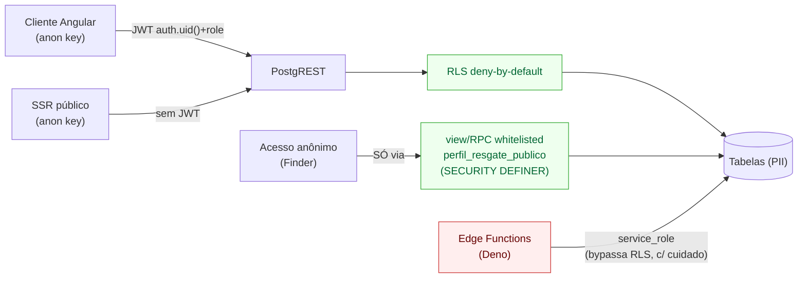
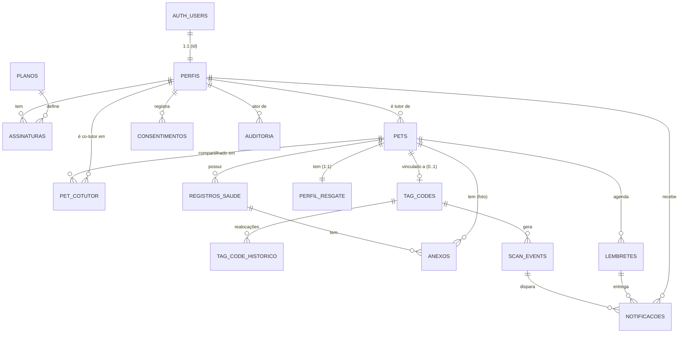
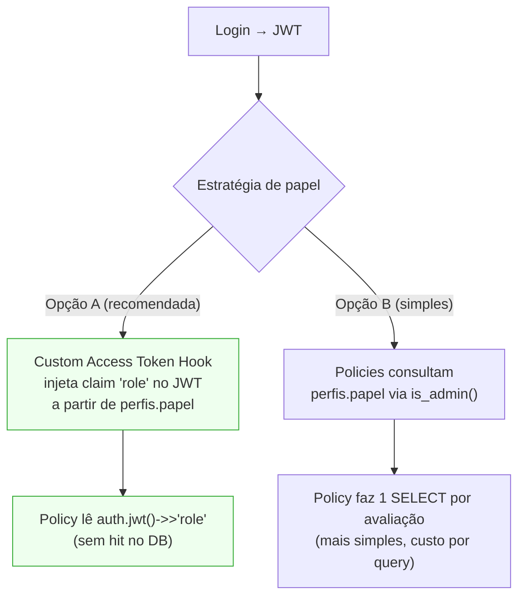
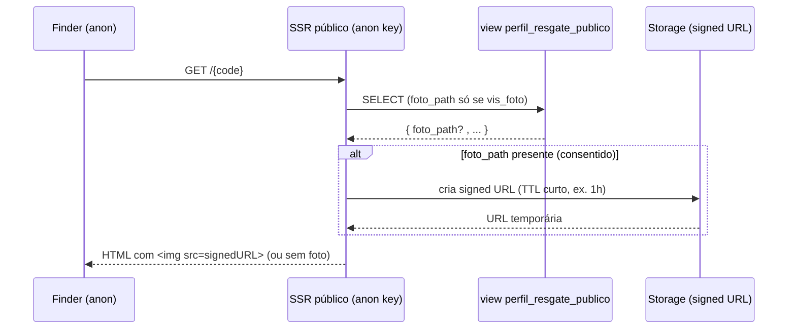
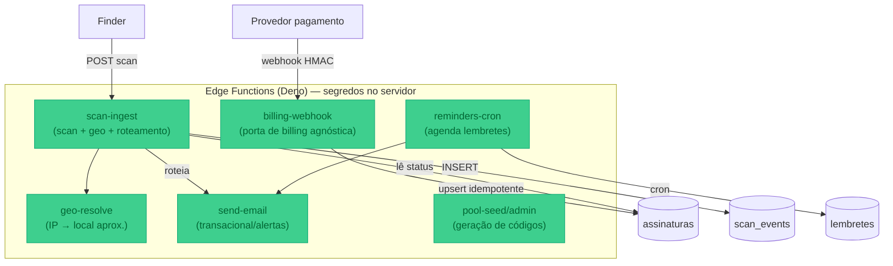
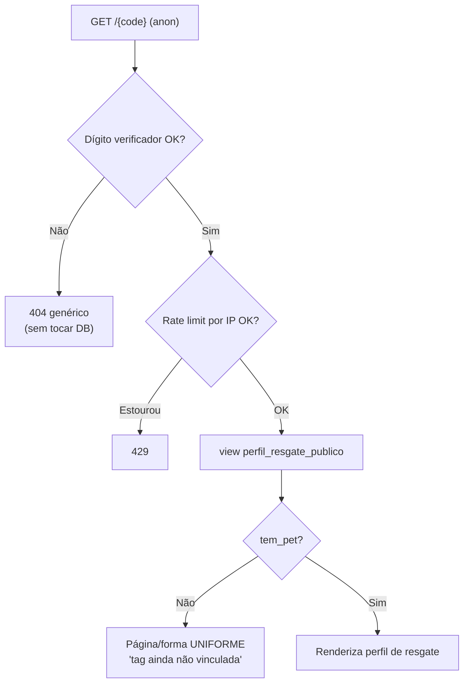

# Arquitetura de Backend & Dados (Supabase) — Faro

> **Documento de Arquitetura de Backend/Dados** do Faro — SaaS de cuidado, saúde e **resgate de pets** via QR Code.
>
> **Status**: v1.0 (rascunho de referência do MVP) · **Data**: 2026-06-03 · **Autor**: Especialista Supabase
>
> **Fontes de verdade que este documento NÃO contradiz** (em caso de conflito, elas vencem):
> - `.specify/memory/constitution.md` (princípios inegociáveis — Rescue-First, LGPD, RLS-first, etc.)
> - `CLAUDE.md` (guidance de runtime, stack ativa, convenções de dados/segurança, glossário canônico)
> - `docs/architecture.md` (arquitetura de solução — C4, renderização híbrida, ADRs)
>
> Este documento detalha **COMO o backend Supabase é estruturado**: modelo de dados, RLS, Auth, Storage, Edge Functions, pool de códigos, migrations/seeds e ambientes. Os exemplos SQL são **ilustrativos** — a versão canônica vive nas migrations versionadas em `supabase/migrations/`.

---

## Índice

1. [Princípios de backend aplicados](#1-princípios-de-backend-aplicados)
2. [Modelo de dados](#2-modelo-de-dados)
3. [Políticas RLS por tabela](#3-políticas-rls-por-tabela)
4. [Autenticação e papéis](#4-autenticação-e-papéis)
5. [Storage (buckets e políticas)](#5-storage-buckets-e-políticas)
6. [Edge Functions](#6-edge-functions)
7. [Pool de códigos de tag](#7-pool-de-códigos-de-tag)
8. [Migrations, seeds e ambientes](#8-migrations-seeds-e-ambientes)
9. [Mapa de objetos do banco (resumo)](#9-mapa-de-objetos-do-banco-resumo)
10. [Questões em aberto](#10-questões-em-aberto)

---

## 1. Princípios de backend aplicados

Cinco invariantes governam **todas** as decisões deste documento:

| # | Invariante | Como se manifesta no banco |
|---|---|---|
| **I** | **Rescue-First** (não-negociável) | A leitura da página de resgate (view `perfil_resgate_publico`) e o contato **não consultam** a assinatura para *gating*. O status da assinatura só decide o **destino do alerta de scan** (Tutor vs Admin), lógica na Edge Function `scan-ingest`. |
| **II** | **LGPD por design** (não-negociável) | Exposição pública por **flags de visibilidade por campo** + opt-in de contato; tabela `consentimentos` auditável; RPCs de export/exclusão de dados do titular. |
| **III** | **RLS-first + segredos no servidor** (não-negociável) | Toda tabela com PII nasce com `ENABLE ROW LEVEL SECURITY` e **deny-by-default**. `anon` só acessa via view/RPC whitelisted. `service_role` e segredos só em Edge Functions. |
| **VI** | **MVP-first / YAGNI** | Schema cobre apenas o laço tutor→pet→registros→QR/resgate→assinatura. Marketplace (Fase 2) **fora** deste schema. |
| **VII** | **Observabilidade/auditoria** | Tabela `auditoria` (append-only) registra scans, mudanças de plano/pagamento, acessos/exclusões LGPD, realocação/claim de tag. |

**Regra de ouro de autorização (defesa em profundidade):**



> **`service_role` bypassa RLS** — por isso vive **exclusivamente** nas Edge Functions (servidor), nunca no cliente nem no SSR público. O SSR público usa **somente** a `anon key` e lê **somente** a view de projeção.

---

## 2. Modelo de dados

Visão de alto nível (principais colunas, **não** DDL completo). Nomes de tabela em `snake_case`, em inglês onde for código; o glossário canônico do CLAUDE.md é respeitado. Todas as PKs são `uuid` (`gen_random_uuid()`), com `created_at`/`updated_at` (`timestamptz`).

### 2.1 Diagrama Entidade-Relacionamento (lógico)



### 2.2 Tabelas — colunas-chave e relacionamentos

#### `perfis` (Tutor / Co-Tutor / Admin)
Espelha `auth.users` 1:1 (preenchida por trigger no signup). É a fonte de **papel** e dados de perfil.

| Coluna | Tipo | Notas |
|---|---|---|
| `id` | `uuid` PK | = `auth.users.id` (FK) |
| `nome` | `text` | nome do tutor |
| `papel` | `text` (enum `tutor`/`admin`) | papel **global**; co-tutoria é por pet (`pet_cotutor`), não papel global |
| `email` | `text` | espelhado de `auth.users` (conveniência; auth é a fonte) |
| `telefone_e164` | `text` | telefone normalizado E.164 (validado por constraint) |
| `whatsapp_optin` | `boolean` default `false` | opt-in global para exibir WhatsApp em resgates |
| `locale` | `text` default `pt-BR` | i18n |
| `created_at`/`updated_at` | `timestamptz` | |

#### `planos` (Plano)
Catálogo de tiers (tabela de referência, leitura pública autenticada).

| Coluna | Tipo | Notas |
|---|---|---|
| `id` | `uuid` PK | |
| `codigo` | `text` unique | `basico` / `pro` / `familia` |
| `nome` | `text` | rótulo PT-BR |
| `max_pets` | `int` | Básico=1, Pro=3, Família=10 *(provisório — spec 002)* |
| `permite_cotutor` | `boolean` | só `familia` no MVP |
| `storage_mb` | `int` | cota de Storage por tutor |
| `preco_centavos` | `int` | provisório; moeda BRL |
| `ativo` | `boolean` | plano disponível para venda |

#### `assinaturas` (Assinatura)
Vínculo tutor↔plano. **Alimentada por webhook idempotente** (Edge Function `billing-webhook`). É a fonte do **status** que roteia o alerta de scan.

| Coluna | Tipo | Notas |
|---|---|---|
| `id` | `uuid` PK | |
| `tutor_id` | `uuid` FK→`perfis` | |
| `plano_id` | `uuid` FK→`planos` | |
| `status` | `text` enum | `trial \| ativo \| carencia \| inativo \| cancelado` (glossário canônico) |
| `provedor` | `text` | `stripe`/`asaas` — agnóstico (porta de billing) |
| `provedor_customer_id` | `text` | id do cliente no provedor |
| `provedor_subscription_id` | `text` | id da assinatura no provedor |
| `trial_fim` | `timestamptz` | fim do trial (14d) |
| `periodo_fim` | `timestamptz` | fim do ciclo atual; base da régua de carência |
| `carencia_fim` | `timestamptz` | quando carência expira → inativo |
| `created_at`/`updated_at` | `timestamptz` | |

> **Rescue-First:** nenhuma leitura de resgate consulta esta tabela. Ela só é lida pela `scan-ingest` para decidir o **destino do alerta**.

#### `pets` (Pet) — tabela com PII, NUNCA exposta a `anon`
| Coluna | Tipo | Notas |
|---|---|---|
| `id` | `uuid` PK | |
| `tutor_id` | `uuid` FK→`perfis` | dono; base da RLS |
| `nome` | `text` | |
| `especie` | `text` enum | `cao` / `gato` (MVP) |
| `raca` | `text` | opcional |
| `sexo` | `text` enum | `macho`/`femea` |
| `nascimento` | `date` | opcional (estimado) |
| `temperamento` | `text` | decisão de produto travada |
| `foto_path` | `text` | caminho no Storage (bucket `pet-fotos`) |
| `castrado` | `boolean` | |
| `obs_saude` | `text` | observações privadas |
| `created_at`/`updated_at` | `timestamptz` | |

#### `perfil_resgate` (PerfilDeResgate — config de visibilidade + modo perdido)
1:1 com `pets`. **Separa a política de exposição dos dados brutos**: a view pública lê esta tabela junto de `pets` e projeta só o consentido.

| Coluna | Tipo | Notas |
|---|---|---|
| `pet_id` | `uuid` PK/FK→`pets` | 1:1 |
| `vis_nome` | `boolean` default `true` | expõe nome? |
| `vis_foto` | `boolean` default `true` | expõe foto? |
| `vis_temperamento` | `boolean` default `false` | expõe temperamento? |
| `vis_raca` | `boolean` default `false` | |
| `contato_optin` | `boolean` default `false` | expõe WhatsApp do tutor? (opt-in LGPD por pet) |
| `mensagem_publica` | `text` | recado livre do tutor (ex.: "toma remédio") |
| `modo_perdido` | `boolean` default `false` | amplifica página + alerta tutor |
| `recompensa_texto` | `text` | só preenchido/projetado em modo perdido |
| `perdido_desde` | `timestamptz` | quando ativou modo perdido |

#### `tag_codes` (TagCode) — entidade separada do pet
| Coluna | Tipo | Notas |
|---|---|---|
| `id` | `uuid` PK | |
| `code` | `text` unique | código **opaco, não sequencial, com dígito verificador** |
| `status` | `text` enum | `available` / `assigned` / `blocked` |
| `pet_id` | `uuid` FK→`pets` null | vínculo opcional (claim) |
| `claimed_at` | `timestamptz` | quando foi vinculado |
| `claimed_by` | `uuid` FK→`perfis` | quem reivindicou |
| `created_at` | `timestamptz` | criado no seed do pool |

#### `tag_code_historico` (realocação/transferência)
Append-only; auditoria fina de movimentação de tag (admin pode realocar).

| Coluna | Tipo | Notas |
|---|---|---|
| `id` | `uuid` PK | |
| `code` | `text` FK→`tag_codes.code` | |
| `acao` | `text` | `claim` / `realocacao` / `unassign` / `block` |
| `pet_id_antigo` | `uuid` null | |
| `pet_id_novo` | `uuid` null | |
| `ator` | `uuid` | tutor/admin/sistema |
| `at` | `timestamptz` | |

#### `registros_saude` (RegistroDeSaude)
| Coluna | Tipo | Notas |
|---|---|---|
| `id` | `uuid` PK | |
| `pet_id` | `uuid` FK→`pets` | base da RLS (herda dono via pet) |
| `tipo` | `text` enum | `vacinacao \| alimentacao \| consulta \| vermifugacao \| peso \| medicacao` |
| `data_evento` | `timestamptz` | quando ocorreu |
| `dados` | `jsonb` | payload por tipo (ex.: peso→`{kg}`, vacina→`{nome,lote,proxima}`) |
| `observacao` | `text` | |
| `criado_por` | `uuid` FK→`perfis` | tutor ou co-tutor |
| `created_at`/`updated_at` | `timestamptz` | |

> O `jsonb dados` mantém o MVP simples (YAGNI): em vez de 6 tabelas por tipo, um payload validado por `CHECK`/função por `tipo`. Promovível a colunas dedicadas se uma spec exigir consultas analíticas.

#### `anexos` (Anexo)
| Coluna | Tipo | Notas |
|---|---|---|
| `id` | `uuid` PK | |
| `pet_id` | `uuid` FK→`pets` | dono (RLS) |
| `registro_id` | `uuid` FK→`registros_saude` null | anexo de registro (opcional) |
| `storage_path` | `text` | caminho no bucket `anexos` |
| `mime` | `text` | |
| `tamanho_bytes` | `bigint` | conta para a cota de Storage do plano |
| `created_at` | `timestamptz` | |

#### `scan_events` (ScanEvent) — fonte canônica de scans
| Coluna | Tipo | Notas |
|---|---|---|
| `id` | `uuid` PK | |
| `code` | `text` FK→`tag_codes.code` | tag escaneada |
| `pet_id` | `uuid` FK→`pets` null | snapshot do vínculo no momento |
| `metodo_geo` | `text` enum | `gps` (preciso, consentido) / `ip` (aproximado) / `nenhum` |
| `precisao` | `text` | `precisa` / `aproximada` (rotulada — LGPD) |
| `lat` / `lng` | `double precision` null | só com consentimento |
| `regiao_aprox` | `text` | cidade/região do fallback IP |
| `ip_hash` | `text` | IP **hasheado** (não armazenar IP cru — minimização) |
| `user_agent` | `text` | |
| `destino_alerta` | `text` enum | `tutor` / `admin` (decidido por status da assinatura) |
| `assinatura_status_no_scan` | `text` | snapshot do status no momento (auditoria) |
| `created_at` | `timestamptz` | |

#### `lembretes` (Lembrete)
| Coluna | Tipo | Notas |
|---|---|---|
| `id` | `uuid` PK | |
| `pet_id` | `uuid` FK→`pets` | |
| `tutor_id` | `uuid` FK→`perfis` | denormalizado p/ RLS rápida |
| `tipo` | `text` enum | mesmo domínio de `registros_saude` (vacina/consulta/vermífugo…) |
| `titulo` | `text` | |
| `agendado_para` | `timestamptz` | quando disparar |
| `recorrencia` | `text` null | `none`/`mensal`/`anual` (RRULE simplificado) |
| `status` | `text` enum | `pendente` / `enviado` / `cancelado` |
| `canais` | `text[]` | `{in_app, email}` |

#### `notificacoes` (Notificação)
| Coluna | Tipo | Notas |
|---|---|---|
| `id` | `uuid` PK | |
| `destinatario_id` | `uuid` FK→`perfis` | tutor/co-tutor/admin |
| `tipo` | `text` enum | `lembrete` / `scan_alerta` / `assinatura` / `sistema` |
| `titulo` / `corpo` | `text` | |
| `origem_scan_id` | `uuid` FK→`scan_events` null | quando vem de scan |
| `origem_lembrete_id` | `uuid` FK→`lembretes` null | |
| `lida_em` | `timestamptz` null | |
| `enviada_email_em` | `timestamptz` null | |
| `created_at` | `timestamptz` | |

#### `pet_cotutor` (CoTutor — associação)
Compartilhamento de **um pet específico** (plano Família). Modela co-tutoria como associação, **não** papel global.

| Coluna | Tipo | Notas |
|---|---|---|
| `pet_id` | `uuid` FK→`pets` | PK composta |
| `cotutor_id` | `uuid` FK→`perfis` | PK composta |
| `convidado_por` | `uuid` FK→`perfis` | tutor dono |
| `status` | `text` enum | `pendente` / `aceito` |
| `created_at` | `timestamptz` | |

#### `consentimentos` (LGPD — auditável)
| Coluna | Tipo | Notas |
|---|---|---|
| `id` | `uuid` PK | |
| `tutor_id` | `uuid` FK→`perfis` | |
| `finalidade` | `text` | `exibir_whatsapp` / `geo_scan` / `marketing` / `termos` … |
| `base_legal` | `text` | `consentimento` / `execucao_contrato` … |
| `concedido` | `boolean` | |
| `versao_documento` | `text` | versão dos termos/política |
| `at` | `timestamptz` | |

#### `auditoria` (Observabilidade — append-only)
| Coluna | Tipo | Notas |
|---|---|---|
| `id` | `uuid` PK | |
| `evento` | `text` | `scan`, `tag_claim`, `tag_realocacao`, `assinatura_mudou`, `dados_exportados`, `dados_excluidos`, `admin_login` … |
| `ator` | `uuid` null | uid / null=sistema |
| `entidade` | `text` | tabela/recurso afetado |
| `entidade_id` | `text` | |
| `detalhe` | `jsonb` | payload estruturado |
| `ip_hash` | `text` | |
| `at` | `timestamptz` | |

#### `webhook_events` (idempotência de billing)
Dedupe de webhooks de pagamento (anti-reprocessamento).

| Coluna | Tipo | Notas |
|---|---|---|
| `provedor` | `text` | `stripe`/`asaas` |
| `event_id` | `text` | id do evento no provedor — **PK composta** com `provedor` |
| `tipo` | `text` | tipo do evento |
| `processado_em` | `timestamptz` | |
| `payload` | `jsonb` | bruto (para replay/debug) |

---

## 3. Políticas RLS por tabela

**Política padrão = NEGAR.** Habilitar RLS sem criar policy permissiva já bloqueia tudo para `anon` e `authenticated`. Cada tabela abaixo lista o vetor de acesso permitido.

### 3.1 Matriz de acesso (resumo)

| Tabela | `anon` | `authenticated` (tutor) | co-tutor | `admin` | Edge (`service_role`) |
|---|---|---|---|---|---|
| `perfis` | ✗ | próprio (`id = auth.uid()`) | — | todos | full |
| `planos` | ✗ | SELECT (catálogo) | SELECT | full | full |
| `assinaturas` | ✗ | próprio (SELECT) | ✗ | todos | full (webhook) |
| `pets` | ✗ (**nunca**) | dono (CRUD) | SELECT/UPDATE registros | todos | full |
| `perfil_resgate` | ✗ (só via view) | dono (CRUD) | UPDATE | todos | full |
| `tag_codes` | ✗ (só via view/RPC) | SELECT do próprio pet | — | full | full |
| `tag_code_historico` | ✗ | SELECT do próprio | — | full | insert |
| `registros_saude` | ✗ | via pet do dono | via pet co-tutorado | todos | full |
| `anexos` | ✗ | via pet do dono | via pet co-tutorado | todos | full |
| `scan_events` | ✗ | SELECT dos próprios pets | SELECT | todos | insert |
| `lembretes` | ✗ | dono (CRUD) | co-tutor (CRUD) | todos | full (cron) |
| `notificacoes` | ✗ | próprias (SELECT/UPDATE lida) | próprias | todos | insert |
| `pet_cotutor` | ✗ | dono gerencia / co-tutor vê | próprio | todos | full |
| `consentimentos` | ✗ | próprios | — | SELECT (suporte) | insert |
| `auditoria` | ✗ | ✗ (ou SELECT dos próprios eventos) | ✗ | SELECT | insert |
| `webhook_events` | ✗ | ✗ | ✗ | ✗ | full |
| **view** `perfil_resgate_publico` | **SELECT** | SELECT | SELECT | SELECT | — |

> **anon só aparece uma vez na coluna de acesso: na view pública.** É a materialização do Princípio III.

### 3.2 Isolamento por tutor (`auth.uid()`)

```sql
-- pets: dono e co-tutor leem; só o dono modifica
ALTER TABLE pets ENABLE ROW LEVEL SECURITY;

CREATE POLICY pets_select ON pets
  FOR SELECT TO authenticated
  USING (
    tutor_id = auth.uid()
    OR EXISTS (
      SELECT 1 FROM pet_cotutor pc
      WHERE pc.pet_id = pets.id
        AND pc.cotutor_id = auth.uid()
        AND pc.status = 'aceito'
    )
  );

CREATE POLICY pets_insert ON pets
  FOR INSERT TO authenticated
  WITH CHECK (tutor_id = auth.uid());

CREATE POLICY pets_update ON pets
  FOR UPDATE TO authenticated
  USING (tutor_id = auth.uid())
  WITH CHECK (tutor_id = auth.uid());

CREATE POLICY pets_delete ON pets
  FOR DELETE TO authenticated
  USING (tutor_id = auth.uid());
-- 'anon' não recebe policy → acesso público à tabela bruta é NEGADO.
```

### 3.3 Herança de dono via pet (registros, anexos)

`registros_saude` e `anexos` não têm `tutor_id` direto — a posse é derivada do `pet`. Uma função helper `SECURITY DEFINER` evita recursão de RLS e centraliza a regra:

```sql
-- Helper: o auth.uid() pode acessar este pet? (dono OU co-tutor aceito)
CREATE FUNCTION pode_acessar_pet(p_pet_id uuid)
RETURNS boolean
LANGUAGE sql STABLE SECURITY DEFINER
SET search_path = public
AS $$
  SELECT EXISTS (
    SELECT 1 FROM pets p WHERE p.id = p_pet_id AND p.tutor_id = auth.uid()
  ) OR EXISTS (
    SELECT 1 FROM pet_cotutor pc
    WHERE pc.pet_id = p_pet_id AND pc.cotutor_id = auth.uid() AND pc.status = 'aceito'
  );
$$;

ALTER TABLE registros_saude ENABLE ROW LEVEL SECURITY;

CREATE POLICY registros_acesso ON registros_saude
  FOR ALL TO authenticated
  USING (pode_acessar_pet(pet_id))
  WITH CHECK (pode_acessar_pet(pet_id));
```

### 3.4 Acesso admin (por papel, no banco)

Admin **não** é um bypass de cliente. É uma função que lê o papel da fonte (`perfis.papel` ou claim do JWT — ver §4.4):

```sql
CREATE FUNCTION is_admin()
RETURNS boolean
LANGUAGE sql STABLE SECURITY DEFINER
SET search_path = public
AS $$
  SELECT EXISTS (
    SELECT 1 FROM perfis WHERE id = auth.uid() AND papel = 'admin'
  );
$$;

-- Admin enxerga tudo em pets (suporte, realocação, fila de scans)
CREATE POLICY pets_admin_all ON pets
  FOR ALL TO authenticated
  USING (is_admin())
  WITH CHECK (is_admin());
```

> Aplicar policies `*_admin_all` análogas nas tabelas onde o backoffice precisa atuar (`tag_codes`, `scan_events`, `assinaturas`, `auditoria` em SELECT). O admin **continua sujeito à RLS** — a policy apenas amplia o conjunto permitido para quem é admin.

### 3.5 Acesso anônimo SOMENTE via projeção pública (Rescue-First + LGPD)

A view projeta **apenas campos consentidos** e **independe da assinatura**:

```sql
-- View de projeção pública: SÓ campos públicos, respeita visibilidade e Rescue-First.
CREATE VIEW perfil_resgate_publico
WITH (security_invoker = false)  -- roda como dono da view (acesso controlado abaixo)
AS
SELECT
  t.code,
  (pr.pet_id IS NOT NULL)                                    AS tem_pet,  -- Rescue-First
  CASE WHEN pr.vis_nome         THEN p.nome END              AS nome,
  CASE WHEN pr.vis_foto         THEN p.foto_path END         AS foto_path,
  CASE WHEN pr.vis_temperamento THEN p.temperamento END      AS temperamento,
  CASE WHEN pr.vis_raca         THEN p.raca END              AS raca,
  CASE WHEN pr.contato_optin AND tut.whatsapp_optin
       THEN tut.telefone_e164 END                            AS whatsapp_e164,
  pr.mensagem_publica,
  pr.modo_perdido,
  CASE WHEN pr.modo_perdido THEN pr.recompensa_texto END     AS recompensa_texto
FROM tag_codes t
LEFT JOIN pets          p   ON p.id  = t.pet_id
LEFT JOIN perfil_resgate pr ON pr.pet_id = p.id
LEFT JOIN perfis        tut ON tut.id = p.tutor_id
WHERE t.status IN ('assigned', 'available');  -- 'blocked' não aparece

-- anon e authenticated leem SÓ a view; NUNCA as tabelas base de PII.
GRANT SELECT ON perfil_resgate_publico TO anon, authenticated;
```

Pontos críticos desta view:
- **Não há `JOIN assinaturas`** → a página de resgate funciona com qualquer status (Princípio I). O status só é lido depois, na `scan-ingest`, para rotear o alerta.
- Cada campo é guardado por seu flag `vis_*`; o WhatsApp exige **dupla** condição (`contato_optin` do pet **E** `whatsapp_optin` global do tutor).
- A view **não** expõe `tutor_id`, `id` do pet, IDs internos ou qualquer PII não consentida — apenas o `code` (que o Finder já tem) e os campos projetados.
- `tem_pet` permite **resposta uniforme**: code inexistente, code `available` sem pet e code `blocked` retornam todos `tem_pet = false`/sem linha, sem revelar se o code existe no pool (anti-enumeração — §7).

> **Alternativa endurecida (recomendada para prod):** em vez de `GRANT SELECT` na view, expor a leitura por **RPC `SECURITY DEFINER`** `resolver_resgate(p_code text)` que valida o dígito verificador *antes* de consultar e aplica rate-limit lógico. Isso evita que `anon` faça `SELECT * FROM perfil_resgate_publico` varrendo a view inteira. Decisão fina na spec 006.

---

## 4. Autenticação e papéis

Supabase Auth (GoTrue) é a fonte de identidade. JWT carrega `sub` (= `auth.uid()`) e claims.

### 4.1 Métodos de login

| Método | Config | Notas |
|---|---|---|
| **E-mail + senha** | provider `email` habilitado | **Confirmação de e-mail obrigatória** (`enable_confirmations = true`) antes de liberar o painel |
| **Google OAuth** | provider `google` (client id/secret nos secrets do Supabase) | redirect para `/auth/callback`; e-mail já vem verificado pelo Google |

### 4.2 Verificação de e-mail e recuperação de senha

- **Verificação**: signup por e-mail dispara link de confirmação (template customizado PT-BR via SMTP do `send-email`/provedor). Sessão fica limitada até confirmar.
- **Recuperação**: fluxo `resetPasswordForEmail` → e-mail com link → tela `/auth/recuperar`. Templates de e-mail em PT-BR, com `lang` e branding Faro.
- **Templates** (confirmar, recuperar, magic link, convite de co-tutor) versionados e localizados; remetente e domínio configurados por ambiente.

### 4.3 Provisionamento de perfil (trigger no signup)

Toda conta nova ganha uma linha em `perfis` automaticamente:

```sql
CREATE FUNCTION handle_new_user()
RETURNS trigger
LANGUAGE plpgsql SECURITY DEFINER
SET search_path = public
AS $$
BEGIN
  INSERT INTO public.perfis (id, email, nome, papel)
  VALUES (
    NEW.id,
    NEW.email,
    COALESCE(NEW.raw_user_meta_data->>'name', split_part(NEW.email, '@', 1)),
    'tutor'                       -- todo novo usuário nasce 'tutor'; admin é promovido manualmente
  );
  RETURN NEW;
END;
$$;

CREATE TRIGGER on_auth_user_created
  AFTER INSERT ON auth.users
  FOR EACH ROW EXECUTE FUNCTION handle_new_user();
```

### 4.4 Papéis nas policies — claim no JWT vs tabela

**Decisão (MVP):** papel admin via **`is_admin()`** (Opção B abaixo). A Opção A (custom claim) fica documentada como evolução futura se o custo de RLS de admin aparecer em profile. Duas estratégias:



- **Opção A — custom claim** (via *Auth Hook* `custom_access_token`): injeta `role` no JWT lendo `perfis.papel`. Policies leem `auth.jwt() ->> 'role'` — **sem hit no banco**, melhor performance. Cuidado: claim só atualiza no refresh do token (promover admin exige re-login).
- **Opção B — função `is_admin()`** (mostrada em §3.4): consulta `perfis` a cada avaliação. Mais simples, sempre fresca, custo por query. Boa para o MVP (poucos admins, baixo volume de queries admin).

**Recomendação MVP:** começar com **Opção B** (simplicidade/YAGNI); migrar para hook de claim se o custo de RLS de admin aparecer em profile.

### 4.5 Co-tutoria (convite)

Co-tutor **não** é papel global. O tutor dono convida por e-mail → cria `pet_cotutor (status='pendente')` + `notificacoes`/e-mail de convite. Ao aceitar, vira `aceito` e as policies de `pode_acessar_pet()` passam a incluir aquele pet. Limite de co-tutores e de pets respeita o **plano Família** (validado por trigger/RPC — §7 análogo ao claim).

---

## 5. Storage (buckets e políticas)

Dois buckets, ambos **privados** (sem leitura pública direta). O acesso a imagens públicas (foto do pet na página de resgate) é feito por **URL assinada de curta duração** gerada na **view/SSR** ou por **transform** — nunca expondo o bucket cru.

| Bucket | Conteúdo | Público? | Acesso |
|---|---|---|---|
| `pet-fotos` | foto de perfil do pet | **privado** | dono/co-tutor via política; resgate público via **signed URL** gerada server-side a partir de `foto_path` quando `vis_foto = true` |
| `anexos` | anexos de registros (PDF de vacina, exames, receitas) | **privado** | só dono/co-tutor; **nunca** público |

### 5.1 Políticas de Storage (RLS em `storage.objects`)

Convenção de caminho: `{tutor_id}/{pet_id}/{arquivo}` — o primeiro segmento amarra o objeto ao dono.

```sql
-- Upload/leitura/exclusão restritos ao dono pelo prefixo do path = tutor_id
CREATE POLICY "pet-fotos: dono gerencia"
ON storage.objects FOR ALL TO authenticated
USING (
  bucket_id = 'pet-fotos'
  AND (storage.foldername(name))[1] = auth.uid()::text
)
WITH CHECK (
  bucket_id = 'pet-fotos'
  AND (storage.foldername(name))[1] = auth.uid()::text
);

-- anexos: idêntico, sem qualquer exceção pública
CREATE POLICY "anexos: dono gerencia"
ON storage.objects FOR ALL TO authenticated
USING (
  bucket_id = 'anexos'
  AND (storage.foldername(name))[1] = auth.uid()::text
);
```

### 5.2 Exposição da foto na página de resgate (LGPD + Rescue-First)



- A **signed URL** é gerada no SSR (que tem só `anon key` — a geração de signed URL é permitida sob política, ou delegada a uma RPC `SECURITY DEFINER` que valida `vis_foto`).
- Sem `vis_foto = true`, `foto_path` **não é projetado** pela view → nenhuma URL é gerada. Privacidade por padrão.
- **Transform de imagem** do Supabase Storage (resize/`webp`) atende ao orçamento de performance da página de resgate (§6.4 do `architecture.md`).
- Cota de Storage por plano: somar `tamanho_bytes` de `anexos` por tutor; checar limite no upload (trigger/RPC) contra `planos.storage_mb`.

---

## 6. Edge Functions

Tudo que exige **segredo** ou **lógica server-side confiável** roda em Edge Functions (Deno). Cliente usa só `anon key`; estas funções usam `service_role` + segredos do ambiente.



### 6.1 `billing-webhook` — porta de billing agnóstica (ADR-002)

| Aspecto | Detalhe |
|---|---|
| **Responsabilidade** | Receber webhooks do provedor (Stripe/Asaas) → mapear evento para status canônico → `upsert assinaturas`. |
| **Segredos** | `service_role`, `WEBHOOK_SIGNING_SECRET`, chaves do provedor. |
| **Segurança** | Valida **assinatura HMAC** do provedor antes de processar (anti-spoofing). **Idempotente** via `webhook_events (provedor, event_id)` — evento repetido é no-op. |
| **Mapeamento** | Adapter por provedor traduz `invoice.paid`/`subscription.deleted`/etc. para `trial\|ativo\|carencia\|inativo\|cancelado`. O domínio nunca vê termos do provedor. |
| **Auditoria** | Cada mudança de status grava `auditoria(evento='assinatura_mudou')`. |
| **Falha** | Erro de processamento **não corta o resgate** (Princípio I); retry tolerante; falhas alertáveis (é dinheiro + acesso). |

```ts
// Pseudo-código (Deno) — idempotência + HMAC + mapeamento agnóstico
const sig = req.headers.get("x-provider-signature");
if (!verifyHmac(rawBody, sig, Deno.env.get("WEBHOOK_SIGNING_SECRET"))) {
  return new Response("invalid signature", { status: 401 });
}
const evt = adapter.parse(rawBody);              // adapter Stripe OU Asaas
const dup = await db.from("webhook_events")
  .insert({ provedor, event_id: evt.id, tipo: evt.type, payload: evt.raw })
  .select().maybeSingle();                       // PK (provedor,event_id) → conflito = duplicado
if (!dup) return new Response("ok (dup)", { status: 200 });
const status = adapter.toCanonicalStatus(evt);   // → 'ativo' | 'carencia' | ...
await db.from("assinaturas").upsert({ tutor_id, plano_id, status, /* ids do provedor */ });
await db.from("auditoria").insert({ evento: "assinatura_mudou", detalhe: { status } });
```

### 6.2 `scan-ingest` — scan + geo + **notificação roteada por status** (ADR-007)

| Aspecto | Detalhe |
|---|---|
| **Responsabilidade** | Registrar `ScanEvent`, resolver geo, **rotear o alerta** conforme o status da assinatura, gravar auditoria. |
| **Segredos** | `service_role`, `GEO_API_KEY`, SMTP. |
| **Geo** | Recebe geo **precisa** do navegador (consentida) **ou** resolve **aproximada por IP** (chama `geo-resolve`). Sempre **rotula** o método/precisão. Armazena **`ip_hash`**, nunca IP cru (minimização LGPD). |
| **Roteamento** | Lê `assinaturas.status` do tutor dono do `code`. `trial\|ativo\|carencia` → **Tutor**; `inativo\|cancelado` → **Admin (fila)**. Em ambos os casos um alerta é gerado — **nunca suprimido** (Rescue-First). |
| **Rate limit** | Por IP e por `code` (janela deslizante) — anti-abuso/enumeração. |
| **Auditoria** | `auditoria(evento='scan')` + `scan_events` é a fonte canônica. |

```ts
// Pseudo-código — roteamento Rescue-First
const tag = await db.from("tag_codes").select("pet_id").eq("code", code).maybeSingle();
if (!tag?.pet_id) return uniform200();           // resposta uniforme (anti-enumeração)

const geo = body.lat ? { metodo:"gps", precisao:"precisa", ...body }
                     : await geoResolve(ipHash); // fallback IP aproximado

const sub = await db.from("assinaturas")
  .select("status, tutor_id").eq("tutor_id", ownerOf(tag.pet_id)).maybeSingle();

const destino = ["trial","ativo","carencia"].includes(sub.status) ? "tutor" : "admin";

await db.from("scan_events").insert({ code, pet_id: tag.pet_id, ...geo,
  destino_alerta: destino, assinatura_status_no_scan: sub.status, ip_hash });

if (destino === "tutor") {
  await notificar(sub.tutor_id, "scan_alerta", geo);   // in-app + send-email
} else {
  await enfileirarParaAdmin(tag.pet_id, geo);          // fila de scans inativos
}
await db.from("auditoria").insert({ evento:"scan", detalhe:{ code, destino } });
```

### 6.3 `geo-resolve` — IP → local aproximado
- Responsabilidade: resolver IP de origem em região aproximada usando a **API de Geo** (segredo). Retorna `{ regiao, precisao:'aproximada' }`. Chamada **só** internamente pela `scan-ingest`. Nunca exposta ao cliente (vazaria a chave).

### 6.4 `send-email` — e-mail transacional / alertas
- Responsabilidade: enviar e-mails (confirmação, recuperação, convite co-tutor, **alerta de scan**, **lembretes**) via provedor SMTP (segredo). Templates PT-BR localizados. Idempotência por chave lógica quando aplicável.

### 6.5 `reminders-cron` — agenda e dispara lembretes
- Responsabilidade: rodar em **cron** (Supabase Scheduled Functions / `pg_cron`), varrer `lembretes` com `agendado_para <= now()` e `status='pendente'`, criar `notificacoes` in-app e chamar `send-email` conforme `canais`. Marca `status='enviado'` e trata recorrência (gera próximo lembrete).

### 6.6 `pool-seed` / RPCs de pool (admin)
- Responsabilidade: gerar e semear o pool de códigos opacos (§7), e operações de admin sobre o pool (bloquear, realocar). Protegida por verificação de admin + `service_role`. Pode ser uma Edge Function de uso único no provisionamento ou um script de migration/seed.

> **Regra de segredos (Princípio III):** `service_role`, chaves de pagamento, `GEO_API_KEY` e SMTP existem **apenas** como secrets do ambiente das Edge Functions (`supabase secrets set ...`), nunca no cliente nem no SSR público.

---

## 7. Pool de códigos de tag

Códigos **opacos, não sequenciais, com dígito verificador**, em pool pré-provisionado (1000 no MVP). `TagCode` é entidade separada, vinculada por **claim atômico**.

### 7.1 Anatomia do código

```
Formato (ilustrativo): FARO-XXXXXX-C
                        └┬─┘ └──┬──┘ └┬┘
                  prefixo  6 chars   dígito verificador
                  (marca)  Crockford  (mod-N sobre o corpo)
                           base32
```

- **Corpo**: 6 caracteres de **Crockford base32** (alfabeto sem `I/L/O/U` para evitar ambiguidade visual em coleira) gerados de **fonte aleatória criptográfica** → ~1 bilhão de combinações; 1000 usados → densidade ínfima → adivinhar um válido aleatório é inviável.
- **Não sequencial / não derivável do pet**: nenhuma relação com `pet_id` ou ordem de criação.
- **Dígito verificador**: checksum (ex.: mod-37 / Damm) sobre o corpo. Permite **rejeitar a maioria das tentativas de força bruta sem tocar o banco** (Princípio III — anti-enumeração) e detectar digitação errada.

### 7.2 Geração + seed dos 1000 códigos

```sql
-- Gera um corpo Crockford base32 aleatório de N chars (ilustrativo)
CREATE FUNCTION gerar_codigo_corpo(p_len int DEFAULT 6)
RETURNS text LANGUAGE plpgsql AS $$
DECLARE
  alfabeto text := '0123456789ABCDEFGHJKMNPQRSTVWXYZ'; -- Crockford (sem I,L,O,U)
  corpo text := '';
  i int;
BEGIN
  FOR i IN 1..p_len LOOP
    corpo := corpo || substr(alfabeto, 1 + (get_byte(gen_random_bytes(1),0) % length(alfabeto)), 1);
  END LOOP;
  RETURN corpo;
END;
$$;

-- Seed idempotente do pool até atingir o alvo, com dígito verificador e unicidade
CREATE FUNCTION seed_pool(p_alvo int DEFAULT 1000)
RETURNS int LANGUAGE plpgsql AS $$
DECLARE
  inseridos int := 0;
  corpo text;
  code text;
BEGIN
  WHILE (SELECT count(*) FROM tag_codes) < p_alvo LOOP
    corpo := gerar_codigo_corpo(6);
    code  := 'FARO-' || corpo || '-' || digito_verificador(corpo); -- checksum
    BEGIN
      INSERT INTO tag_codes(code, status) VALUES (code, 'available');
      inseridos := inseridos + 1;
    EXCEPTION WHEN unique_violation THEN
      -- colisão rara → tenta de novo
      NULL;
    END;
  END LOOP;
  RETURN inseridos;
END;
$$;
```

### 7.3 Claim atômico (evita corrida — ADR-006)

A atribuição do próximo código livre / de um código específico ao pet é uma **transação com `FOR UPDATE`**:

```sql
CREATE FUNCTION claim_tag(p_code text, p_pet_id uuid)
RETURNS void
LANGUAGE plpgsql SECURITY DEFINER
SET search_path = public
AS $$
DECLARE v_status text;
BEGIN
  -- 1) valida o dígito verificador ANTES de tocar pesado o DB
  IF NOT digito_valido(p_code) THEN
    RAISE EXCEPTION 'codigo_invalido';
  END IF;

  -- 2) trava a linha do código (anti-corrida)
  SELECT status INTO v_status FROM tag_codes
    WHERE code = p_code FOR UPDATE;
  IF v_status IS NULL OR v_status <> 'available' THEN
    RAISE EXCEPTION 'tag_indisponivel';
  END IF;

  -- 3) defesa: o pet é do auth.uid()?
  IF NOT EXISTS (SELECT 1 FROM pets WHERE id = p_pet_id AND tutor_id = auth.uid()) THEN
    RAISE EXCEPTION 'pet_invalido';
  END IF;

  -- 4) vincula
  UPDATE tag_codes
     SET status='assigned', pet_id=p_pet_id, claimed_at=now(), claimed_by=auth.uid()
   WHERE code = p_code;

  INSERT INTO tag_code_historico(code, acao, pet_id_novo, ator, at)
    VALUES (p_code, 'claim', p_pet_id, auth.uid(), now());
  INSERT INTO auditoria(evento, ator, entidade, entidade_id, detalhe)
    VALUES ('tag_claim', auth.uid(), 'tag_codes', p_code,
            jsonb_build_object('pet_id', p_pet_id));
END;
$$;
```

### 7.4 Realocação/transferência (admin)
Função análoga `realocar_tag(p_code, p_pet_novo)` (admin-only via `is_admin()`): trava a linha, registra `pet_id_antigo`/`pet_id_novo` em `tag_code_historico` + `auditoria(evento='tag_realocacao')`. Permite reaproveitar uma coleira/tag (ex.: pet faleceu, troca de animal).

### 7.5 Anti-enumeração na resolução pública



Camadas: (1) dígito verificador filtra força bruta antes do DB; (2) rate limit por IP (hospedagem/WAF + lógica na Edge); (3) **resposta uniforme** para code inexistente / sem pet / bloqueado — não vira oráculo; (4) códigos não sequenciais tornam a varredura inútil.

---

## 8. Migrations, seeds e ambientes

### 8.1 Estratégia de migrations

- **Tudo via migration versionada** em `supabase/migrations/` (constituição: nenhuma mudança de schema fora de migration revisada).
- Fluxo: `supabase db diff -f <nome>` gera a migration a partir das mudanças locais → revisão em PR → `supabase db push` promove dev → staging → prod no pipeline.
- **Ordem recomendada das migrations** (uma área por migration, facilita review):
  1. `extensions` (`pgcrypto` para `gen_random_bytes`, `pg_cron` se usado).
  2. `enums_e_dominios` (status de assinatura, tipos de registro, etc.).
  3. `tabelas_core` (`perfis`, `planos`, `assinaturas`).
  4. `tabelas_pet` (`pets`, `perfil_resgate`, `pet_cotutor`).
  5. `tabelas_tag` (`tag_codes`, `tag_code_historico`).
  6. `tabelas_saude` (`registros_saude`, `anexos`).
  7. `tabelas_resgate_obs` (`scan_events`, `lembretes`, `notificacoes`, `consentimentos`, `auditoria`, `webhook_events`).
  8. `funcoes_e_rpc` (`pode_acessar_pet`, `is_admin`, `claim_tag`, `seed_pool`, helpers de código).
  9. `rls_policies` (habilita RLS + policies por tabela — **deny-by-default primeiro**).
  10. `views_publicas` (`perfil_resgate_publico` + grants para `anon`).
  11. `storage_buckets` (criação de buckets + policies de `storage.objects`).
  12. `triggers` (`on_auth_user_created`, `updated_at`, validação de limite de plano).

> **Princípio crítico:** habilitar RLS (`ENABLE ROW LEVEL SECURITY`) em cada tabela **na mesma migration** que a cria — nunca deixar uma tabela de PII "nascer" sem RLS, mesmo temporariamente.

### 8.2 Seeds

| Seed | Conteúdo | Onde |
|---|---|---|
| **`planos`** | Básico/Pro/Família (limites provisórios spec 002) | `supabase/seed.sql` (todos os ambientes) |
| **Pool de tags** | `seed_pool(1000)` — códigos opacos | seed/migration (idempotente; **mesmos códigos em staging ≠ prod** — gerar por ambiente) |
| **Admin inicial** | 1 perfil `papel='admin'` para o backoffice | seed manual/controlado (não commitar credenciais) |
| **Dados de teste** | pets/registros fictícios | **só dev/staging**, nunca prod |

### 8.3 Ambientes (alinhado a `architecture.md` §5)

| Ambiente | Supabase | Pool de códigos | Pagamento | Segredos |
|---|---|---|---|---|
| **dev** | `supabase start` (Docker local) + `functions serve` | pool pequeno gerado localmente | sandbox/mocks | `.env` local (não commitado) |
| **staging** | projeto Supabase isolado | pool de staging (≠ prod) | sandbox do provedor | secrets do painel/Edge |
| **prod** | projeto Supabase isolado, região próxima ao BR | pool prod (1000) | live | secrets do painel/Edge |

- **Isolamento total** staging/prod: projetos, chaves, buckets e **pool de códigos** separados — um QR de staging nunca resolve em prod.
- **Segredos por ambiente** (`supabase secrets set`): `service_role` (gerenciado), `WEBHOOK_SIGNING_SECRET`, `GEO_API_KEY`, SMTP, Google OAuth client/secret. Nunca commitados.
- **Revisão de segurança & privacidade obrigatória** em PR que toque RLS, PII, pagamento ou exposição pública (constituição).

---

## 9. Mapa de objetos do banco (resumo)

```text
supabase/
├── migrations/
│   ├── 0001_extensions.sql                # pgcrypto, pg_cron
│   ├── 0002_enums_e_dominios.sql
│   ├── 0003_tabelas_core.sql              # perfis, planos, assinaturas
│   ├── 0004_tabelas_pet.sql               # pets, perfil_resgate, pet_cotutor
│   ├── 0005_tabelas_tag.sql               # tag_codes, tag_code_historico
│   ├── 0006_tabelas_saude.sql             # registros_saude, anexos
│   ├── 0007_tabelas_resgate_obs.sql       # scan_events, lembretes, notificacoes,
│   │                                      # consentimentos, auditoria, webhook_events
│   ├── 0008_funcoes_e_rpc.sql             # pode_acessar_pet, is_admin, claim_tag,
│   │                                      # realocar_tag, seed_pool, helpers de código
│   ├── 0009_rls_policies.sql              # ENABLE RLS + policies (deny-by-default)
│   ├── 0010_views_publicas.sql            # perfil_resgate_publico + GRANT anon
│   ├── 0011_storage_buckets.sql           # buckets + storage.objects policies
│   └── 0012_triggers.sql                  # on_auth_user_created, updated_at, limite de plano
├── seed.sql                               # planos + admin + (pool por ambiente)
└── functions/
    ├── billing-webhook/                   # webhook agnóstico (HMAC + idempotente)
    ├── scan-ingest/                       # scan + geo + roteamento de alerta
    ├── geo-resolve/                       # IP → local aproximado (segredo geo)
    ├── send-email/                        # e-mail transacional/alertas
    ├── reminders-cron/                    # cron de lembretes
    └── pool-admin/                        # geração/realocação do pool (admin)
```

**Conformidade com os princípios (checklist):**

- [x] **Rescue-First**: `perfil_resgate_publico` não consulta `assinaturas`; roteamento de alerta é o único uso do status.
- [x] **LGPD**: visibilidade por campo (`vis_*`), opt-in de contato, `consentimentos` auditável, IP hasheado, RPCs de export/exclusão.
- [x] **RLS-first**: RLS habilitada na criação de cada tabela; deny-by-default; `anon` só na view; segredos só nas Edge Functions.
- [x] **Anti-enumeração**: códigos opacos não sequenciais + dígito verificador + rate limit + resposta uniforme.
- [x] **Idempotência de billing**: `webhook_events (provedor, event_id)` + HMAC.
- [x] **Observabilidade**: `auditoria` append-only + `scan_events` canônico.

---

## 10. Questões em aberto

Itens que dependem de decisão dos sócios ou de specs futuras:

1. **`TODO(BILLING_PROVIDER)` — Stripe vs Asaas**: define o **adapter** da `billing-webhook` e os campos `provedor_*` em `assinaturas`. A porta agnóstica já isola o domínio (ADR-002), mas o mapeamento de eventos → status canônico é específico do provedor.
2. **Papel no JWT** (§4.4): custom claim via Auth Hook (performance) vs `is_admin()` por query (simplicidade). Recomendação MVP: começar com `is_admin()`.
3. **Provedor de Geo-IP** (`GEO_API_KEY`): ipinfo/MaxMind/ipapi — impacta custo, precisão e residência de dados (LGPD).
4. **Provedor de e-mail transacional**: Resend/SendGrid/SES vs SMTP próprio — usado em `send-email` e templates do Auth.
5. **Região do Supabase**: preferir região próxima ao Brasil (latência + residência de dados LGPD); confirmar disponibilidade.
6. **`registros_saude.dados` jsonb vs colunas dedicadas**: MVP usa `jsonb` (YAGNI). Promover a colunas/tabelas por tipo se alguma spec exigir consultas analíticas/relatórios pesados.
7. **View pública: `GRANT SELECT` vs RPC `SECURITY DEFINER`** (§3.5): RPC permite validar dígito verificador e rate-limit lógico antes de consultar — recomendado para prod; decisão fina na spec 006.
8. **Cron de lembretes**: `pg_cron` (no DB) vs Supabase Scheduled Functions — confirmar disponibilidade no plano contratado.
9. **Política de retenção** de `scan_events`/`auditoria`/IP hash: definir janela de retenção e anonimização (LGPD) na spec de privacidade.
10. **Limites de plano** (Básico 1 / Pro 3 / Família 10, trial 14d): provisórios — a confirmar na spec 002 com validação de custo; a validação de limite no banco (trigger/RPC) lê `planos.max_pets`.
