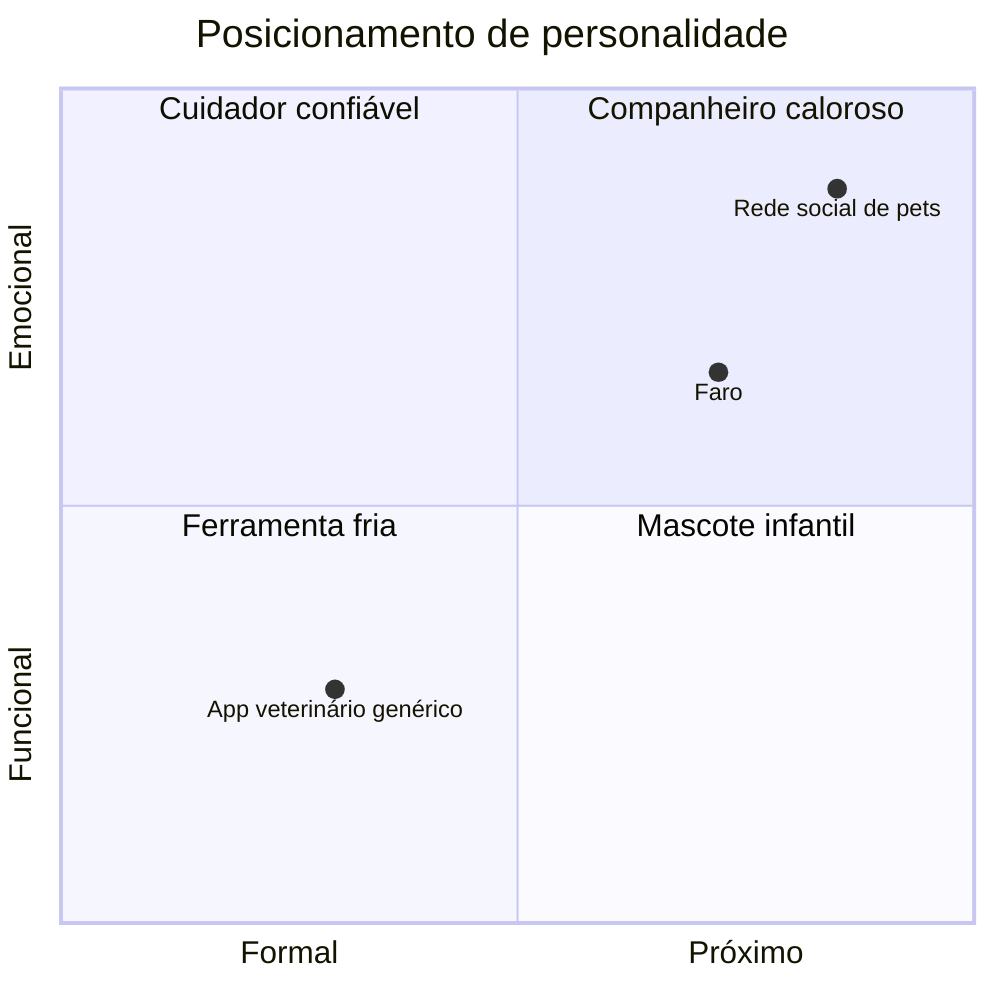
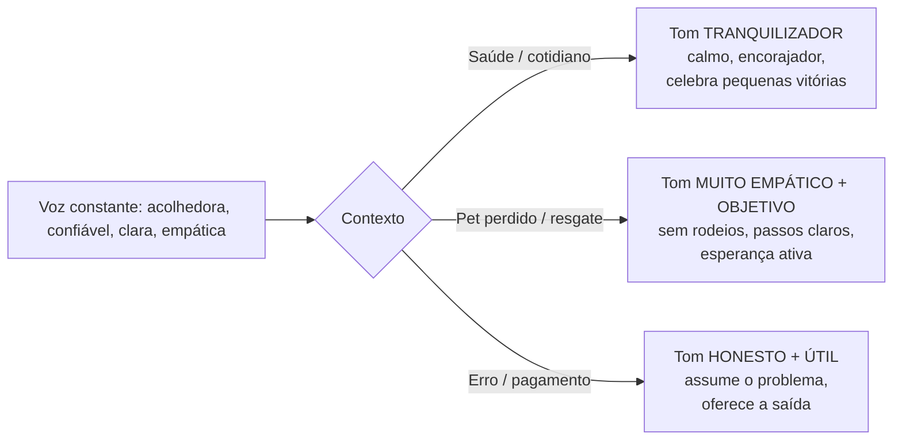
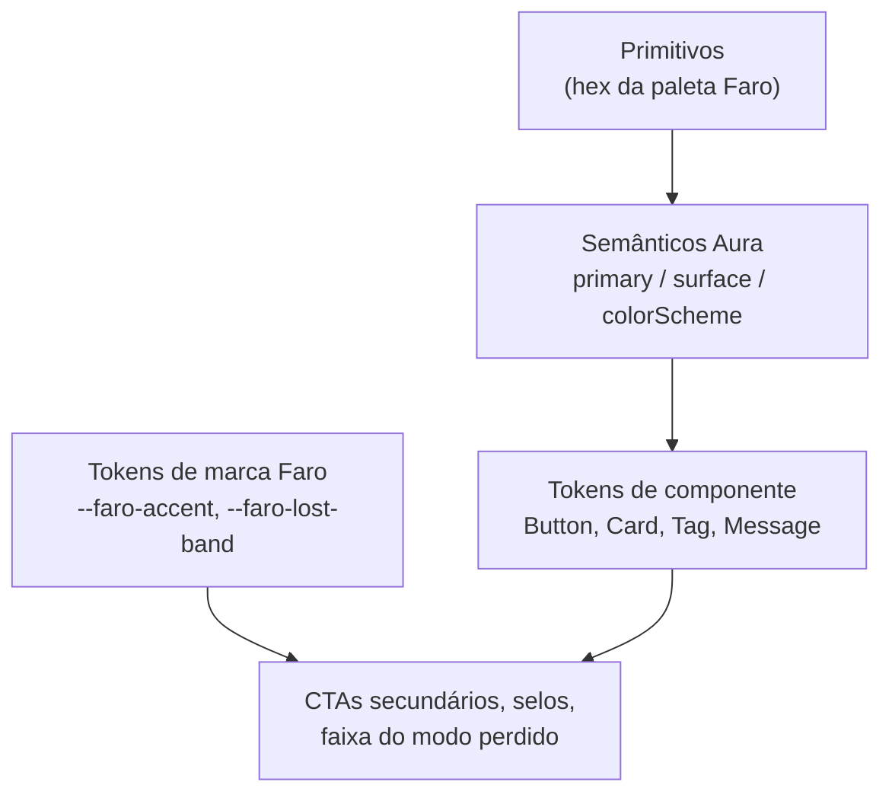
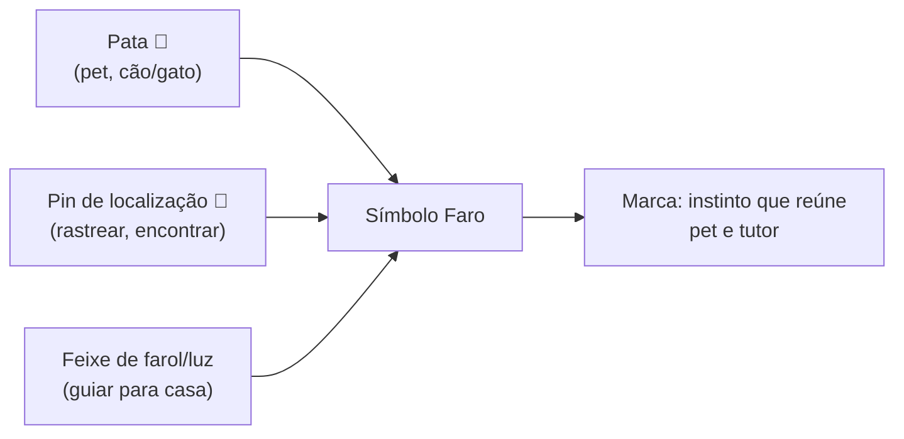
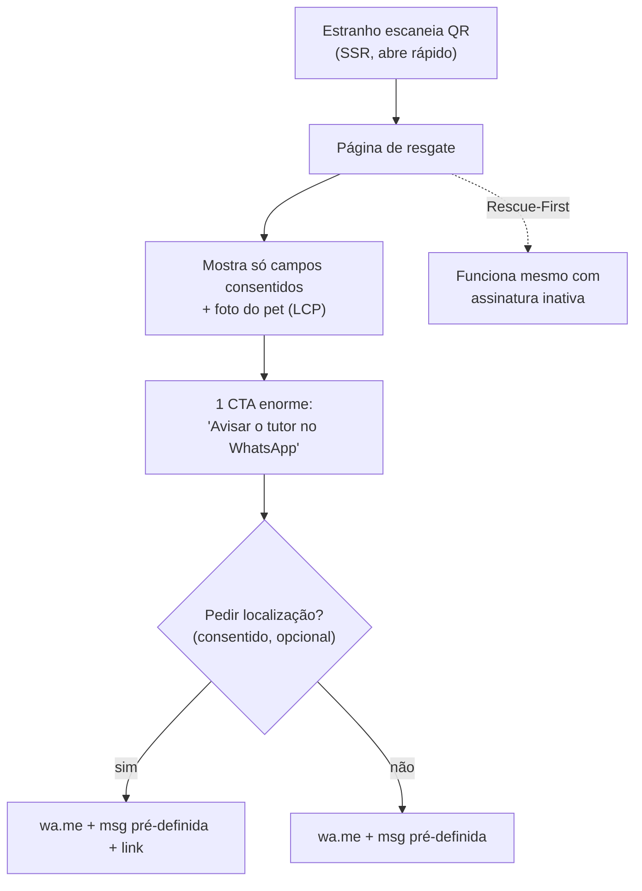

# Faro — Design System & Identidade Verbal

> **Status:** Proposta v1.0 (Designer de Marca & UX) — paleta (C · Faro Noturno) e fontes (Poppins + Inter) **decididas**; logo ainda pendente.
> **Fonte de verdade:** este documento NÃO contradiz `.specify/memory/constitution.md` nem `CLAUDE.md`. Em conflito, a constituição vence.
> **Stack alvo:** Angular 21 (standalone, signals) + PrimeNG **tema Aura** + PrimeIcons. PWA mobile-first. i18n PT-BR. SSR nas rotas públicas (resgate), CSR no painel.
> **Princípios que moldam o design:** Rescue-First (a página pública sempre funciona), LGPD por design (só mostra o consentido), Mobile-First + WCAG 2.1 AA.

---

## Sumário

1. [Fundamentos de marca](#1-fundamentos-de-marca)
2. [Tom de voz & identidade verbal](#2-tom-de-voz--identidade-verbal)
3. [Paleta de cores (3 opções + recomendação)](#3-paleta-de-cores)
4. [Tipografia](#4-tipografia)
5. [Logotipo & identidade visual](#5-logotipo--identidade-visual)
6. [Iconografia & imagens](#6-iconografia--imagens)
7. [Princípios de UX](#7-princípios-de-ux)
8. [Tokens de design (resumo acionável)](#8-tokens-de-design--resumo-acionável)
9. [Decisões do usuário (status)](#9-decisões-do-usuário-status)

---

## 1. Fundamentos de marca

### 1.1 Essência

**Faro** é o instinto que reúne pet e tutor. O nome evoca o **faro do cão** (rastrear, encontrar, reconhecer pelo cheiro) e ecoa **"farol"** (luz que guia de volta para casa). A marca existe para um propósito simples e emocional: **nenhum pet fica perdido**. No dia a dia, é a memória de saúde que cuida; no pior dia, é a ponte que traz o pet de volta.

> **Frase-síntese (essência):** _"Faro: o caminho de volta para casa."_

### 1.2 Valores

| Valor | O que significa na prática |
|---|---|
| **Segurança** | O resgate nunca falha. A página pública funciona com ou sem assinatura ativa (Rescue-First). |
| **Cuidado** | Acompanhar vacinas, peso, consultas — estar presente no cotidiano, não só na emergência. |
| **Confiança** | Privacidade por design (LGPD), transparência sobre o que é público, dados do tutor protegidos. |
| **Conexão pet–tutor** | Tudo gira em torno desse laço afetivo; tecnologia invisível a serviço do vínculo. |

### 1.3 Personalidade (arquétipos)

- **Arquétipo primário: O Cuidador (Caregiver).** Protetor, atencioso, presente.
- **Arquétipo secundário: O Companheiro (Everyman/Buddy).** Próximo, sem jargão, fala como gente.
- **Traços de personalidade:** acolhedor, confiável, calmo, claro. **Nunca:** infantil, "fofo demais", corporativo-frio, alarmista sem necessidade.



### 1.4 Posicionamento

> Para **tutores de cães e gatos no Brasil** que querem cuidar da saúde do pet e ter segurança contra perdas, o **Faro** é o app de cuidado + tag QR de resgate que **mantém a página de resgate sempre no ar** — mesmo sem assinatura ativa — diferente de coleiras de identificação comuns (estáticas) e de apps de saúde (sem rede de resgate).

**Diferenciais a comunicar sempre:**
1. O QR **funciona mesmo que a assinatura esteja inativa** (princípio ético do produto).
2. Você decide **o que aparece** na página pública (controle de privacidade).
3. Saúde + resgate **no mesmo lugar**.

---

## 2. Tom de voz & identidade verbal

### 2.1 Princípios de voz (sempre)

| Princípio | Definição | Como soa |
|---|---|---|
| **Acolhedor** | Fala com quem ama um animal, com calor humano. | "Vamos cuidar do Thor juntos." |
| **Confiável** | Direto, sem promessas vazias; segurança transmitida com calma. | "Seus dados ficam protegidos. Você escolhe o que é público." |
| **Claro** | Frases curtas, zero jargão técnico, uma ação por vez. | "Aponte a câmera para o QR da coleira." |
| **Empático** | Reconhece a emoção do momento, principalmente no pior dia. | "Sabemos que esse momento é difícil. Vamos agir rápido." |

### 2.2 Voz x Tom — adaptação por contexto

A **voz** é constante; o **tom** muda conforme a temperatura emocional do momento.



**Regra de ouro do resgate:** quanto maior o estresse do usuário (tutor desesperado ou estranho tentando ajudar), **menos texto, mais ação**. Empatia em uma frase, instrução na seguinte.

### 2.3 Léxico — palavras Faro

| Use (PT-BR) | Evite |
|---|---|
| pet, bichinho, companheiro | "animal de estimação" (frio), "espécime" |
| tutor | "dono", "proprietário", "usuário" (na UI voltada ao tutor) |
| coleira / tag | "dispositivo", "hardware" |
| página de resgate | "landing page", "perfil público" |
| modo perdido | "alerta de extravio", "ocorrência" |
| quem encontrou | "terceiro", "anônimo" |
| plano / assinatura | "licença", "subscrição" |

**Mecânica de escrita:**
- 2ª pessoa ("você"), verbos no presente, voz ativa.
- Microcopy de botão = **verbo + objeto** ("Ativar modo perdido", "Adicionar vacina"), não "OK"/"Enviar".
- Números e datas em formato BR (03/06/2026, R$ 19,90).
- Emojis: **com parcimônia** e nunca em fluxos de erro de pagamento ou no topo do resgate. Um 🐾 leve em onboarding/sucesso é aceitável; jamais 😱 no modo perdido.

### 2.4 Do / Don't geral

**DO**
- Diga primeiro o que a pessoa precisa fazer.
- Reconheça a emoção antes de instruir, no resgate.
- Ofereça sempre uma saída em telas de erro.
- Trate a privacidade como benefício, não como aviso legal chato.

**DON'T**
- Não use jargão (SSR, RLS, token, payload) na UI.
- Não culpe o usuário ("Você digitou errado").
- Não seja alarmista no cotidiano nem frio na emergência.
- Não prometa o que o produto não garante ("Encontramos seu pet").

### 2.5 Biblioteca de microcopy (PT-BR)

> Convenção: textos finais devem viver nos arquivos de i18n. Aqui ficam os **modelos canônicos**.

#### a) Onboarding (tom tranquilizador, acolhedor)

- **Boas-vindas (tela 1):**
  Título: "Bem-vindo ao Faro 🐾"
  Corpo: "Vamos cuidar da saúde do seu pet e deixar tudo pronto caso ele se perca. Leva uns 2 minutinhos."
  CTA: "Começar"
- **Cadastro do primeiro pet:**
  Título: "Quem é o seu companheiro?"
  Corpo: "Comece pelo nome e a espécie. O resto a gente preenche com calma depois."
  CTA: "Adicionar pet"
- **Vincular a tag (claim):**
  Título: "Conecte a coleira do Thor"
  Corpo: "Aponte a câmera para o QR da tag ou digite o código. É isso que ativa a página de resgate."
  CTA: "Ler o QR" / link secundário: "Digitar código"
- **Sucesso de setup:**
  Título: "Pronto! O Thor está protegido."
  Corpo: "Se alguém encontrar o Thor, é só escanear a coleira que a página de resgate abre na hora."

#### b) Estados vazios (tom encorajador, nunca culpa)

- **Sem pets:** "Nenhum pet por aqui ainda. Que tal apresentar o primeiro? 🐾" — CTA "Adicionar pet".
- **Sem registros de saúde:** "Ainda não há registros. Anote a primeira vacina, consulta ou pesagem para começar o histórico do Thor." — CTA "Novo registro".
- **Sem lembretes:** "Tudo em dia por aqui. Quando agendar uma vacina ou consulta, o lembrete aparece nesta tela."
- **Sem escaneamentos:** "Nenhum escaneamento ainda — e isso é uma boa notícia. Se a coleira do Thor for lida, o evento aparece aqui."

#### c) Ativação do modo perdido (tom MUITO empático + objetivo)

- **Confirmação (dialog):**
  Título: "Ativar o modo perdido para o Thor?"
  Corpo: "Vamos destacar a página de resgate e avisar quem encontrar que o Thor está perdido. Você recebe um alerta a cada escaneamento."
  CTA primária: "Ativar modo perdido" — CTA secundária: "Agora não"
- **Pós-ativação (estado calmo, esperançoso):**
  Título: "Modo perdido ativado. Estamos com você."
  Corpo: "A página do Thor agora pede ajuda a quem o encontrar. Mantenha o WhatsApp à mão — avisamos a cada leitura da coleira."
  Ação opcional: "Adicionar recompensa" · "Compartilhar página"
- **Microcopy de recompensa (opt-in):** "Quer oferecer recompensa? Isso costuma aumentar as chances de retorno. (Opcional)"

#### d) Página vista por QUEM ENCONTROU o pet (tom empático + objetivo, pouquíssimo texto)

> Esta é a tela mais importante da marca. Carrega via SSR, abre rápido em rede móvel, mostra **só o consentido**.

- **Estado normal (assinatura ativa ou não — sempre funciona):**
  Título: "Você encontrou o(a) **Thor**? 🐾"
  Subtítulo: "Obrigado por ajudar. Avise o tutor — é rápido."
  CTA primária (grande, fixa): "Avisar o tutor no WhatsApp"
  Bloco de info (apenas campos consentidos): nome, foto, espécie/porte, temperamento ("dócil"), observação de saúde se houver.
- **Estado modo perdido (destaque visual + urgência calma):**
  Faixa de topo: "Este pet está perdido. Sua ajuda pode levá-lo para casa."
  Título: "Este é o **Thor**. A família dele está procurando."
  (Se houver recompensa consentida) Selo: "Recompensa oferecida"
  CTA primária: "Avisar a família agora"
- **Microcopy de localização (consentimento de geo):** "Compartilhar onde você encontrou o Thor ajuda o tutor a chegar mais rápido. Topa?" — "Compartilhar localização" / "Agora não".
- **Tranquilizador sobre temperamento (se aplicável):** "O Thor é dócil, mas pode estar assustado. Fale baixinho e com calma."
- **DON'T aqui:** não pedir cadastro, não exibir mais de uma ação primária, não mostrar dado não consentido, não usar tom de emergência gritante (vermelho saturado em tela cheia) — urgência **calma**.

#### e) Mensagem pré-definida do WhatsApp (`wa.me`, opt-in do tutor)

> Gerada no clique; o tutor consentiu expor o contato. Texto curto, pronto para enviar.

- **Estado normal:**
  > "Oi! Encontrei o(a) Thor e cheguei até você pela coleira Faro 🐾. Ele(a) está bem e comigo. Como combinamos a devolução?"
- **Estado modo perdido:**
  > "Oi! Vi que o(a) Thor está perdido(a) e o encontrei pela coleira Faro 🐾. Está comigo, em segurança. Me diga como faço para devolvê-lo(a)."
- **Com localização consentida (anexa link):**
  > "...Estou perto de [referência]. Mando minha localização: [link]."

#### f) Erros de pagamento (tom honesto + útil, nunca alarmista; lembrar Rescue-First)

> **Princípio crítico de copy:** mesmo na falha de pagamento, **reforce que o resgate continua funcionando**. Nunca assuste o tutor com "seu pet ficará desprotegido".

- **Cartão recusado:**
  Título: "Não conseguimos concluir o pagamento"
  Corpo: "Seu banco recusou a cobrança. Pode ser limite ou um dado do cartão. Quer tentar outro cartão?"
  CTA: "Tentar de novo" · "Trocar forma de pagamento"
- **Assinatura em carência (status `carência`):**
  Banner não-bloqueante: "Sua assinatura está em carência. A página de resgate continua ativa 🐾. Atualize o pagamento para manter os lembretes e o histórico."
  CTA: "Regularizar pagamento"
- **Assinatura inativa (status `inativo`):**
  "Sua assinatura está inativa. **A coleira e a página de resgate continuam funcionando** — se alguém encontrar seu pet, nós avisamos. Para voltar a ter lembretes e novos registros, reative quando quiser."
  CTA: "Reativar plano"
- **Erro genérico de billing:**
  "Algo deu errado ao processar o pagamento, mas o problema é nosso, não seu. Tente novamente em instantes — se persistir, fale com a gente."

### 2.6 Mensagens de sistema — padrões

| Tipo | Estrutura | Exemplo |
|---|---|---|
| **Sucesso** | Confirma + próximo passo opcional | "Vacina registrada. O próximo reforço foi agendado para 03/2027." |
| **Erro recuperável** | O quê + por quê (humano) + saída | "Não foi possível salvar agora. Verifique a conexão e tente de novo." |
| **Validação inline** | Específico, sem culpa | "O e-mail precisa ter um @." |
| **Confirmação destrutiva** | Consequência clara + ação reversível quando possível | "Excluir o registro de peso? Isso não pode ser desfeito." |

---

## 3. Paleta de cores

> **3 opções** de paleta, cada uma com conceito. Todas garantem **contraste WCAG 2.1 AA** (texto normal ≥ 4.5:1; texto grande/UI ≥ 3:1). Cores semânticas padronizadas. Ao final, **recomendação** e mapeamento para o tema **PrimeNG Aura**.

**Convenção de contraste (validada com cálculo de luminância relativa WCAG):** "AA-normal" = ≥ 4.5:1 (texto normal); "AA-large" = ≥ 3:1 (texto grande ≥ 18px/14px-bold, ícones e bordas de UI). Todos os valores abaixo foram conferidos. **Regra prática:** para **texto normal sobre cor de ação**, use o tom **600** (que passa AA-normal nas 3 paletas); reserve o tom **500** para botões/UI grandes. As faixas de "modo perdido" usam texto grande (AA-large).

### Opção A — "Trilha Confiável" (Verde-Petróleo + Âmbar) — alternativa considerada

**Conceito:** confiança e natureza. O verde-petróleo (teal escuro) transmite segurança serena e saúde; o âmbar quente é o "farol" que guia — usado em destaques e no modo perdido com calor, não com pânico. Diferencia o Faro do mar de apps pet azul-genéricos.

| Token | Hex | Uso | Contraste |
|---|---|---|---|
| `primary-50` | `#E6F2F1` | fundo de chip/realce sutil | — |
| `primary-100` | `#C2DFDD` | hover suave | — |
| `primary-300` | `#5FA8A3` | bordas/ícones | — |
| `primary-500` | `#0E8C84` | **cor primária**, botões/UI grandes | branco sobre 500 = **4.12:1** → AA-large (use texto grande ou rótulo em 600) |
| `primary-600` | `#0A6F69` | ação com texto normal, hover, links | branco sobre 600 = **6.02:1** ✅ AA-normal |
| `primary-700` | `#075048` | títulos sobre claro | **9.33:1** ✅ AA-normal |
| `accent` (âmbar) | `#F2A33C` | destaque, CTA secundário, selo recompensa | **texto escuro** sobre âmbar (não usar branco) |
| `accent-strong` | `#C26A12` | faixa do modo perdido (texto grande) | branco sobre = **3.91:1** ✅ AA-large |

> ⚠️ Na Opção A, **não** use texto normal branco sobre o tom 500 (fica em 4.12:1). Para o rótulo de botão use peso 600 (conta como "large/bold" → AA-large) ou aplique o tom 600 como cor de fundo do botão primário.

### Opção B — "Lar Aconchegante" (Coral + Verde-Sálvia) — alternativa considerada

**Conceito:** calor afetivo e cuidado. O coral é humano, amoroso, lembra o vínculo emocional; o verde-sálvia equilibra com calma e saúde. Mais "lifestyle", ótimo para a percepção de marca acolhedora; o coral exige cuidado para não soar "fofo demais".

| Token | Hex | Uso | Contraste |
|---|---|---|---|
| `primary-50` | `#FCEEEC` | realce sutil | — |
| `primary-100` | `#F8D5CF` | hover | — |
| `primary-500` | `#E8624C` | **cor primária**, UI grande | branco sobre 500 = **3.34:1** → AA-large |
| `primary-600` | `#C8462F` | ação com texto normal, links | branco sobre 600 = **4.80:1** ✅ AA-normal |
| `primary-700` | `#9E331F` | títulos | **7.13:1** ✅ AA-normal |
| `accent` (sálvia) | `#6F9E78` | secundário (texto escuro sobre ele) | decorativo |
| `accent-strong` | `#3F6B49` | modo perdido / ênfase calma | branco sobre = **6.16:1** ✅ AA-normal |

> Nota: no coral, o tom 500 fica em 3.34:1 (AA-large). Use **600** como cor de ação com texto normal/links para garantir AA-normal; reserve **500** para superfícies e botões grandes.

### Opção C — "Faro Noturno" (Azul-Índigo + Verde-Lima) ⭐ SELECIONADA

**Conceito:** tecnologia confiável e rastreamento. Índigo profundo = segurança/precisão (a ideia de "farol/sinal"); o verde-lima energético sinaliza ação e "encontrado". Mais tech/moderno, excelente em dark mode; risco de soar menos "pet caloroso".

> **Decisão do usuário:** esta é a **paleta SELECIONADA** do Faro — primária **Índigo `#3A4FD6`**, accent de marca **Verde-Lima `#7FBF3F`**. As opções A e B ficam documentadas como **alternativas consideradas**.

| Token | Hex | Uso | Contraste |
|---|---|---|---|
| `primary-50` | `#EAEDFB` | realce | — |
| `primary-100` | `#CBD3F5` | hover | — |
| `primary-500` | `#3A4FD6` | **cor primária** (passa AA-normal) | branco sobre 500 = **6.42:1** ✅ AA-normal |
| `primary-600` | `#2D3CAC` | hover/pressed | branco sobre = **8.92:1** ✅ AA-normal |
| `primary-700` | `#212C80` | títulos | **12.09:1** ✅ AA-normal |
| `accent` (lima) | `#7FBF3F` | destaque (texto escuro sobre lima) | decorativo |
| `accent-strong` | `#557F29` | modo perdido / ênfase | branco sobre = **4.71:1** ✅ AA-normal |

> Vantagem da Opção C: o próprio tom 500 já passa AA-normal com texto branco — menos cuidado necessário em botões.

### 3.1 Neutros e superfícies (compartilhados pelas 3 opções)

| Token | Light | Dark | Uso |
|---|---|---|---|
| `surface-0` | `#FFFFFF` | `#0F1417` | fundo de cards/dialogs |
| `surface-50` | `#F7F8F8` | `#161C20` | fundo de app |
| `surface-100` | `#EEF0F1` | `#1E262B` | divisores sutis |
| `surface-200` | `#E2E5E7` | `#2A343A` | bordas |
| `text-strong` | `#13201E` | `#F2F5F4` | títulos (≥ 12:1 sobre surface) |
| `text-default` | `#33403D` | `#C9D2D0` | corpo (≥ 7:1) |
| `text-muted` | `#5E6C69` | `#8E9C99` | legendas (≥ 4.5:1) |

### 3.2 Cores semânticas (compartilhadas, validadas AA)

> Os hex de texto/borda abaixo foram validados sobre branco para **AA-normal (≥4.5:1)**, garantindo que texto semântico (ex.: mensagem de erro, rótulo de status) seja legível.

| Semântica | Hex (texto/borda) | Hex (fundo claro) | Contraste (texto/branco) | Uso |
|---|---|---|---|---|
| **Success** | `#157A3F` | `#E4F4EA` | **5.40:1** ✅ | vacina em dia, pagamento ok |
| **Info** | `#1F6FB2` | `#E3F0FA` | **5.28:1** ✅ | dicas, neutro |
| **Warn** | `#946005` | `#FBF1DD` | **5.34:1** ✅ | carência, atenção |
| **Danger** | `#C23A2B` | `#FBE7E4` | **5.34:1** ✅ | erro, exclusão |

> **Modo perdido NÃO usa `danger` em tela cheia.** Use `accent-strong` da paleta (âmbar/sálvia/lima escuro) na faixa de topo, com tom de "urgência calma e esperançosa". Vermelho saturado dispara ansiedade em quem encontrou o pet — efeito contrário ao desejado.

### 3.3 Mapeamento para o tema PrimeNG Aura

O Aura (PrimeNG 19+/v4 token system) usa **design tokens** em três camadas: *primitive* → *semantic* → *component*. Mapeamento da **paleta selecionada (Opção C — Índigo + Lima)**:

```ts
// app.config.ts — providePrimeNG com preset Aura customizado
import { providePrimeNG } from 'primeng/config';
import Aura from '@primeng/themes/aura';
import { definePreset } from '@primeng/themes';

const FaroPreset = definePreset(Aura, {
  semantic: {
    // Primária = Índigo (Opção C selecionada)
    primary: {
      50:  '#EAEDFB', 100: '#CBD3F5', 200: '#A6B3EE', 300: '#7B8CE4',
      400: '#566DDD', 500: '#3A4FD6', 600: '#2D3CAC', 700: '#212C80',
      800: '#171E58', 900: '#0E1336', 950: '#080B20',
    },
    colorScheme: {
      light: {
        primary: { color: '{primary.500}', contrastColor: '#ffffff',
                   hoverColor: '{primary.600}', activeColor: '{primary.700}' },
        surface: { 0: '#ffffff', 50: '#F7F8F8', 100: '#EEF0F1', 200: '#E2E5E7' },
      },
      dark: {
        primary: { color: '{primary.400}', contrastColor: '#080B20',
                   hoverColor: '{primary.300}', activeColor: '{primary.200}' },
        surface: { 0: '#0F1417', 50: '#161C20', 100: '#1E262B', 200: '#2A343A' },
      },
    },
  },
});

providePrimeNG({ theme: { preset: FaroPreset, options: { darkModeSelector: '.faro-dark' } } });
```

**Regras de mapeamento:**
- **Cor primária do Aura** = `primary-500` (light) / `primary-400` (dark, para manter contraste sobre superfícies escuras).
- **No Índigo, o tom 500 (`#3A4FD6`) já passa AA-normal** com texto branco (6.42:1) — diferente da Opção A, não é preciso recorrer ao tom 600 para texto normal sobre a cor de ação. A regra geral (texto normal sobre cor de ação usa o tom 600) segue valendo como padrão conservador e para hover/pressed.
- **`contrastColor`** define a cor de texto sobre a primária — validamos branco (light) e quase-preto (dark) para AA.
- **Verde-Lima/accent** (`--faro-accent: #7FBF3F`) NÃO vira a primária do Aura; é um token de marca aplicado a CTAs secundários, selos e à faixa do modo perdido via CSS, fora do ciclo de botões padrão (texto escuro sobre a lima).
- Cores semânticas mapeiam para os tokens de severidade dos componentes PrimeNG (`Message`, `Tag`, `Toast`): success/info/warn/danger conforme tabela 3.2.
- **Dark mode** via `darkModeSelector` (classe na raiz), respeitando `prefers-color-scheme`.



---

## 4. Tipografia

**Famílias (Google Fonts, open-source, SIL OFL):**

| Papel | Fonte | Por quê |
|---|---|---|
| **Display / Títulos** | **Poppins** | Geométrica, arredondada, amigável e confiável; ótima em PT-BR; pesos 600/700. |
| **Texto / UI** | **Inter** | Altíssima legibilidade em telas pequenas, projetada para UI, suporta números tabulares (datas, R$). |
| **Mono (eventual)** | **JetBrains Mono** | Código de tag, IDs — só onde houver caractere a caractere. |

> **Decisão do usuário:** tipografia **decidida** = **Poppins (títulos) + Inter (texto/UI)** (par equilibra carisma e legibilidade). A alternativa "tudo em uma" — **Nunito Sans** (display + texto) — fica registrada apenas como opção considerada.

**Carregamento:** `font-display: swap`, subset `latin` + `latin-ext` (acentos PT-BR), self-host quando possível para performance/SSR (orçamento de performance da rota de resgate).

**Escala tipográfica** (base 16px, razão ~1.25 — Major Third; mobile-first):

| Token | Tamanho | Line-height | Peso | Uso |
|---|---|---|---|---|
| `display` | 32 / 40px* | 1.15 | 700 (Poppins) | título da página de resgate |
| `h1` | 28px | 1.2 | 700 | título de tela |
| `h2` | 22px | 1.25 | 600 | seções |
| `h3` | 18px | 1.3 | 600 | cards |
| `body-lg` | 18px | 1.5 | 400 | leitura confortável (resgate) |
| `body` | 16px | 1.5 | 400 | corpo padrão |
| `body-sm` | 14px | 1.45 | 400 | apoio |
| `caption` | 12px | 1.4 | 500 | legendas, rótulo "localização aproximada" |
| `button` | 16px | 1 | 600 | rótulos de botão |

\* responsivo: 32px mobile → 40px em ≥768px.

**Regras:**
- Corpo nunca abaixo de 16px em fluxos críticos (resgate, pagamento) — legibilidade em rua/sol/celular.
- Números de data e valores em **Inter com `font-variant-numeric: tabular-nums`**.
- Máx. ~70 caracteres por linha em texto longo.

---

## 5. Logotipo & identidade visual

> Direção textual/conceitual (não há arte final ainda). Objetivo: símbolo memorável que una **rastrear/encontrar** + **pet** + **voltar para casa**.
>
> **Logo NÃO decidido (pendente):** o usuário ainda avalia entre uma identidade **amigável/arredondada** e uma **séria/formal**. Os 3 concepts abaixo seguem documentados como **candidatos**; nenhum está cravado.

### 5.1 Conceito candidato — "Pata-Farol / Pin de Pata"

Uma **pata de pet** cujo coxim central se transforma em um **pin de localização** (gota de mapa), e/ou cujas linhas evocam um **feixe de farol**. Une as três ideias da marca em um único sinal:



**Atributos do símbolo:**
- Geometria arredondada (consistente com Poppins), traço de peso médio, funciona em **monocromático** e em **16px** (favicon, pin do mapa, ícone PWA).
- O coxim central = pin; os 4 dedos podem sugerir leve irradiação (farol) sem virar "explosão".
- Versões: **símbolo isolado** (app icon, marca-d'água), **logotipo horizontal** (símbolo + "Faro" em Poppins 700), **versão reduzida** (símbolo + ponto).

### 5.2 Conceitos alternativos
- **B — "Focinho + sinal":** silhueta de focinho de cão formada por ondas de sinal/sonar (faro = farejar = detectar). Mais tech.
- **C — "Casa-coleira":** uma medалha de coleira (tag redonda) cujo furo/argola desenha um telhadinho de casa (= voltar para casa). Mais literal/afetivo.

### 5.3 Aplicação
- **Área de proteção:** ≥ altura do "F" ao redor do logo.
- **Tamanho mínimo:** símbolo 16px; logo horizontal 96px de largura.
- **Versões de cor:** primária sobre claro, branco sobre primária/escuro, monocromática preta, monocromática branca. Nunca aplicar accent (verde-lima) como cor do símbolo principal.
- **Favicon / app icon PWA:** símbolo isolado em `surface-0` ou `primary-500` (gerar 192/512px maskable).
- **Marca na página de resgate:** discreta no rodapé ("Protegido por Faro 🐾") — não competir com o CTA de contato.

---

## 6. Iconografia & imagens

### 6.1 Ícones — PrimeIcons (padrão da stack)

- Biblioteca padrão: **PrimeIcons** (já no PrimeNG). Estilo de linha, peso uniforme, tamanho base 1rem; tamanhos 16/20/24px.
- Cor: herdam `text-default`/`primary` conforme contexto; nunca cor semântica fora do significado (vermelho só para danger/exclusão).
- **Acessibilidade:** ícone sozinho que é ação precisa de `aria-label`; ícone decorativo recebe `aria-hidden`.

**Mapeamento de ícones por domínio (PrimeIcons):**

| Contexto | Ícone (`pi pi-…`) |
|---|---|
| Pet / perfil | `pi-heart`, `pi-user` (tutor) |
| Saúde / vacina | `pi-shield`, `pi-syringe`* (se ausente, `pi-plus-circle`) |
| Consulta | `pi-calendar` |
| Peso | `pi-chart-line` |
| Medicação | `pi-stopwatch` |
| Alimentação | `pi-apple` / `pi-bell` |
| Tag / QR | `pi-qrcode`, `pi-tag` |
| Resgate / localização | `pi-map-marker` |
| Modo perdido | `pi-exclamation-triangle` (em accent, não danger) |
| WhatsApp / contato | `pi-whatsapp`, `pi-phone` |
| Lembrete | `pi-bell` |
| Privacidade / consentido | `pi-eye` / `pi-eye-slash`, `pi-lock` |
| Admin | `pi-cog`, `pi-shield` |

\* validar disponibilidade na versão do PrimeIcons; fallback indicado.

### 6.2 Estilo de imagens & ilustração

- **Fotografia:** pets reais brasileiros (cães/gatos SRD inclusos — representatividade), luz natural, momentos afetivos (não "banco de imagens frio"). Tutores diversos.
- **Ilustração (estados vazios, onboarding, modo perdido):** estilo **flat com cantos arredondados**, traço médio, paleta da marca + um neutro quente. Personalidade gentil; **evitar mascote infantil**.
- **Modo perdido / quem encontrou:** priorizar a **foto real do pet** (reconhecimento), ilustração só de apoio. Nada de imagens dramáticas/tristes — foco em esperança e ação.
- **Performance (rota de resgate, SSR):** imagens responsivas (`srcset`), formato moderno (WebP/AVIF), `loading=lazy` exceto a foto principal do pet (essa é LCP — priorizar). Respeitar orçamento de performance da constituição.

---

## 7. Princípios de UX

### 7.1 Mobile-first
- Layout projetado primeiro para ~360px; expande para tablet/desktop.
- **Alvos de toque ≥ 44×44px** (CTA de resgate maior ainda).
- Ação primária **fixa e ao alcance do polegar** (bottom-anchored) nas telas críticas (resgate, novo registro).
- **Uma ação primária por tela.** Secundárias como link/texto.

### 7.2 Acessibilidade (WCAG 2.1 AA — obrigatório)
- Contraste validado (seção 3); não comunicar **só por cor** (ícone + texto em estados).
- Foco visível em todos os interativos; navegação por teclado completa; ordem de leitura lógica.
- Labels e `aria-*` em formulários; mensagens de erro associadas ao campo (`aria-describedby`).
- Respeitar `prefers-reduced-motion`; animações sutis e funcionais.
- HTML semântico + landmarks; rota de resgate utilizável com leitor de tela.
- Idioma `lang="pt-BR"`.

### 7.3 Clareza nos fluxos críticos



**Diretrizes dos fluxos sensíveis:**
- **Página de resgate:** menos é mais. Foto + nome + 1 ação. Sem cadastro, sem login, sem popup. Carrega em rede lenta. Estado "modo perdido" muda só o enquadramento (faixa de topo + urgência calma), não a mecânica.
- **Geolocalização:** sempre **consentida**; quando aproximada por IP, **rotular visivelmente** ("localização aproximada"). Explicar a finalidade em 1 linha antes de pedir.
- **Pagamento/erro:** nunca bloquear o resgate; comunicar carência/inativo sem pânico (seção 2.5f). Sempre uma saída.
- **Onboarding:** progressivo — pedir o mínimo para gerar valor (nome + espécie + vincular tag); o resto depois.
- **Privacidade como UX:** toggles de visibilidade por campo com preview "como estranhos verão"; default privado.
- **Feedback:** toda ação confirma (toast/sucesso); estados de carregamento com skeleton; offline-aware (PWA).

### 7.4 Estados de componente (padrão)
Todo elemento interativo define: **default, hover, focus, active, disabled, loading, error**. Em PrimeNG, herdar do tema Aura customizado e só sobrescrever quando a marca exigir (ex.: CTA de resgate).

---

## 8. Tokens de design — resumo acionável

Sugestão de CSS custom properties (independente do preset Aura; usar para tokens de marca não cobertos por componente). Valores da **paleta selecionada (Opção C — Índigo + Lima)**.

```css
:root {
  /* Marca */
  --faro-primary: #3A4FD6;         /* Índigo (primária selecionada) */
  --faro-primary-hover: #2D3CAC;
  --faro-primary-strong: #212C80;
  --faro-accent: #7FBF3F;          /* Verde-Lima: CTA secundário, selo recompensa (texto escuro sobre ele) */
  --faro-lost-band: #C26A12;       /* faixa do modo perdido — âmbar de urgência calma (NÃO usar a primária nem danger; texto grande branco = AA-large) */

  /* Superfícies / texto */
  --faro-surface-0: #FFFFFF;
  --faro-surface-app: #F7F8F8;
  --faro-border: #E2E5E7;
  --faro-text-strong: #13201E;
  --faro-text: #33403D;
  --faro-text-muted: #5E6C69;

  /* Semânticas */
  --faro-success: #157A3F;
  --faro-info: #1F6FB2;
  --faro-warn: #946005;
  --faro-danger: #C23A2B;

  /* Tipografia */
  --faro-font-display: "Poppins", system-ui, sans-serif;
  --faro-font-body: "Inter", system-ui, sans-serif;

  /* Forma / espaço */
  --faro-radius-sm: 8px;
  --faro-radius-md: 12px;
  --faro-radius-lg: 20px;     /* cards, dialogs (aspecto amigável) */
  --faro-space-unit: 4px;     /* escala 4/8/12/16/24/32 */
  --faro-shadow-card: 0 1px 3px rgba(19,32,30,.08), 0 4px 12px rgba(19,32,30,.06);
  --faro-touch-min: 44px;
}
```

---

## 9. Decisões do usuário (status)

**Decididas:**
1. **Paleta de cores** — ✅ **Opção C "Faro Noturno"** (Índigo `#3A4FD6` + Verde-Lima `#7FBF3F`). A e B ficam como alternativas consideradas. Os tokens semânticos e neutros são compartilhados.
2. **Tipografia** — ✅ **Poppins (títulos) + Inter (texto/UI)**. Nunito Sans (família única) descartada como opção considerada.

**Pendentes:**
3. **Conceito de logo** — ainda **não decidido**: o usuário avalia entre uma identidade **amigável/arredondada** e uma **séria/formal**. Candidatos documentados: A (Pata-Farol/Pin), B (Focinho + sinal), C (Casa-coleira).
4. **Domínio/marca exibida** — confirmar grafia "Faro" e uso de `faropet.com.br` na assinatura visual e no rodapé da página de resgate.

> Com a paleta e a tipografia já decididas, o **preset Aura final** (`FaroPreset`) e a folha de tokens (§3.3/§8) refletem a Opção C. Falta cravar o logo e o domínio para fechar a identidade visual.
