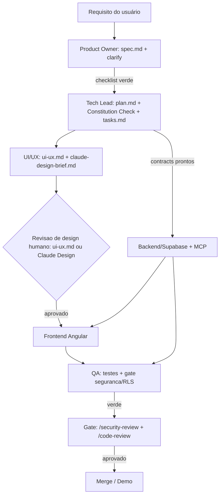

# Esteira de Desenvolvimento do Faro

Pipeline de desenvolvimento orientado a Spec Kit, com subagentes especializados e os
portões (gates) de qualidade da [constituição](../.specify/memory/constitution.md).
Para **cada feature** (uma pasta `specs/NNN-*/`), o fluxo é o abaixo.

## Papéis (subagentes em `.claude/agents/`)

| Papel | Arquivo | Modelo | Responsabilidade |
|---|---|---|---|
| **Product Owner** | `product-owner.md` | opus | Requisito → `spec.md` (+ checklist), coerência com glossário e specs antigas |
| **Tech Lead / Arquiteto** | `tech-lead-planner.md` | opus | `spec.md` → `plan.md` (Constitution Check) + `data-model`/`contracts` + `tasks.md` |
| **UI/UX Designer** | `ui-ux-designer.md` | opus | `ui-ux.md` + `claude-design-brief.md` (por feature) + dono da identidade (`design-system.md`) |
| **Revisão de design (gate)** | — (humano + Claude Design) | — | Aprovar a tela **antes** de implementar (Gate 👁️) |
| **Frontend** | `frontend-angular.md` | sonnet | Implementa UI Angular 21 + PrimeNG Aura (Paleta C); usa skill `angular-developer` |
| **Backend/Supabase** | `backend-supabase.md` | sonnet | Migrations, RLS, Edge Functions, pool de códigos, billing port, Storage (usa **MCP Supabase**) |
| **QA** | `qa-engineer.md` | sonnet | Testes (unit/integração RLS/e2e) + **gate de segurança/RLS + Rescue-First** |
| **Revisão (gate)** | — (skills nativas) | — | `/security-review` + `/code-review` antes do merge (PII/RLS/pagamento/exposição) |

> Modelos são ajustáveis. PO e Tech Lead usam modelo forte (raciocínio); implementadores e QA usam Sonnet (velocidade).

## Fluxo por feature

1. **Requisito → Spec** (PO). Saída: `spec.md` + `checklists/requirements.md` verde. Gate: sem `[NEEDS CLARIFICATION]` crítico em aberto.
2. **Spec → Plano + Tarefas** (Tech Lead). Saída: `plan.md` (com **Constitution Check ✓**), `data-model.md`, `contracts/`, `tasks.md`. Gate: Constitution Check sem violação injustificada.
3. **Desenho de UI/UX** (UI/UX Designer). Saídas: `ui-ux.md` (telas/fluxos, estados, componentes PrimeNG, microcopy, a11y) **e** `claude-design-brief.md` (prompt p/ o Claude Design, escopado à feature). Roda **em paralelo** ao Backend.
4. **Revisão de design — GATE humano** 👁️. Você avalia a tela **antes** de implementar: (a) lê o `ui-ux.md`, ou (b) cola o `claude-design-brief.md` no **Claude Design**, vê/itera o mockup e aprova (handoff volta ao Claude Code). O Frontend só começa após o "aprovado".
5. **Implementação** (Backend + Frontend, **em paralelo**). Backend: schema/RLS/Edge/Storage (usa o **MCP Supabase**); Frontend: telas em Angular 21 + PrimeNG usando o **FaroPreset + `src/styles/faro-ds.css`**, seguindo o `ui-ux.md` (e o visual aprovado do Claude Design).
6. **Testes & qualidade** (QA). Gate **bloqueante**: isolamento multi-tenant, anon-só-projeção, anti-enumeração, **Rescue-First com assinatura inativa**, scan de segredos.
7. **Revisão final** (gate humano): rodar `/security-review` e `/code-review` quando o diff tocar PII/RLS/pagamento/exposição pública (exigência da constituição).
8. **Merge/Demo**.

## Mecânica (por que assim)

- **Skills `speckit-*` são user-invocable-only** (`disable-model-invocation: true`): subagentes não as invocam. PO e Tech Lead **executam o procedimento** lendo os templates em `.specify/templates/`. Você (humano) pode rodar `/speckit.specify`, `/speckit.plan`, etc. diretamente quando quiser a execução "oficial" da skill.
- **`angular-developer` é model-invocável** e fica **pré-carregada** no Frontend e no QA (campo `skills:`), funcionando como roteador para as referências em `.agents/skills/angular-developer/references/`.
- **Precedência** para qualquer agente: **constituição > docs do projeto > defaults genéricos de skill** (ex.: usamos PrimeNG Aura — não Tailwind; Playwright — não Cypress; Vitest).
- **MCP do Supabase**: o `backend-supabase` declara `mcpServers: [supabase]` (de `.mcp.json`) e ganha as ferramentas do MCP sem precisar listá-las em `tools`. O `.mcp.json` é *project-scoped*: **aprove o servidor uma vez na sessão** (a aprovação vale para os subagentes).
- **Loop do Claude Design (opcional, visual)**: o `ui-ux-designer` gera um `claude-design-brief.md` por feature; você o cola no **Claude Design** (claude.ai), que desenha as telas usando o design system Faro; você revisa/aprova e usa "entregar para o Claude Code". O `frontend-angular` reimplementa em PrimeNG/Angular (o HTML do Claude Design é referência, não produção). O design system já implementado vive em `src/styles/faro-ds.css` + `src/theme/faro-preset.ts`.
- **Carregar os agentes**: como foram criados como arquivos, **reinicie a sessão** (ou use `/agents`) para que apareçam como `subagent_type`.

## Como acionar

- Por menção/descrição: descreva a tarefa e o harness delega ao agente cujo `description` casa.
- Explicitamente: via ferramenta Agent com `subagent_type: product-owner | tech-lead-planner | ui-ux-designer | frontend-angular | backend-supabase | qa-engineer`.
- **Orquestração**: o loop principal (ou um Workflow) conduz o fluxo e respeita os gates; Backend (4) e Frontend (4) podem rodar concorrentes.

## Decisões e padrões de referência

- Decisões tomadas × em aberto: [docs/README.md](README.md) (fonte única).
- Glossário e guard-rails: [CLAUDE.md](../CLAUDE.md).
- Convenção de teste: `data-testid="<feature>-<elemento>"`. Pastas de feature em inglês (`pets`, `health-records`, `subscription`, `reminders`, `admin`, `public`).
