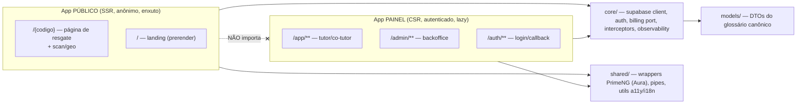
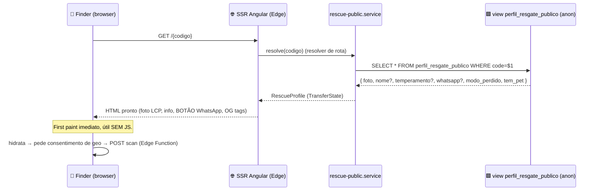
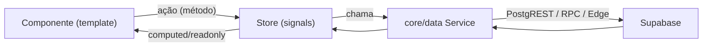
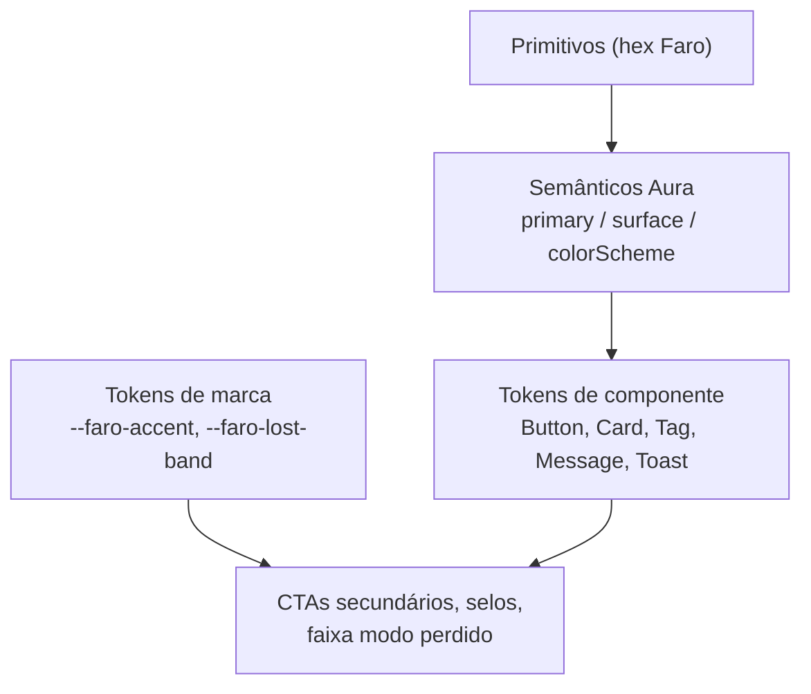
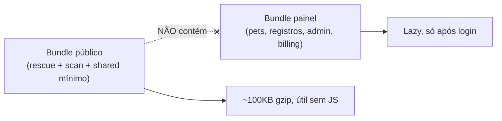
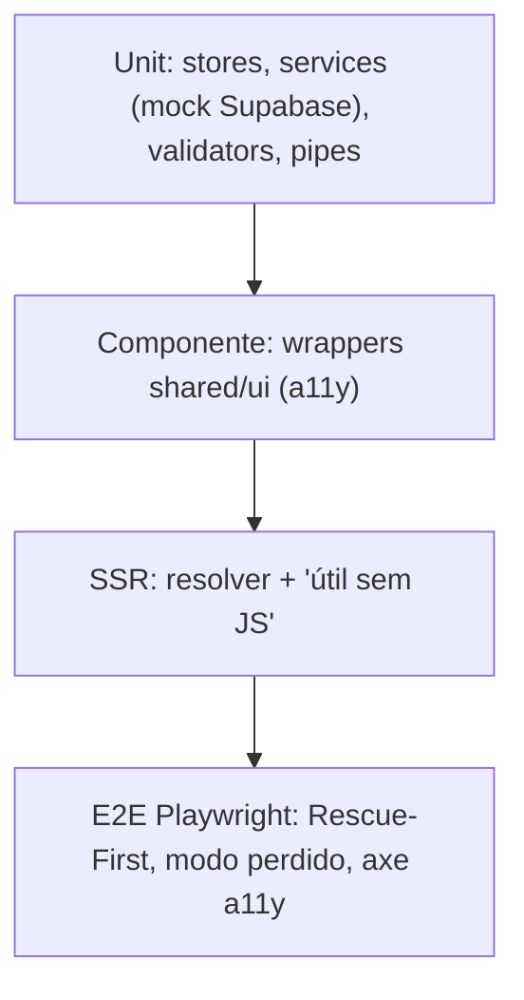

# Arquitetura de Frontend — Faro

> **Documento de Arquitetura de Frontend** do Faro — SaaS de cuidado, saúde e **resgate de pets** via QR Code.
>
> **Status**: v1.0 (referência do MVP) · **Data**: 2026-06-03 · **Autor**: Especialista Frontend (Angular 21 + PrimeNG Aura)
>
> **Fontes de verdade que este documento NÃO contradiz** (em conflito, elas vencem):
> - `.specify/memory/constitution.md` (princípios inegociáveis — Rescue-First, LGPD, RLS-first)
> - `CLAUDE.md` (guidance de runtime, stack, convenções de dados/segurança, glossário)
> - `docs/architecture.md` (arquitetura de solução: renderização híbrida, segurança, fluxos, ADRs)
> - `docs/design-system.md` (paleta, tokens, tipografia, microcopy, UX)
>
> Este documento detalha **COMO o frontend Angular é estruturado e implementado**. O O QUÊ/POR QUÊ vive nas specs (`specs/NNN-nome/`); decisões técnicas por feature vivem nos `plan.md`.

---

## Índice

1. [Princípios que guiam o frontend](#1-princípios-que-guiam-o-frontend)
2. [Estrutura de projeto](#2-estrutura-de-projeto)
3. [Roteamento e renderização (SSR vs CSR)](#3-roteamento-e-renderização-ssr-vs-csr)
4. [Estado: signals + zoneless](#4-estado-signals--zoneless)
5. [Camada de dados (core/)](#5-camada-de-dados-core)
6. [Integração do Design System (tema Aura)](#6-integração-do-design-system-tema-aura)
7. [Componentes e wrappers PrimeNG; formulários](#7-componentes-e-wrappers-primeng-formulários)
8. [PWA e i18n](#8-pwa-e-i18n)
9. [Performance e acessibilidade](#9-performance-e-acessibilidade)
10. [Ganchos para testes](#10-ganchos-para-testes)
11. [Questões em aberto](#11-questões-em-aberto)

---

## 1. Princípios que guiam o frontend

Estes princípios decidem qualquer dúvida de implementação:

1. **Rescue-First (invariante):** a rota pública `/{codigo}` e o botão WhatsApp funcionam **com ou sem JS**, **independentemente do status da assinatura**. O bundle do painel **nunca** é carregado na rota pública. A página de resgate é **server-rendered** e útil já no primeiro paint.
2. **Two-bundle mindset:** existem dois aplicativos lógicos no mesmo workspace — **público** (SSR, enxuto, anônimo) e **painel** (CSR, autenticado, rico). A fronteira entre eles é física (lazy boundaries) e de dependências (`features/public/` não importa nada do painel).
3. **Banco é a fonte de verdade:** validação no cliente é UX; autorização real é RLS (`docs/architecture.md` §3). Guards e validadores nunca substituem políticas no banco.
4. **Signals + zoneless:** estado reativo com signals; sem `zone.js` quando viável. Sem `any`; TypeScript estrito.
5. **Acesso a dados só via `core/`:** nenhuma view chama o cliente Supabase diretamente (CLAUDE.md). Serviços encapsulam queries, RPC e Edge Functions.
6. **Mobile-first + WCAG 2.1 AA:** uma ação primária por tela, alvos ≥ 44px, contraste validado (design-system §3/§7).



---

## 2. Estrutura de projeto

Standalone components em todo lugar (sem `NgModule`). Organização por camadas alinhada ao `CLAUDE.md` e ao mapa de módulos de `docs/architecture.md` §8.

```text
pet-app/
├── src/
│   ├── main.ts                     # bootstrapApplication (cliente)
│   ├── main.server.ts              # bootstrap SSR
│   ├── server.ts                   # handler @angular/ssr (Node/Worker)
│   ├── index.html
│   ├── manifest.webmanifest        # PWA
│   ├── styles/
│   │   ├── styles.css              # reset + tokens de marca (CSS vars)
│   │   └── faro-tokens.css         # --faro-* (design-system §8)
│   ├── locale/
│   │   ├── messages.pt-BR.xlf      # i18n (PT-BR, idioma fonte)
│   │   └── messages.en.xlf         # (preparado p/ EN; vazio no MVP)
│   └── app/
│       ├── app.ts                  # AppComponent (root, standalone)
│       ├── app.config.ts           # providers CSR (router, http, primeng, i18n)
│       ├── app.config.server.ts    # providers SSR (mergeApplicationConfig)
│       ├── app.routes.ts           # rotas raiz + lazy boundaries
│       ├── app.routes.server.ts    # render mode por rota (ServerRoute[])
│       │
│       ├── core/                   # infra transversal e PORTAS (singletons)
│       │   ├── supabase/
│       │   │   ├── supabase-client.ts        # factory do client (anon key)
│       │   │   ├── supabase.types.ts         # tipos gerados do schema (supabase gen types)
│       │   │   └── query.helpers.ts          # wrappers tipados de PostgREST/RPC
│       │   ├── auth/
│       │   │   ├── auth.store.ts              # signals: sessão, user, role
│       │   │   ├── auth.service.ts            # signIn/signOut/OAuth/refresh
│       │   │   ├── auth.guard.ts              # CanMatch p/ /app
│       │   │   ├── admin.guard.ts             # CanMatch p/ /admin (role=admin)
│       │   │   └── anon.guard.ts              # CanMatch p/ /auth (redireciona logado)
│       │   ├── billing/
│       │   │   ├── billing.port.ts            # interface BillingPort (ADR-002)
│       │   │   └── billing.edge.adapter.ts    # invoca Edge Function (checkout/portal)
│       │   ├── data/                          # serviços de domínio (1 por agregado)
│       │   │   ├── pets.service.ts
│       │   │   ├── health-records.service.ts
│       │   │   ├── tags.service.ts            # claim_tag RPC, pool (admin)
│       │   │   ├── subscription.service.ts
│       │   │   ├── reminders.service.ts
│       │   │   ├── rescue-public.service.ts   # SÓ projeção pública (SSR/anon)
│       │   │   └── scan.service.ts            # POST scan → Edge Function
│       │   ├── interceptors/
│       │   │   ├── error.interceptor.ts       # mapeia erro → mensagem PT-BR
│       │   │   └── auth-header.interceptor.ts # injeta JWT quando aplicável
│       │   ├── i18n/
│       │   │   └── locale.providers.ts        # LOCALE_ID, registerLocaleData(pt)
│       │   └── observability/
│       │       └── logger.ts                  # log estruturado client-side
│       │
│       ├── shared/                 # reutilizáveis SEM dependência de feature
│       │   ├── ui/                            # wrappers PrimeNG + tema Aura
│       │   │   ├── faro-button/               # CTA padrão (resgate usa variante)
│       │   │   ├── faro-field/                # label + control + erro (a11y)
│       │   │   ├── faro-card/
│       │   │   ├── faro-empty-state/          # estados vazios (design-system §2.5b)
│       │   │   ├── faro-confirm/              # confirmação destrutiva
│       │   │   └── faro-skeleton/
│       │   ├── pipes/
│       │   │   ├── date-br.pipe.ts            # dd/MM/yyyy
│       │   │   └── species.pipe.ts
│       │   ├── a11y/
│       │   │   └── focus-trap.directive.ts
│       │   └── forms/
│       │       └── validators.ts             # validadores PT-BR (espelham constraints)
│       │
│       ├── features/
│       │   ├── public/             # 🔓 ROTA SSR — NÃO importa nada do painel
│       │   │   ├── landing/                     # / — landing/marketing (prerender), SEPARADA do resgate
│       │   │   │   └── landing.ts
│       │   │   ├── rescue-page/
│       │   │   │   ├── rescue-page.ts         # render projeção pública + WhatsApp
│       │   │   │   ├── rescue-page.html
│       │   │   │   └── rescue-meta.ts         # Open Graph / Title dinâmicos (SSR)
│       │   │   ├── scan/
│       │   │   │   └── scan-geo.ts            # consentimento geo + scan.service
│       │   │   └── public.routes.ts
│       │   ├── pets/
│       │   ├── health-records/                # RegistroDeSaude
│       │   ├── subscription/                  # planos, checkout, status
│       │   ├── reminders/
│       │   └── admin/                          # pool de tags, realocação, fila de scans
│       │
│       ├── models/                 # tipos/DTOs do GLOSSÁRIO canônico
│       │   ├── pet.model.ts
│       │   ├── tag-code.model.ts
│       │   ├── subscription.model.ts          # status: trial|ativo|carencia|inativo|cancelado
│       │   ├── health-record.model.ts
│       │   ├── rescue-profile.model.ts        # projeção pública + visibilidade + modo perdido
│       │   ├── scan-event.model.ts
│       │   └── index.ts
│       └── environments/
│           ├── environment.ts                 # anon key + supabase url (públicas)
│           └── environment.prod.ts
└── ...  (supabase/, .specify/, docs/, CLAUDE.md — ver architecture.md §8)
```

**Regra de dependência (imposta por convenção e, idealmente, por lint de boundaries):**

| De → Para | `core/` | `shared/` | `models/` | `features/*` | `features/public` |
|---|---|---|---|---|---|
| `features/*` (painel) | ✅ | ✅ | ✅ | ❌ (entre features) | ❌ |
| `features/public` | ✅ (só `rescue-public`, `scan`, `i18n`, `observability`) | ✅ | ✅ | ❌ | — |
| `core/` | (interno) | ❌ | ✅ | ❌ | ❌ |
| `shared/` | ❌ | (interno) | ✅ | ❌ | ❌ |

> **Por que `features/public` tem acesso restrito a `core/`:** para não arrastar o `subscription.service`, `auth.store` etc. para o bundle público (Rescue-First + orçamento de performance, architecture §6.4). Recomenda-se uma regra de `eslint` (`no-restricted-imports` ou `@nx/enforce-module-boundaries` se adotar Nx) que falhe o build se `features/public/**` importar de `features/(pets|admin|subscription|...)` ou de `core/billing`/`core/auth`.

---

## 3. Roteamento e renderização (SSR vs CSR)

Angular 21 com **render mode por rota** via `@angular/ssr`. Segue a tabela de `docs/architecture.md` §2.1 (não contradizer).

### 3.1 Render mode por rota

`app.routes.server.ts` declara o modo de cada padrão de rota:

```ts
// app.routes.server.ts
import { RenderMode, ServerRoute } from '@angular/ssr';

export const serverRoutes: ServerRoute[] = [
  // Landing: estática, sem dados dinâmicos → pré-render em build (SEO, carga instantânea)
  { path: '', renderMode: RenderMode.Prerender },

  // Página de resgate: vínculo code→pet muda em runtime → SSR por requisição
  { path: ':codigo', renderMode: RenderMode.Server },
  { path: ':codigo/perdido', renderMode: RenderMode.Server },

  // Painel, admin e auth: CSR puro (sem ganho de SSR; dados sensíveis)
  { path: 'app/**', renderMode: RenderMode.Client },
  { path: 'admin/**', renderMode: RenderMode.Client },
  { path: 'auth/**', renderMode: RenderMode.Client },

  // Fallback
  { path: '**', renderMode: RenderMode.Server },
];
```

```ts
// app.routes.ts — lazy boundaries garantem que o painel não entra no bundle público
import { Routes } from '@angular/router';
import { authGuard } from './core/auth/auth.guard';
import { adminGuard } from './core/auth/admin.guard';
import { anonGuard } from './core/auth/anon.guard';

export const routes: Routes = [
  // Público (SSR/prerender)
  {
    path: '',
    loadComponent: () => import('./features/public/landing/landing'),
  },
  {
    path: 'auth',
    canMatch: [anonGuard],
    loadChildren: () => import('./features/auth/auth.routes'),
  },
  {
    path: 'app',
    canMatch: [authGuard],
    loadChildren: () => import('./features/app.routes'), // tutor/co-tutor
  },
  {
    path: 'admin',
    canMatch: [adminGuard],
    loadChildren: () => import('./features/admin/admin.routes'),
  },

  // IMPORTANTE: rota de código é a ÚLTIMA (catch-all de 1 segmento) para não colidir
  // com /auth, /app, /admin. O guard de código valida o dígito verificador (anti-enumeração).
  {
    path: ':codigo',
    loadChildren: () => import('./features/public/public.routes'),
  },
];
```

> **Ordem das rotas é load-bearing:** `:codigo` precisa vir **depois** de `auth`/`app`/`admin`, senão capturaria `/auth` como um "código". Os segmentos reservados (`auth`, `app`, `admin`) são exclusões; um `matcher` adicional pode reforçar isso, mas a ordem já resolve no MVP.

### 3.2 Fluxo SSR da página de resgate (sem bloquear o first paint)

A página de resgate deve ser **útil sem JS** (architecture §2.3). O servidor busca a projeção pública; geo e mapa são enriquecimentos pós-hidratação.



- **Resolver de rota (`rescue.resolver.ts`)** roda no servidor, busca via `rescue-public.service` e grava em **`TransferState`** para o cliente não re-buscar.
- **Open Graph / Title dinâmicos:** `rescue-meta.ts` usa `Meta`/`Title` (Angular) no servidor para o preview de link no WhatsApp refletir o pet atual (architecture §2.2).
- **WhatsApp e info essencial vêm no HTML** (não dependem de JS). O `wa.me` é um `<a href>` montado server-side com a mensagem pré-definida (design-system §2.5e).
- **`provideClientHydration()` com hidratação incremental** e `withEventReplay()` para capturar cliques antes da hidratação completa.

### 3.3 Hidratação e Transfer State

```ts
// app.config.ts (trecho)
provideClientHydration(
  withIncrementalHydration(),   // hidrata sob demanda (defer) — mantém o painel longe da rota pública
  withEventReplay(),            // não perde o clique no CTA durante a hidratação
),
```

- A foto do pet (LCP) é prioridade: `NgOptimizedImage` com `priority` na imagem principal; demais imagens `loading="lazy"`.
- O bloco de mapa do scan usa `@defer (on interaction)` para só carregar tiles após o usuário pedir (orçamento de performance, architecture §6.4).

---

## 4. Estado: signals + zoneless

### 4.1 Zoneless

```ts
// app.config.ts (trecho)
import { provideZonelessChangeDetection } from '@angular/core';

export const appConfig: ApplicationConfig = {
  providers: [
    provideZonelessChangeDetection(),
    // ...
  ],
};
```

Sem `zone.js` no `polyfills`. Toda reatividade passa por **signals**; chamadas assíncronas atualizam signals (não dependemos de monkey-patching de zona). Isso reduz o JS inicial e melhora a previsibilidade — crítico para o bundle público.

### 4.2 Padrão de store (signal store leve, sem libs externas)

Stores são serviços `@Injectable` com signals privados (`signal`/`computed`) e API pública somente-leitura. Padrão para o MVP (YAGNI — sem NgRx):

```ts
// core/auth/auth.store.ts
import { Injectable, computed, signal } from '@angular/core';
import type { Session, User } from '../supabase/supabase.types';

type Role = 'tutor' | 'cotutor' | 'admin';

@Injectable({ providedIn: 'root' })
export class AuthStore {
  // estado privado (escrita só aqui dentro)
  private readonly _session = signal<Session | null>(null);
  private readonly _loading = signal(true);

  // seletores públicos (somente leitura)
  readonly session = this._session.asReadonly();
  readonly user = computed<User | null>(() => this._session()?.user ?? null);
  readonly isAuthenticated = computed(() => this.user() !== null);
  readonly role = computed<Role | null>(
    () => (this.user()?.app_metadata?.['role'] as Role) ?? null,
  );
  readonly loading = this._loading.asReadonly();

  // mutadores (chamados pelo AuthService)
  setSession(s: Session | null) { this._session.set(s); this._loading.set(false); }
  clear() { this._session.set(null); }
}
```

```ts
// features/pets/pets.store.ts — store de feature, escopo da rota (providers da rota)
@Injectable()
export class PetsStore {
  private readonly api = inject(PetsService);
  private readonly _state = signal<{ pets: Pet[]; status: 'idle'|'loading'|'error'; error?: string }>(
    { pets: [], status: 'idle' },
  );
  readonly pets = computed(() => this._state().pets);
  readonly status = computed(() => this._state().status);

  async load() {
    this._state.update(s => ({ ...s, status: 'loading' }));
    try {
      const pets = await this.api.listMine();           // core/data
      this._state.set({ pets, status: 'idle' });
    } catch (e) {
      this._state.update(s => ({ ...s, status: 'error', error: String(e) }));
    }
  }
}
```

**Regras de estado:**
- **Stores globais** (`providedIn: 'root'`): sessão/auth, preferências de UI (tema claro/escuro), toasts. Poucos e bem definidos.
- **Stores de feature**: providos no array `providers` da **rota** (escopo de rota), destruídos ao sair — evita estado órfão.
- **Data fetching:** assíncrono via serviços `core/data`; o resultado popula signals. `resource()`/`rxResource` do Angular pode ser usado onde houver fetch declarativo dependente de signal (ex.: filtro reativo), mas o MVP pode começar com `async load()` explícito.
- **Derivações** sempre com `computed`; efeitos colaterais com `effect` (com parcimônia — preferir fluxo de dados explícito).



---

## 5. Camada de dados (core/)

Toda I/O passa por `core/` (CLAUDE.md). A view nunca toca o cliente Supabase.

### 5.1 Cliente Supabase (anon key)

```ts
// core/supabase/supabase-client.ts
import { InjectionToken } from '@angular/core';
import { createClient, SupabaseClient } from '@supabase/supabase-js';
import { environment } from '../../environments/environment';
import type { Database } from './supabase.types';

export const SUPABASE = new InjectionToken<SupabaseClient<Database>>('SUPABASE');

export function supabaseFactory(): SupabaseClient<Database> {
  return createClient<Database>(environment.supabaseUrl, environment.supabaseAnonKey, {
    auth: {
      // No SSR, NÃO persistir sessão em storage do servidor (sem PII no servidor público).
      persistSession: typeof window !== 'undefined',
      autoRefreshToken: typeof window !== 'undefined',
      detectSessionInUrl: typeof window !== 'undefined',
    },
  });
}
```

> Apenas a **`anon key`** (pública por design) vive no cliente/SSR. `service_role` e demais segredos ficam **só em Edge Functions** (architecture §3.4, ADR-007). Os tipos `Database` são gerados (`supabase gen types typescript`) para tipagem ponta a ponta — proíbe `any`.

### 5.2 Serviço de domínio (exemplo: pets)

```ts
// core/data/pets.service.ts
@Injectable({ providedIn: 'root' })
export class PetsService {
  private readonly db = inject(SUPABASE);

  async listMine(): Promise<Pet[]> {
    // RLS garante que só vêm os pets do auth.uid() (e co-tutoria). O cliente NÃO filtra por tutor.
    const { data, error } = await this.db.from('pets').select('*').order('created_at');
    if (error) throw mapPgError(error);
    return (data ?? []).map(toPet);
  }

  async claimTag(code: string, petId: string): Promise<void> {
    // RPC ATÔMICO (architecture §4.1). O frontend só dispara; a corrida é resolvida no banco.
    const { error } = await this.db.rpc('claim_tag', { p_code: code, p_pet_id: petId });
    if (error) throw mapPgError(error);
  }
}
```

### 5.3 Serviço público de resgate (SSR/anon) — isolado

```ts
// core/data/rescue-public.service.ts
@Injectable({ providedIn: 'root' })
export class RescuePublicService {
  private readonly db = inject(SUPABASE);

  // LÊ APENAS a view whitelisted; nunca a tabela pets crua (architecture §3.2).
  async getProfile(code: string): Promise<RescueProfile | null> {
    const { data, error } = await this.db
      .from('perfil_resgate_publico')
      .select('code, nome, foto_url, temperamento, whatsapp, modo_perdido, recompensa_texto, tem_pet')
      .eq('code', code)
      .maybeSingle();
    if (error) throw mapPgError(error);
    return data ? toRescueProfile(data) : null;
  }
}
```

> Este serviço **não** importa `auth.store` nem `subscription.service`. A página de resgate **não consulta a assinatura** (Rescue-First / ADR-003); o status só roteia o alerta de scan na Edge Function.

### 5.4 Porta de billing agnóstica (ADR-002)

```ts
// core/billing/billing.port.ts
export interface BillingPort {
  createCheckout(planId: string): Promise<{ url: string }>;
  openCustomerPortal(): Promise<{ url: string }>;
}
export const BILLING = new InjectionToken<BillingPort>('BILLING');
```

```ts
// core/billing/billing.edge.adapter.ts — invoca Edge Function (segredo no servidor)
@Injectable({ providedIn: 'root' })
export class BillingEdgeAdapter implements BillingPort {
  private readonly db = inject(SUPABASE);
  async createCheckout(planId: string) {
    const { data, error } = await this.db.functions.invoke('billing-checkout', { body: { planId } });
    if (error) throw mapPgError(error);
    return data as { url: string };
  }
  async openCustomerPortal() {
    const { data, error } = await this.db.functions.invoke('billing-portal', {});
    if (error) throw mapPgError(error);
    return data as { url: string };
  }
}
// provider: { provide: BILLING, useClass: BillingEdgeAdapter }
```

O domínio depende de `BILLING` (interface); trocar Stripe↔Asaas não altera o frontend — só o adaptador/Edge Function.

### 5.5 Guards (UX; autorização real é RLS)

```ts
// core/auth/auth.guard.ts
export const authGuard: CanMatchFn = () => {
  const auth = inject(AuthStore);
  const router = inject(Router);
  return auth.isAuthenticated() ? true : router.parseUrl('/auth/login');
};

// core/auth/admin.guard.ts
export const adminGuard: CanMatchFn = () => {
  const auth = inject(AuthStore);
  const router = inject(Router);
  return auth.role() === 'admin' ? true : router.parseUrl('/app');
};
```

> Guards são `CanMatch` (não só `CanActivate`) para impedir o **download do chunk** do painel/admin por quem não tem acesso — melhora performance e reduz superfície. Mas a defesa real é a RLS no banco (architecture §3.5); um guard burlado não dá acesso a dados.

### 5.6 Interceptors

```ts
// core/interceptors/error.interceptor.ts — traduz erros técnicos em mensagem PT-BR amigável
export const errorInterceptor: HttpInterceptorFn = (req, next) =>
  next(req).pipe(
    catchError((err: HttpErrorResponse) => {
      // Sem stack trace ao usuário (constituição §VII). Toast amigável + log estruturado.
      inject(Logger).error('http_error', { url: req.url, status: err.status });
      inject(ToastService).show(messageFor(err)); // usa microcopy do design-system §2.6
      return throwError(() => err);
    }),
  );
```

- `auth-header.interceptor`: o SDK Supabase já injeta o JWT nas chamadas PostgREST; o interceptor cobre apenas chamadas HTTP diretas (ex.: webhooks de leitura, assets assinados).
- `provideHttpClient(withFetch(), withInterceptors([...]))` — `withFetch` para compatibilidade SSR.

---

## 6. Integração do Design System (tema Aura)

Aplica `docs/design-system.md` (§3.3 e §8). PrimeNG v4 (token system: *primitive → semantic → component*).

### 6.1 Preset Aura customizado (Paleta C — Índigo + Lima, selecionada)

```ts
// app.config.ts (trecho) — ver design-system.md §3.3 para a paleta completa
import { providePrimeNG } from 'primeng/config';
import Aura from '@primeng/themes/aura';
import { definePreset } from '@primeng/themes';

const FaroPreset = definePreset(Aura, {
  semantic: {
    // Primária = Índigo (Paleta C selecionada)
    primary: {
      50:'#EAEDFB',100:'#CBD3F5',200:'#A6B3EE',300:'#7B8CE4',400:'#566DDD',
      500:'#3A4FD6',600:'#2D3CAC',700:'#212C80',800:'#171E58',900:'#0E1336',950:'#080B20',
    },
    colorScheme: {
      light: {
        primary: { color:'{primary.500}', contrastColor:'#ffffff',
                   hoverColor:'{primary.600}', activeColor:'{primary.700}' },
        surface: { 0:'#ffffff', 50:'#F7F8F8', 100:'#EEF0F1', 200:'#E2E5E7' },
      },
      dark: {
        primary: { color:'{primary.400}', contrastColor:'#080B20',
                   hoverColor:'{primary.300}', activeColor:'{primary.200}' },
        surface: { 0:'#0F1417', 50:'#161C20', 100:'#1E262B', 200:'#2A343A' },
      },
    },
  },
});

providePrimeNG({
  theme: { preset: FaroPreset, options: { darkModeSelector: '.faro-dark', cssLayer: { name: 'primeng', order: 'tailwind-base, primeng, faro' } } },
});
```

> A paleta selecionada é a **C (Índigo + Lima)** (design-system §3.3/§9). No Índigo o tom 500 (`#3A4FD6`) já passa AA-normal com texto branco. O **verde-lima/accent** NÃO é a primária do Aura — é token de marca (`--faro-accent: #7FBF3F`) aplicado a CTAs secundários, selos e à **faixa do modo perdido**. A faixa do modo perdido (`--faro-lost-band`) continua **âmbar** de urgência calma — nunca a primária (índigo) nem `danger` vermelho (design-system §3.2).

### 6.2 Tokens de marca (CSS vars) e tipografia

`src/styles/faro-tokens.css` define os `--faro-*` de design-system §8 (cores de marca, semânticas, raios, sombras, `--faro-touch-min: 44px`). Fontes **Poppins** (display) + **Inter** (texto), self-hosted com `font-display: swap` e subset `latin`+`latin-ext` (acentos PT-BR) para não bloquear o LCP da página de resgate.

### 6.3 Dark mode

`darkModeSelector: '.faro-dark'` (classe na raiz). Um `ThemeStore` (signal) alterna a classe respeitando `prefers-color-scheme` como default. A **página de resgate pública** usa **tema claro fixo** no MVP (previsibilidade do preview de link e do contraste em rua/sol); dark mode é recurso do painel.



---

## 7. Componentes e wrappers PrimeNG; formulários

### 7.1 Quando criar wrapper (`shared/ui/`)

Padronizar via wrapper quando houver **repetição** + **regra de marca/a11y** (CLAUDE.md). Não envelopar por envelopar (YAGNI).

| Wrapper | Encapsula | Por quê |
|---|---|---|
| `faro-button` | `p-button` | Tamanho mínimo 44px, variantes (`primary`/`secondary`/`rescue`), estado `loading` padrão |
| `faro-field` | `label` + control + `p-message` de erro | A11y consistente (`for`/`id`, `aria-describedby`), uma fonte de erro |
| `faro-card` | `p-card` | Raio `--faro-radius-lg`, sombra de marca |
| `faro-empty-state` | layout + ilustração + CTA | Microcopy de estado vazio (design-system §2.5b) |
| `faro-confirm` | `p-confirmDialog` | Confirmação destrutiva com microcopy padrão (§2.6) |
| `faro-skeleton` | `p-skeleton` | Loading states consistentes |

O **CTA da página de resgate** é uma variante especial (`rescue`) do `faro-button`: grande, fixo (bottom-anchored), alvo ampliado — é o ativo mais importante (design-system §7.1/§7.3).

### 7.2 Reactive forms + validação

Reactive forms tipados; validadores em `shared/forms/validators.ts` **espelham** as constraints do banco (banco é a verdade — CLAUDE.md).

```ts
// exemplo: formulário de pet
form = inject(NonNullableFormBuilder).group({
  nome: ['', [Validators.required, Validators.maxLength(60)]],
  especie: this.fb.control<'cao' | 'gato'>('cao', { validators: [Validators.required] }),
  temperamento: ['', [Validators.maxLength(120)]],
});
```

- Erros exibidos via `faro-field` com `aria-describedby` (a11y, design-system §7.2). Mensagens pela microcopy de validação inline (§2.6: específica, sem culpar o usuário).
- **Toggles de visibilidade/consentimento** (`vis_*`, `contato_optin`) com preview "como estranhos verão" (LGPD por design, design-system §7.3). Default **privado**.

---

## 8. PWA e i18n

### 8.1 PWA (instalável, offline básico)

- `@angular/pwa` (`provideServiceWorker('ngsw-worker.js', { enabled: !isDevMode() })`).
- **Manifest:** ícones maskable 192/512px (símbolo Pata-Farol, design-system §5.3), `display: standalone`, `lang: pt-BR`, `theme_color` = `--faro-primary`.
- **Estratégia de cache (`ngsw-config.json`):**
  - **App shell do painel:** `prefetch` (instalável/offline básico).
  - **Rota pública de resgate `/{codigo}`:** **freshness/network-first** — o conteúdo de resgate **não pode** servir cache desatualizado (modo perdido, realocação de tag). Curto fallback de cache só para resiliência total de rede.
  - Assets versionados (`hashed`): cache longo.

```jsonc
// ngsw-config.json (trecho conceitual)
{
  "dataGroups": [
    {
      "name": "rescue-api",
      "urls": ["/rest/v1/perfil_resgate_publico**"],
      "cacheConfig": { "strategy": "freshness", "maxAge": "5m", "timeout": "3s", "maxSize": 50 }
    }
  ]
}
```

### 8.2 i18n (PT-BR no MVP, pronto p/ EN/ES)

- **`@angular/localize`** com PT-BR como idioma fonte. Textos de UI via `i18n`/`$localize` — **nunca hardcoded** (architecture §6.2). Microcopy canônica vem do design-system §2.5.
- `LOCALE_ID = 'pt-BR'` + `registerLocaleData(localePt)` para datas/números/moeda BR (`DatePipe`, `CurrencyPipe`, `tabular-nums`).
- Build localizado por idioma (`i18n` no `angular.json`); EN/ES adicionados depois sem refatorar (só novos `.xlf`).
- A página de resgate emite `lang="pt-BR"` e **OG tags localizadas** (SSR) para preview de link correto.

---

## 9. Performance e acessibilidade

### 9.1 Performance — orçamentos (architecture §6.4)

| Métrica | Alvo | Como o frontend atinge |
|---|---|---|
| **LCP** ≤ 2.5s | foto do pet | `NgOptimizedImage` com `priority`; SSR entrega `` no HTML; WebP/AVIF via transform do Storage |
| **TTFB** ≤ 600ms | SSR | resolver enxuto (1 query à view), `TransferState`, sem chamadas em cascata |
| **JS inicial público** ≤ ~100KB gzip | rota `/{codigo}` | zoneless (sem zone.js), lazy boundaries, `features/public` não importa o painel |
| **Útil sem JS** | ✅ | HTML do SSR já tem info + WhatsApp (`<a href="wa.me/...">`) |

Táticas adicionais: `@defer (on interaction)` para o mapa do scan; `preconnect` para o domínio Supabase; code-splitting por rota; `withIncrementalHydration` para não hidratar o que não está em viewport.



### 9.2 Acessibilidade (WCAG 2.1 AA — design-system §7.2)

- Contraste validado (design-system §3); estados **nunca** comunicados só por cor (ícone + texto).
- Foco visível; navegação por teclado completa; `focus-trap` em dialogs (`shared/a11y`).
- `aria-label` em ícones-ação; `aria-hidden` em ícones decorativos (PrimeIcons).
- Erros de formulário associados ao campo (`aria-describedby`) via `faro-field`.
- `prefers-reduced-motion` respeitado; HTML semântico + landmarks; `lang="pt-BR"`.
- Página de resgate navegável por leitor de tela: heading único (`Você encontrou o Thor?`), CTA como `<a>`/`<button>` real.

---

## 10. Ganchos para testes

### 10.1 Convenção de test ids

Atributo **`data-testid`** em elementos-chave (CTAs, campos, estados). Convenção: `data-testid="<feature>-<elemento>[-<variante>]"`.

| Elemento | `data-testid` |
|---|---|
| CTA WhatsApp (resgate) | `rescue-whatsapp-cta` |
| Faixa modo perdido | `rescue-lost-band` |
| Botão consentir geo | `scan-geo-consent` |
| Form pet — salvar | `pet-form-submit` |
| Toggle visibilidade nome | `pet-visibility-nome` |
| Botão claim de tag | `tag-claim-submit` |
| Banner carência | `subscription-grace-banner` |

> Em produção, os `data-testid` podem ser removidos por build (atributo stripping) se desejado — mas o custo é desprezível e ajuda QA.

### 10.2 Estrutura testável

- **Unit (Vitest/Jest + Testing Library Angular):** stores testados isoladamente (signals são fáceis de assertar); serviços `core/data` com cliente Supabase **mockado** (sem rede). Validadores e pipes 100% cobertos.
- **Componente:** wrappers `shared/ui` testados por comportamento (a11y: foco, `aria-*`).
- **DI para teste:** serviços via `InjectionToken` (`SUPABASE`, `BILLING`) facilitam substituir por fakes. A `BillingPort` permite testar fluxo de assinatura sem provedor real.
- **SSR:** teste do resolver de resgate garantindo que lê **só** a view pública e popula `TransferState`; teste de "útil sem JS" (snapshot do HTML SSR contém o `wa.me` e a foto).
- **E2E (Playwright):** cenário crítico Rescue-First — `/{codigo}` carrega e mostra o CTA WhatsApp **mesmo com assinatura simulada como `inativo`**; modo perdido mostra faixa âmbar (não vermelho).
- **A11y automatizado:** `axe` no E2E nas telas críticas (resgate, login, novo registro).



---

## 11. Questões em aberto

A **fonte única** das decisões é o `docs/README.md`. Status alinhado a design-system §9 e architecture §9:

**Decididas (sem ação pendente):**
1. **Paleta** — ✅ **C (Índigo + Lima)**. Define o `FaroPreset` (§6.1).
2. **Tipografia** — ✅ **Poppins + Inter** (self-host, subset `latin`+`latin-ext`).
3. **Test runner** — ✅ **Vitest** (velocidade e ESM, bom com standalone/signals/zoneless).
4. **Boundaries enforcement** — ✅ **eslint `no-restricted-imports`** para garantir que `features/public` não puxe o painel.
5. **Provedor de mapa** na página de resgate — ✅ **Leaflet + OpenStreetMap** (leve, sem chave no cliente) — afeta o `@defer` do scan (architecture §9.7).
6. **Estratégia de tema na página pública** — ✅ **claro fixo** (previsibilidade do preview de link e do contraste em rua/sol); dark mode do painel fica para fase posterior.

**Em aberto:**
7. **`resource()` vs `async load()`** — adotar a API `resource`/`rxResource` do Angular para data fetching declarativo já no MVP, ou manter `async load()` explícito e migrar depois.
