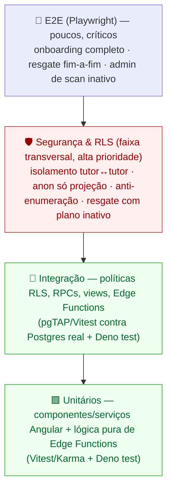
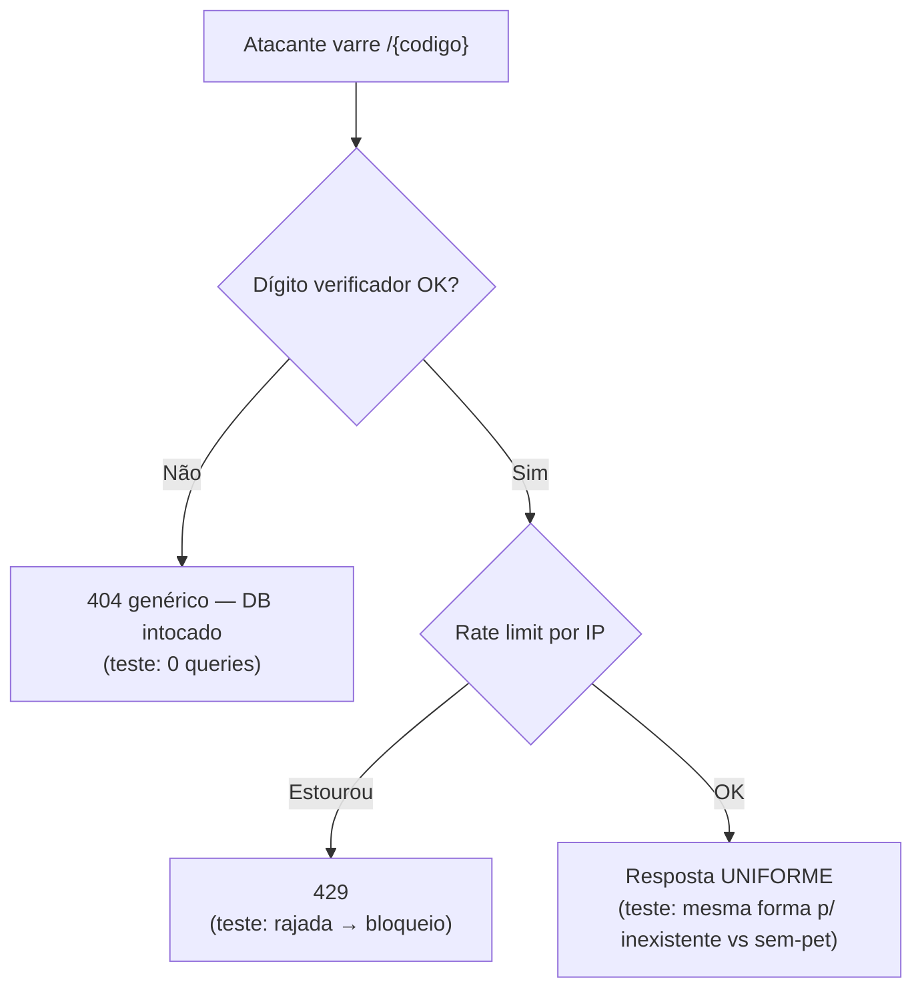
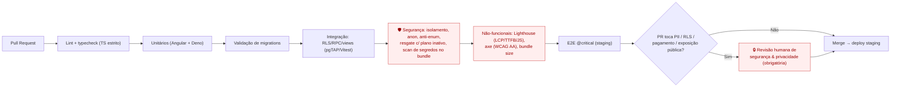

# Estratégia de Testes — Faro

> **Documento de Estratégia de Testes (QA)** do Faro — SaaS de cuidado, saúde e **resgate de pets** via QR Code.
>
> **Status**: v1.0 (referência de QA do MVP) · **Data**: 2026-06-03 · **Autor**: Engenharia de QA
>
> **Fontes de verdade que este documento NÃO contradiz** (em conflito, elas vencem):
> - `.specify/memory/constitution.md` (princípios inegociáveis — Rescue-First, LGPD, RLS-first, observabilidade)
> - `CLAUDE.md` (guidance de runtime, stack ativa, convenções de dados/segurança, glossário)
> - `docs/architecture.md` (renderização híbrida, segurança RLS-first, fluxos de dados, ADRs)
>
> Este documento descreve **COMO testamos** o Faro. O **O QUÊ/POR QUÊ** de cada feature vive nas specs (`specs/NNN-nome/`). Os critérios de aceitação concretos por user story serão preenchidos quando cada spec for gerada (roadmap 001–008); aqui definimos os **gabaritos de teste** que cada spec deverá satisfazer.

---

## Índice

1. [Princípios e filosofia de teste](#1-princípios-e-filosofia-de-teste)
2. [Pirâmide de testes e ferramentas por camada](#2-pirâmide-de-testes-e-ferramentas-por-camada)
3. [Testes de segurança e RLS (críticos)](#3-testes-de-segurança-e-rls-críticos)
4. [Testes de aceitação por user story (P1/P2/P3)](#4-testes-de-aceitação-por-user-story-p1p2p3)
5. [Testes não-funcionais (performance, a11y, LGPD)](#5-testes-não-funcionais-performance-a11y-lgpd)
6. [Dados de teste, ambientes e portões de CI](#6-dados-de-teste-ambientes-e-portões-de-ci)
7. [Cobertura mínima por feature do MVP](#7-cobertura-mínima-por-feature-do-mvp)
8. [Rastreabilidade e questões em aberto](#8-rastreabilidade-e-questões-em-aberto)

---

## 1. Princípios e filosofia de teste

A estratégia deriva diretamente dos princípios inegociáveis da constituição. Cada princípio vira uma **classe de teste obrigatória**:

| Princípio (constituição) | Implicação para QA | Tipo de teste dominante |
|---|---|---|
| **I. Rescue-First** (não-negociável) | A página de resgate e o WhatsApp **DEVEM** funcionar com assinatura `inativo`/`cancelado` e **sem JS**. O status só roteia o destino do alerta. | Integração (RLS/RPC) + E2E + SSR sem-JS |
| **II. LGPD por design** (não-negociável) | Só expõe campos consentidos; export/exclusão funcionam; geo só com consentimento e rotulada. | Integração (projeção pública) + E2E de consentimento |
| **III. RLS-first / segurança em profundidade** (não-negociável) | Isolamento entre tutores; `anon` não lê tabela crua; anti-enumeração; segredos só no servidor. | **Testes de segurança/RLS** (seção 3) |
| **V. Mobile-first / performance / a11y** | Orçamentos de performance da página de resgate; WCAG 2.1 AA. | Não-funcionais (Lighthouse/axe) |
| **VII. Observabilidade / auditoria** | Eventos sensíveis geram registro auditável (`scan`, plano, exclusão, realocação, claim). | Integração (verifica linha em `auditoria`/`ScanEvent`) |

**Invariantes que TODO teste deve respeitar (gates lógicos):**

1. **Resgate desacoplado de cobrança (ADR-003)** — nenhum teste pode "consertar" um bug fazendo a página de resgate consultar a `Assinatura` para *gating*. Existe um conjunto de testes de regressão dedicado a provar esse desacoplamento.
2. **Deny-by-default** — a ausência de policy é o estado seguro; testes de segurança partem da premissa de que `anon`/outro tutor **não** vê nada, e provam exceções controladas.
3. **Banco é a fonte de verdade** — toda validação testada na UI tem um espelho testado no banco (constraint/RLS/RPC). Teste de UI sozinho nunca "valida" uma regra de segurança.
4. **Tudo que tem segredo roda no servidor** — testes de cliente jamais exercitam chaves de pagamento/geo/SMTP; isso é coberto por testes de Edge Function com segredos mockados/injetados via env de teste.

---

## 2. Pirâmide de testes e ferramentas por camada

A forma é uma **pirâmide com um "diamante" de segurança embutido**: muitos testes unitários e de integração de RLS na base, E2E enxuto e focado em fluxos críticos no topo, e uma faixa horizontal espessa de **testes de segurança/RLS** que cortam várias camadas.



### 2.1 Camada unitária

**Alvo:** componentes e serviços Angular (lógica de apresentação, signals, guards, pipes, mapeadores de DTO, adaptadores da porta de billing) e **lógica pura** das Edge Functions (validação de dígito verificador, parsing/verificação de assinatura HMAC do webhook, decisão de roteamento de alerta, normalização de geo).

**Ferramentas:**
- **Angular**: runner padrão do Angular 21. Preferir **Vitest** (rápido, ESM, bom com standalone/signals) ou Karma+Jasmine se for o default do scaffold. Usar `TestBed` para componentes standalone, `provideExperimentalZonelessChangeDetection()` para validar comportamento zoneless, e testes de signal por estado computado.
- **Edge Functions (Deno)**: `deno test` com `@std/assert`. Isolar a lógica de negócio em funções puras testáveis (ex.: `routeAlert(status): 'tutor' | 'admin'`), separadas dos efeitos colaterais (DB/SMTP), que entram com test doubles.

**Diretrizes:**
- Testar **a decisão**, não o framework. Ex.: para o roteamento de alerta, uma tabela de casos cobre todos os status.
- Nunca chamar Supabase real em teste unitário — o acesso a dados é mockado no limite do serviço `core/`.
- Componentes da rota pública (`features/public/*`) testados também em modo **sem PII além do consentido** (entrada = DTO da projeção pública, nunca a entidade `Pet` crua).

```ts
// Exemplo (Deno) — roteamento de alerta por status da assinatura (ADR-003 / Princípio I)
import { assertEquals } from "jsr:@std/assert";
import { routeAlert } from "./route-alert.ts";

Deno.test("alerta vai ao TUTOR quando plano é ativo/trial/carência", () => {
  for (const s of ["trial", "ativo", "carencia"] as const) {
    assertEquals(routeAlert(s), "tutor");
  }
});

Deno.test("alerta vai ao ADMIN quando plano é inativo/cancelado (Rescue-First)", () => {
  for (const s of ["inativo", "cancelado"] as const) {
    assertEquals(routeAlert(s), "admin");
  }
});
```

```ts
// Exemplo (Angular) — botão WhatsApp aparece só com opt-in (LGPD), independente da assinatura
it("exibe WhatsApp quando há opt-in, mesmo com assinatura inativa", () => {
  const fixture = TestBed.createComponent(RescuePageComponent);
  fixture.componentRef.setInput("perfil", {
    code: "X", temPet: true, whatsapp: "+5511999999999", modoPerdido: false,
  });
  fixture.detectChanges();
  const btn = fixture.nativeElement.querySelector('[data-testid="rescue-whatsapp-cta"]');
  expect(btn).toBeTruthy();
});
```

### 2.2 Camada de integração

**Alvo (o coração da estratégia):** políticas **RLS**, **RPCs** (`claim_tag`, etc.), **views públicas** (`perfil_resgate_publico`), constraints/triggers de limite de plano, e **Edge Functions completas** contra um Postgres real.

**Ferramentas:**
- **pgTAP** rodando dentro do Supabase local (`supabase test db`) para asserções SQL de RLS/policies/RPC/constraints — é a forma mais fiel de testar segurança no banco.
- Alternativa/complemento em TypeScript: **Vitest** com o cliente `supabase-js` apontando para o stack local, criando sessões com JWTs de diferentes papéis (tutor A, tutor B, anon, admin) para provar isolamento de ponta a ponta do PostgREST.
- **Edge Functions**: `supabase functions serve` + testes que disparam requisições HTTP reais (incluindo webhook de pagamento com payload assinado), validando efeitos no DB (`ScanEvent`, `auditoria`, `assinaturas`).

**Diretrizes:**
- Cada policy nova tem teste **positivo** (dono acessa) e **negativo** (não-dono é negado). O teste negativo é o que protege o produto.
- Toda RPC `SECURITY DEFINER` tem teste de **abuso** (chamar com `pet_id` de outro tutor, código indisponível, condição de corrida).
- Webhook testado para **idempotência** (mesmo `event_id` 2x → 1 efeito) e **assinatura inválida** (rejeição).

```sql
-- Exemplo (pgTAP) — tutor B NÃO vê pet do tutor A (isolamento por RLS)
BEGIN;
SELECT plan(2);

-- Autentica como tutor B (helper de teste seta auth.uid())
SET LOCAL request.jwt.claims = '{"sub":"<uuid-tutor-B>","role":"authenticated"}';

SELECT is_empty(
  $$ SELECT 1 FROM pets WHERE tutor_id = '<uuid-tutor-A>' $$,
  'tutor B não enxerga pets do tutor A'
);

-- anon não consegue ler a tabela crua
SET LOCAL role anon;
SELECT throws_ok(
  $$ SELECT * FROM pets LIMIT 1 $$,
  '42501',  -- insufficient_privilege
  NULL,
  'anon é negado na tabela pets crua'
);

SELECT * FROM finish();
ROLLBACK;
```

### 2.3 Camada E2E

**Alvo:** os dois fluxos de negócio críticos completos, ponta a ponta, num navegador real, contra o stack de staging (ou local efêmero).

**Ferramenta:** **Playwright** (recomendado — multi-browser, mobile emulation, intercept de rede, contexto isolado por teste, suporte a `geolocation` e `permissions`). Cobre também a verificação de "útil sem JS" (`javaScriptEnabled: false`).

**Fluxos críticos E2E (mínimo do MVP):**

1. **Onboarding feliz:** cadastro → trial/checkout (provedor em sandbox) → criar pet → reivindicar (`claim`) código → ver QR/URL canônica.
2. **Resgate fim-a-fim:** abrir `/{codigo}` (mobile, rede lenta emulada) → ver info consentida + botão WhatsApp → conceder geo → POST scan → confirmar `ScanEvent` e notificação ao destino correto.
3. **Resgate com plano inativo (regressão Rescue-First):** mesmo fluxo do (2) com `assinatura=inativo` → página e WhatsApp ainda funcionam → alerta cai na **fila do Admin** (não no tutor).
4. **Modo perdido:** tutor ativa modo perdido → `/{codigo}/perdido` exibe recompensa/destaque → scan alerta o tutor com prioridade.

**Diretrizes E2E:**
- Tag `@critical` nos cenários acima — esses **bloqueiam o deploy de prod** se falharem.
- Usar seletores estáveis `data-testid="<feature>-<elemento>"` (padrão de `frontend.md` §10; nunca texto traduzível — respeita i18n).
- Reset de estado entre testes via seed transacional/`db reset` em ambiente efêmero (seção 6).
- Pagamentos sempre em **sandbox**; nunca tocar provedor live.

```ts
// Exemplo (Playwright) — Rescue-First: resgate funciona com plano inativo e SEM JS
test("@critical resgate é útil sem JS e com assinatura inativa", async ({ browser }) => {
  const ctx = await browser.newContext({ javaScriptEnabled: false });
  const page = await ctx.newPage();
  await page.goto(`/${codeComPlanoInativo}`);
  // HTML do SSR já traz info e contato — sem depender de hidratação
  await expect(page.getByTestId("rescue-pet-name")).toBeVisible();
  await expect(page.getByTestId("rescue-whatsapp-cta")).toHaveAttribute("href", /wa\.me/);
});
```

---

## 3. Testes de segurança e RLS (críticos)

Esta é a faixa de maior prioridade — um vazamento aqui compromete milhares de tutores e pets de uma vez (constituição, Princípio III). Estes testes são **obrigatórios em CI** e **bloqueiam merge** (seção 6). Todos partem do princípio **deny-by-default**: o padrão é negar; provamos as exceções.

### 3.1 Matriz de autorização (o "quem-pode-o-quê")

Cada célula vira um caso de teste de integração (positivo onde ✅, negativo onde ❌):

| Recurso / Operação | `anon` | Tutor A (dono) | Tutor B (não-dono) | Co-Tutor do pet | Admin |
|---|---|---|---|---|---|
| `SELECT pets` (tabela crua) | ❌ | ✅ próprios | ❌ alheios | ✅ pet compartilhado | ✅ (policy admin) |
| `UPDATE/DELETE pets` | ❌ | ✅ próprios | ❌ | conforme spec 003 | ✅ |
| `SELECT registros_saude` | ❌ | ✅ próprios | ❌ | ✅ do pet | ✅ |
| `SELECT perfil_resgate_publico` (view) | ✅ só consentidos | ✅ | ✅ | ✅ | ✅ |
| `SELECT assinaturas` | ❌ | ✅ própria | ❌ | ❌ | ✅ |
| `RPC claim_tag` | ❌ | ✅ próprio pet | ❌ pet alheio | conforme spec | ✅ |
| `UPDATE tag_codes` (realocar) | ❌ | ❌ | ❌ | ❌ | ✅ |
| Storage (anexos/fotos) | ❌ (privado) | ✅ próprios | ❌ | ✅ do pet | ✅ |

> Cada ❌ é um **teste negativo obrigatório**. A suíte falha o build se qualquer ❌ virar ✅.

### 3.2 Isolamento entre tutores (multi-tenant)

- **Cenário base:** semear tutor A e tutor B, cada um com pets/registros/assinatura. Autenticar como B e tentar ler/alterar tudo de A → tudo negado (linhas vazias ou erro de privilégio).
- **Co-tutoria:** B só acessa pets de A **se** existir linha em `pet_cotutor`; ao remover a associação, o acesso cessa imediatamente (re-teste).
- **Via PostgREST e via SQL direto:** provar nos dois caminhos (o cliente usa PostgREST com `anon`/JWT; a defesa real é a RLS).

### 3.3 Anônimo NÃO lê dados privados — só a projeção

- `anon` recebe `42501` (insufficient_privilege) ao tocar `pets`, `registros_saude`, `assinaturas`, `auditoria`, `scan_events`.
- `anon` lê a **view** `perfil_resgate_publico`, mas **somente** os campos com flag de visibilidade ligado:
  - Com `vis_nome=false` → `nome` vem `NULL` na view (teste por campo).
  - Com `contato_optin=false` → `whatsapp` vem `NULL` (sem opt-in, sem contato — Princípio II).
  - Campos de outras tabelas (peso, histórico de saúde, e-mail do tutor) **nunca** aparecem na projeção (teste de "ausência de coluna sensível").
- **Teste de regressão de schema:** snapshot das colunas expostas pela view; qualquer coluna nova exige revisão explícita (falha o teste até aprovação) — evita vazamento acidental por `SELECT *`.

```sql
-- Exemplo (pgTAP) — sem opt-in, a view NÃO projeta o WhatsApp
SET LOCAL role anon;
SELECT is(
  (SELECT whatsapp FROM perfil_resgate_publico WHERE code = '<code-sem-optin>'),
  NULL,
  'sem contato_optin, whatsapp não é projetado (LGPD)'
);
```

### 3.4 Anti-enumeração de códigos

- **Dígito verificador antes do DB:** códigos malformados retornam **404 genérico** sem nenhuma query (verificar via log/spy que o DB não foi tocado).
- **Resposta uniforme:** código inexistente, código válido sem pet vinculado e código válido com pet retornam **a mesma forma de página/erro** quando apropriado (não revela se o código existe no pool). Teste compara forma/headers/status, não conteúdo dinâmico.
- **Rate limiting:** rajada de N+1 requisições do mesmo IP ao `/{codigo}` e ao `scan-ingest` → `429`. Validar janela e reset.
- **Não-sequencialidade (teste estatístico do gerador):** amostra de códigos gerados não tem correlação previsível (sem prefixo incremental, distribuição de entropia adequada); dígito verificador corresponde ao algoritmo definido.



### 3.5 Resgate funciona com assinatura inativa (regressão Rescue-First)

Conjunto dedicado de testes de **regressão** que prova ADR-003 / Princípio I:

- `perfil_resgate_publico` retorna dados para um pet cujo tutor está `inativo`/`cancelado` (a view **não** filtra por status).
- O botão WhatsApp continua presente (se opt-in) com plano inativo.
- O `scan-ingest` com tutor `inativo` **registra** o `ScanEvent` e **enfileira** o alerta para o **Admin** (nunca suprime).
- **Teste anti-regressão de acoplamento:** uma asserção que falha se a consulta da página de resgate passar a referenciar a tabela/colunas de `assinaturas` no caminho de leitura pública (guardião arquitetural).

### 3.6 Segredos só no servidor

- **Varredura de bundle:** o build do cliente (`dist/`) **não** contém `service_role`, chaves de pagamento, API key de geo ou SMTP (grep/scan no artefato de build — teste de CI que falha o pipeline ao encontrar padrão de segredo).
- **Bundle público enxuto:** o bundle da rota `/{codigo}` **não** importa código do painel (`features/admin`/`features/subscription`) — teste de orçamento + análise de import.
- **Webhook:** assinatura HMAC inválida → rejeição (`401/400`); só `service_role` em Edge Function escreve em `assinaturas`.

---

## 4. Testes de aceitação por user story (P1/P2/P3)

As specs (001–008) ainda serão geradas; cada uma terá user stories priorizadas (P1/P2/P3). Esta seção define o **contrato de QA**: para cada user story, a spec gera ao menos um **cenário de aceitação Gherkin** rastreável, e P1 obriga cobertura E2E. Abaixo, os gabaritos previstos por feature (a serem refinados com as specs reais).

**Convenção de prioridade → cobertura mínima:**

| Prioridade | Cobertura mínima exigida |
|---|---|
| **P1** (essencial / MVP-crítico) | E2E `@critical` + integração + unitário; bloqueia deploy se falhar |
| **P2** (importante) | Integração + unitário; E2E se tocar fluxo crítico |
| **P3** (desejável) | Unitário + integração focada |

### 4.1 Gabaritos de aceitação (Gherkin) por feature

**001 — Auth e contas (Tutor)**
- **P1** — *Cadastro e login email/senha + Google.*
  ```gherkin
  Cenário: Tutor faz login e só vê seus próprios dados
    Dado que existem o Tutor A e o Tutor B com pets
    Quando o Tutor A autentica (email/senha ou Google)
    Então ele vê apenas os pets e registros de tutor_id = A
    E não consegue acessar nenhum dado do Tutor B
  ```
- **P2** — recuperação de senha; sessão/refresh; logout invalida acesso.

**002 — Assinaturas e planos**
- **P1** — *Iniciar trial e contratar plano via checkout (sandbox).*
  ```gherkin
  Cenário: Webhook ativa a assinatura de forma idempotente
    Dado um checkout pago no provedor (sandbox)
    Quando o webhook chega ao billing-webhook (assinatura HMAC válida)
    Então a Assinatura fica com status 'ativo'
    E reprocessar o mesmo event_id não cria efeito duplicado
  ```
- **P2** — limite de pets por plano aplicado no banco; régua de carência; cancelamento → status `cancelado`.
- **P3** — troca de plano (upgrade/downgrade).

**003 — Cadastro de pets**
- **P1** — *Criar pet (cão/gato, com temperamento) respeitando limite do plano.*
  ```gherkin
  Cenário: Limite de pets é imposto pelo banco
    Dado um Tutor no plano Básico (limite 1) já com 1 pet
    Quando tenta criar um segundo pet
    Então a criação é rejeitada por constraint/RPC do banco (não só pela UI)
  ```
- **P2** — editar visibilidade por campo (consentimento); upload de foto.
- **P3** — co-tutoria (plano Família) compartilha pet específico.

**004 — Registros de saúde**
- **P1** — *Registrar vacinação/alimentação/consulta/vermifugação/peso/medicação com anexo.*
  ```gherkin
  Cenário: Anexo respeita isolamento por RLS no Storage
    Dado um registro de saúde do pet do Tutor A com anexo
    Quando o Tutor B tenta baixar o anexo
    Então o acesso é negado pela política do bucket
  ```
- **P2** — edição/remoção; histórico ordenado por data; gráfico de peso.

**005 — Tags / QR / códigos**
- **P1** — *Reivindicar (claim) um código disponível e gerar o QR.*
  ```gherkin
  Cenário: Claim atômico evita corrida por uma mesma tag
    Dado um TagCode 'available'
    Quando dois claims concorrentes para pets diferentes ocorrem
    Então exatamente um sucede e o outro recebe 'tag_indisponivel'
  ```
- **P2** — admin pré-provisiona pool; admin realoca/transfere tag (com auditoria).
- **P3** — relatório de uso do pool (available/assigned).

**006 — Página de resgate** (a mais crítica)
- **P1** — *Exibir perfil público consentido + WhatsApp; registrar scan com geo.*
  ```gherkin
  Cenário: Resgate funciona mesmo com assinatura inativa (Rescue-First)
    Dado um pet vinculado cujo tutor está com assinatura 'inativo'
    Quando alguém escaneia o QR e abre /{codigo}
    Então a página mostra a info consentida e o botão WhatsApp
    E o alerta de scan é roteado ao Admin (fila), não suprimido
  ```
  ```gherkin
  Cenário: Geo só com consentimento, com fallback rotulado
    Dado o Finder na página de resgate
    Quando ele recusa o consentimento de geolocalização precisa
    Então o scan usa fallback por IP rotulado como 'aproximado'
    E nada quebra a página
  ```
- **P2** — modo perdido (recompensa/destaque + alerta prioritário); preview social (OG tags) correto.
- **P3** — exibição de mapa do local do scan (sob demanda).

**007 — Lembretes e notificações**
- **P1** — *Criar lembrete (vacina/consulta/vermífugo) e receber notificação in-app + e-mail.*
  ```gherkin
  Cenário: Cron dispara o lembrete na data e registra a notificação
    Dado um lembrete agendado para hoje
    Quando o reminders-cron executa
    Então uma Notificação in-app é criada e um e-mail é enviado (provedor mockado)
  ```
- **P2** — marcar como lido/concluído; reagendar.

**008 — Backoffice (Admin)**
- **P1** — *Ver e processar a fila de scans de planos inativos (acionar tutor).*
  ```gherkin
  Cenário: Admin só acessa o backoffice com papel admin
    Dado um usuário sem papel admin
    Quando tenta acessar /admin e suas tabelas
    Então a RLS de admin nega o acesso aos dados (guard de UI é insuficiente)
  ```
- **P2** — gerenciar pool de tags; realocar tag; ver auditoria.
- **P3** — métricas de resgate (tempo scan→contato).

> **Rastreabilidade:** cada cenário acima receberá um ID `AC-<spec>-<n>` quando a spec for criada, ligado ao caso de teste automatizado correspondente (seção 8).

---

## 5. Testes não-funcionais (performance, a11y, LGPD)

### 5.1 Performance — página de resgate em rede móvel (Princípio V)

A rota `/{codigo}` é o caminho crítico (Finder anônimo, 3G/Slow 4G). Os orçamentos da arquitetura (§6.4) viram **asserções automatizadas**:

| Métrica | Orçamento (Slow 4G/3G) | Como testamos | Gate |
|---|---|---|---|
| **LCP** | ≤ 2.5 s | Lighthouse CI (perfil mobile + throttling) | Falha o PR |
| **TTFB** (SSR) | ≤ 600 ms | Lighthouse CI / WebPageTest na rota SSR | Falha o PR |
| **JS inicial da rota pública** | ≤ ~100 KB gzip | `size-limit`/`bundlesize` no artefato da rota `/{codigo}` | Falha o PR |
| **Útil sem JS** | obrigatório | Playwright `javaScriptEnabled:false` exibe info + WhatsApp | Falha o PR |
| **Bundle do painel ausente na rota pública** | obrigatório | análise de imports/budget | Falha o PR |

- **Lighthouse CI** com configuração mobile + throttling como gate de PR para `/` e `/{codigo}`.
- **Carga/SSR sob concorrência:** teste de carga leve (k6/Artillery) na rota SSR de resgate simulando rajada de scans (ex.: tag de campanha) — verificar TTFB sob N req/s e ausência de degradação que quebre o resgate.
- **Transfer state:** asserção de que o cliente não re-busca o que o SSR já entregou (sem flicker/refetch).

### 5.2 Acessibilidade — WCAG 2.1 AA (Princípio V)

- **axe-core** integrado ao Playwright (`@axe-core/playwright`) em todas as telas-chave; **zero violações críticas/sérias** = gate.
- **Foco na página de resgate** (usada por estranhos sob estresse): contraste AA, alvos de toque ≥ 44px, ordem de foco lógica, `lang="pt-BR"`, labels/`aria` no botão WhatsApp e no fluxo de consentimento de geo.
- **Teclado e leitor de tela:** navegação completa por teclado no painel; smoke test com leitor de tela nos fluxos P1 (manual, checklist).
- **PrimeNG Aura:** verificar que os wrappers em `shared/` preservam acessibilidade dos componentes (não removem `aria`/foco).

```ts
// Exemplo (Playwright + axe) — página de resgate sem violações sérias
import AxeBuilder from "@axe-core/playwright";
test("@critical página de resgate atende WCAG AA (sem violações sérias)", async ({ page }) => {
  await page.goto(`/${codeValido}`);
  const results = await new AxeBuilder({ page })
    .withTags(["wcag2a", "wcag2aa"]).analyze();
  const serias = results.violations.filter(v => ["serious","critical"].includes(v.impact ?? ""));
  expect(serias).toEqual([]);
});
```

### 5.3 Consentimento e LGPD (Princípio II)

Testes que provam o respeito ao titular dos dados:

- **Minimização / visibilidade por campo:** alternar cada flag `vis_*`/`contato_optin` e provar que a projeção pública acompanha (já coberto em 3.3, aqui na ótica de aceitação do tutor).
- **Geo consentida e rotulada:** sem consentimento → sem geo precisa; fallback por IP **sempre** rotulado como "aproximado" na UI e no `ScanEvent` (`metodo`/`precisao`).
- **Direito do titular — exportação:** tutor solicita export → recebe seus dados completos (pets, registros, assinatura) e **nenhum dado de outro tutor**.
- **Direito do titular — exclusão:** tutor exclui conta/dados → dados pessoais removidos/anonimizados; o **vínculo do código** retorna a um estado seguro; o evento de exclusão é **auditado** (Princípio VII); a tag pode ser realocada pelo admin.
- **Auditoria de consentimento:** mudanças de consentimento/visibilidade geram registro auditável.
- **Registro de scan vs PII:** o `ScanEvent` não armazena PII do Finder além do necessário (IP para geo/rate limit conforme política de retenção definida na spec).

---

## 6. Dados de teste, ambientes e portões de CI

### 6.1 Estratégia de dados de teste

- **Seeds versionados e determinísticos** em `supabase/seed.sql` (ou fixtures por suíte) com um **conjunto canônico de personas**:
  - `Tutor A` (plano `ativo`, 2 pets, 1 código `assigned`).
  - `Tutor B` (plano `ativo`, 1 pet) — usado para provar isolamento.
  - `Tutor C` (plano `inativo`, 1 pet `assigned`) — usado para Rescue-First.
  - `Co-Tutor` associado a um pet de A.
  - `Admin`.
  - Pool de `TagCode`: alguns `available`, alguns `assigned`, alguns válidos-sem-pet, e códigos malformados (dígito verificador inválido) para anti-enumeração.
- **Isolamento por teste:** integração roda em transação com `ROLLBACK` (pgTAP) ou `supabase db reset` em ambiente efêmero; E2E usa contexto de browser isolado + reset entre cenários.
- **Sem dados reais / PII real:** dados sintéticos (faker pt-BR). **Proibido** copiar dados de produção para teste (LGPD).
- **Fábricas de dados** (builders) no código de teste para criar entidades com defaults seguros, evitando dependência de seed global frágil.
- **Segredos de teste:** provedores externos (pagamento/geo/e-mail) em **sandbox/mock**; chaves de teste em variáveis de ambiente do CI, nunca commitadas.

### 6.2 Ambientes (alinhado à arquitetura §5)

| Ambiente | Uso de QA | Stack |
|---|---|---|
| **dev (local)** | unitário + integração (pgTAP/Vitest) + Edge Functions (`functions serve`) | `supabase start` (Docker) |
| **CI efêmero** | toda a pirâmide a cada PR; Postgres+Supabase descartável | container Supabase + browsers Playwright |
| **staging** | E2E `@critical`, validação real de webhook, smoke de RLS, Lighthouse | projeto Supabase de staging + deploy preview |
| **prod** | smoke pós-deploy (read-only, não-destrutivo) + monitoração | produção |

- **Isolamento total** staging↔prod (projetos/chaves/buckets separados — já exigido pela arquitetura).
- **Migrations** testadas no pipeline antes de promover (toda mudança de schema com migration revisada — constituição).

### 6.3 Portões de CI (gates) — alinhados à constituição

A constituição exige **revisão de segurança & privacidade** para PRs que tocam PII, RLS, pagamento ou exposição pública. QA materializa isso em gates automáticos + um gate humano.



**Regras de gate (bloqueiam merge/deploy):**
1. Unitário + integração **verdes** (sem skips silenciosos).
2. **Suíte de segurança/RLS verde** — qualquer teste negativo que vire positivo bloqueia o merge.
3. **Scan de segredos no bundle** sem achados; bundle público dentro do orçamento.
4. **Lighthouse e axe** dentro dos limites nas rotas públicas.
5. **E2E `@critical` verde** em staging antes de promover para prod.
6. **Revisão humana obrigatória** quando o diff toca PII/RLS/pagamento/exposição pública (label automático no PR dispara o reviewer).
7. **Cobertura mínima** por feature (seção 7) verificada; quedas de cobertura em arquivos de `core/`/RLS exigem justificativa.

---

## 7. Cobertura mínima por feature do MVP

"Cobertura mínima" = o que **DEVE** existir verde antes de a feature ser considerada pronta. (U)=Unitário, (I)=Integração, (S)=Segurança/RLS, (E)=E2E, (NF)=Não-funcional.

| Feature | Cobertura mínima obrigatória |
|---|---|
| **001 auth-contas-tutor** | (U) guards/serviço de auth; (I) RLS de `perfis`/`roles`; (S) **isolamento A↔B**, anon negado; (E) login → vê só os próprios dados |
| **002 assinaturas-planos** | (U) adaptador da porta de billing, verificação HMAC; (I) **webhook idempotente**, transição de status; (S) tutor não lê assinatura alheia, só `service_role` escreve; (E) trial→checkout(sandbox)→ativo |
| **003 cadastro-pets** | (U) form/validação, signals; (I) **limite de plano no banco**, RLS de `pets`, co-tutoria; (S) A↔B em pets, anon negado; (E) criar pet respeitando limite |
| **004 registros-saude** | (U) componentes de registro, mapeadores; (I) RLS de `registros_saude` + **políticas de Storage**; (S) anexo isolado por tutor/co-tutor; (E) registrar com anexo |
| **005 tags-qr-codigos** | (U) **dígito verificador**, gerador (não-sequencial); (I) **RPC `claim_tag` atômico** (corrida), realocação com auditoria; (S) claim de pet alheio negado, só admin realoca; (E) claim → QR |
| **006 pagina-resgate** | (U) componentes da projeção pública (sem PII), CTA WhatsApp por opt-in, normalização de geo; (I) **view `perfil_resgate_publico`** (visibilidade por campo), `scan-ingest` roteia por status, `ScanEvent`+auditoria; (S) **anon só projeção**, **anti-enumeração** (404/429/uniforme), **resgate com plano inativo**, sem PII de outras tabelas; (E) **resgate fim-a-fim**, **sem-JS**, **modo perdido**; (NF) **LCP/TTFB/JS budget + axe WCAG AA** |
| **007 lembretes-notificacoes** | (U) agendamento/regra de disparo; (I) `reminders-cron` cria notificação + e-mail (mock), RLS de `lembretes`/`notificacoes`; (S) tutor não vê lembretes alheios; (E) lembrete na data → notificação |
| **008 backoffice-admin** | (U) telas de admin; (I) **RLS de admin**, fila de scans inativos, auditoria de realocação; (S) **não-admin negado** mesmo com guard de UI burlado, admin não vê além do escopo definido; (E) processar fila de scan inativo |

**Cobertura transversal obrigatória (vale para todas as features):**
- (S) **Scan de segredos** no bundle do cliente a cada build.
- (NF) **axe WCAG AA** em qualquer tela nova.
- (VII) Todo **evento sensível** (scan, plano/pagamento, exclusão/acesso de dados, realocação/claim de tag, login admin) tem teste que confirma a linha de `auditoria`/`ScanEvent`.
- (II) Qualquer campo novo exposto publicamente entra no **snapshot da projeção pública** (3.3) e exige revisão.

---

## 8. Rastreabilidade e questões em aberto

### 8.1 Rastreabilidade

- **Spec → user story → critério de aceitação (`AC-<spec>-<n>`) → caso de teste automatizado.** Cada PR de feature referencia os ACs cobertos; o gate de cobertura mínima (seção 7) confere a presença dos testes obrigatórios da feature.
- **Princípio → classe de teste:** a tabela da seção 1 garante que cada princípio inegociável tem suíte rastreável; testes de Rescue-First, LGPD e RLS são marcados (`@rescue-first`, `@lgpd`, `@rls`) para auditoria e execução seletiva.
- Os critérios de aceitação concretos serão preenchidos quando as specs 001–008 forem geradas; os **gabaritos** da seção 4 são o contrato mínimo que cada spec deverá satisfazer.

### 8.2 Questões em aberto (dependem de decisão / das specs)

1. **Runner unitário Angular**: confirmar **Vitest** (recomendado para Angular 21/ESM/zoneless) vs Karma+Jasmine do scaffold padrão.
2. **Provedor de pagamento (TODO BILLING_PROVIDER)**: define a forma do payload/HMAC do webhook a testar (Stripe vs Asaas) e o ambiente sandbox usado nos E2E de 002.
3. **Provedores de geo-IP e e-mail**: definem como mockar/contratar sandbox nos testes de `scan-ingest`, `geo-resolve` e `send-email`.
4. **Hospedagem do SSR (Vercel vs Cloudflare)**: impacta a forma de medir TTFB/SSR no CI e a compatibilidade do runtime nos testes de carga.
5. **Política de retenção de IP/geo no `ScanEvent`**: necessária para fechar os testes de LGPD de retenção (seção 5.3).
6. **Parâmetros exatos de rate limit** (janela/limite por IP e por código): necessários para tornar determinístico o teste anti-enumeração (3.4).
7. **Limiar numérico de cobertura por camada** (ex.: % de linhas em `core/` e em policies): a definir com o time para o gate da seção 6.3.
8. **Algoritmo do dígito verificador**: a spec 005 deve fixá-lo para o teste de validação e do gerador (3.4).
