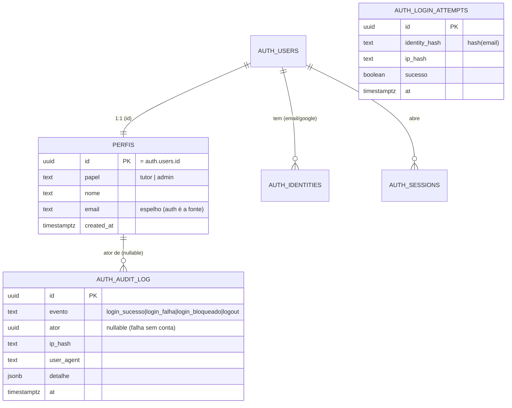

# Data Model — Login (001-login)

**Fase 1 do plano.** Modela as entidades da feature usando os **termos canônicos do glossário ampliado do `CLAUDE.md`**: **Conta/Usuário, Papel (Role), Sessão, Identidade Externa, Evento de Auditoria de Autenticação**.

> **Nativo do Supabase Auth vs. tabela própria.** Grande parte da identidade vive no schema `auth` do Supabase (gerido pelo GoTrue) — **não** criamos nem alteramos essas tabelas; apenas as consumimos. As tabelas **próprias** desta feature vivem no schema `public` e nascem com **RLS deny-by-default na mesma migration**.

| Entidade (glossário) | Onde mora | Tabela / objeto | Criada por esta feature? |
|---|---|---|---|
| Conta / Usuário | `auth` (Supabase) + espelho em `public` | `auth.users` (nativo) + `public.perfis` (própria) | `perfis` sim; `auth.users` não (nativo) |
| Papel (Role) | `public` | `public.perfis.papel` | sim |
| Sessão | `auth` (Supabase) | `auth.sessions` + JWT (`access_token`/`refresh_token`) | não (nativo do GoTrue) |
| Identidade Externa (Google) | `auth` (Supabase) | `auth.identities` | não (nativo do GoTrue) |
| Evento de Auditoria de Autenticação | `public` | `public.auth_audit_log` | sim |
| (suporte) Tentativa de login (rate-limit) | `public` | `public.auth_login_attempts` | sim |

---

## ER (lógico) — recorte da feature



> `AUTH_USERS`, `AUTH_IDENTITIES`, `AUTH_SESSIONS` são **nativos** (schema `auth`, geridos pelo GoTrue) — mostrados só para contexto.

---

## 1. Conta / Usuário

Identidade autenticável e titular dos dados (LGPD). Dividida entre:

### 1a. `auth.users` (nativo do Supabase — NÃO modificar)
Fonte de verdade da identidade. Campos relevantes ao login (somente leitura para nós): `id` (uuid), `email`, `encrypted_password` (gerido pelo GoTrue — nunca acessado por nós), `email_confirmed_at` (FR-024 — login de e-mail/senha exige `email_confirmed_at IS NOT NULL`), `raw_user_meta_data` (nome do Google), timestamps.

### 1b. `public.perfis` (própria — espelho 1:1 + papel)
| Coluna | Tipo | Validações / Notas |
|---|---|---|
| `id` | `uuid` PK / FK → `auth.users.id` ON DELETE CASCADE | = `auth.uid()`; base da RLS |
| `nome` | `text` NOT NULL | de `raw_user_meta_data->>'name'` ou parte local do e-mail |
| `email` | `text` | espelho de `auth.users.email` (conveniência; **auth é a fonte**) |
| `papel` | `papel_enum` NOT NULL DEFAULT `'tutor'` | **Papel (Role)** — ver entidade 2 |
| `created_at` | `timestamptz` NOT NULL DEFAULT `now()` | |
| `updated_at` | `timestamptz` NOT NULL DEFAULT `now()` | |

**Provisionamento:** trigger `on_auth_user_created` (`handle_new_user`, `SECURITY DEFINER`) insere a linha em `perfis` no signup, papel default `'tutor'`. (Signup é spec futura; o trigger é fundação que o login pressupõe e o seed cobre para teste.)

**Relacionamentos:** 1:1 com `auth.users`; é referenciada como `ator` (nullable) em `auth_audit_log`.

**RLS (deny-by-default):**
- `authenticated`: `SELECT`/`UPDATE` somente `id = auth.uid()` (o próprio perfil). Não pode alterar `papel` (constraint/policy: update de `papel` negado a não-admin).
- `admin` (`is_admin()`): `SELECT` de todos (suporte/backoffice).
- `anon`: **nenhum acesso**.

---

## 2. Papel (Role)

Classificação que determina o destino pós-login (FR-005/006).

- **Representação:** coluna `perfis.papel` do tipo `papel_enum` = `('tutor', 'admin')`.
  - *(Co-tutoria NÃO é papel global — é associação por pet, fora do escopo desta feature; ver `pet_cotutor` em specs futuras.)*
- **Validação:** enum no banco (não aceita valores fora do domínio). `papel` NOT NULL DEFAULT `'tutor'`.
- **Uso seguro (FR-006):** roteamento do cliente é só UX; a **autorização** é a RLS via `is_admin()` (lê `perfis.papel = 'admin'`). Nenhum claim do cliente decide autorização.
- **Aberto a MFA futuro:** acrescentar MFA não altera `papel` nem `perfis` (TOTP nativo do Supabase sobre `auth.users`).

---

## 3. Sessão

Vínculo temporário de acesso autenticado. **100% nativa do Supabase Auth** — não criamos tabela própria.

- **Representação:** `auth.sessions` (servidor GoTrue) + par `access_token` (JWT curto) / `refresh_token` no cliente (storage conforme "manter conectado").
- **Estados:** ativa / expirada / encerrada (logout). Mapeados pelo SDK (`onAuthStateChange`).
- **Duração (FR-008/009):**
  - **persistente** ("manter conectado" marcado): `refresh_token` em `localStorage`; renovação automática (`autoRefreshToken`) enquanto válido.
  - **curta** (desmarcado): storage volátil (`sessionStorage`); termina ao encerrar o contexto do navegador.
- **Encerramento (FR-010):** `auth.service.signOut()` → `supabase.auth.signOut()` invalida a sessão e limpa o storage; registra `logout` na auditoria.
- **Expiração em uso (FR-012):** `auth.guard` detecta ausência de sessão válida → redireciona ao login preservando `returnUrl` → após autenticar, leva ao destino pretendido.
- **Aberto a MFA futuro:** o GoTrue suporta AAL (Authenticator Assurance Level) sobre a mesma sessão sem mudança no nosso schema.

---

## 4. Identidade Externa (Google)

Vínculo entre a Conta do Faro e um provedor social. **Nativa do Supabase Auth.**

- **Representação:** `auth.identities` (linha por provedor: `email`, `google`). Gerida pelo GoTrue no fluxo OAuth.
- **Validações/garantias:**
  - e-mail vindo do Google chega **verificado** → dispensa confirmação (FR-024).
  - **Sem duplicidade** (US2 cenário 4): quando a identidade Google corresponde ao e-mail de uma conta existente, o GoTrue reconhece a mesma `auth.users` (política fina de conflito = spec de cadastro, conforme Assumption da spec).
- **Segredos:** Google OAuth **client id/secret** ficam em secrets do servidor (Supabase) — nunca no frontend (Princípio III).
- **Relacionamento:** N identidades : 1 `auth.users` : 1 `perfis`.

---

## 5. Evento de Auditoria de Autenticação

Registro estruturado e auditável de evento sensível de login (FR-020, Princípio VII), com minimização (FR-021).

### `public.auth_audit_log` (própria, append-only)
| Coluna | Tipo | Validações / Notas |
|---|---|---|
| `id` | `uuid` PK DEFAULT `gen_random_uuid()` | |
| `evento` | `evento_auth_enum` NOT NULL | `login_sucesso \| login_falha \| login_bloqueado \| logout` |
| `ator` | `uuid` FK → `perfis.id` NULL | **nullable**: falha de login de conta inexistente não tem ator |
| `ip_hash` | `text` | **hash** do IP (pgcrypto) — nunca IP cru (minimização) |
| `user_agent` | `text` | truncado (ex.: 256 chars); sem fingerprint excessivo |
| `detalhe` | `jsonb` NOT NULL DEFAULT `'{}'` | mínimo (ex.: `{ "metodo": "password" }`); **sem** PII, **sem** senha/token, **sem** e-mail cru |
| `at` | `timestamptz` NOT NULL DEFAULT `now()` | |

**Invariantes:** append-only (sem `UPDATE`/`DELETE` por usuários). **Sem** e-mail em claro, **sem** senha, **sem** token, **sem** PII de terceiros.

**RLS (deny-by-default):**
- `INSERT`: **somente `service_role`** (Edge Function `login-guard` / RPC `log_auth_event` chamada server-side).
- `SELECT`: **somente admin** (`is_admin()`).
- `anon` e `authenticated` (não-admin): **nenhum acesso**.

**Retenção/anonimização:** janela definida na spec **009-privacidade-lgpd** (colunas já minimizadas hoje).

---

## 6. (Suporte) Tentativa de Login — rate-limit / anti-bruteforce

Sustenta o FR-018. Não é entidade do glossário; é estrutura de apoio à decisão de bloqueio.

### `public.auth_login_attempts` (própria)
| Coluna | Tipo | Validações / Notas |
|---|---|---|
| `id` | `uuid` PK DEFAULT `gen_random_uuid()` | |
| `identity_hash` | `text` NOT NULL | **hash(email)** — minimização; contagem por identidade |
| `ip_hash` | `text` NOT NULL | **hash(IP)** — contagem por origem |
| `sucesso` | `boolean` NOT NULL | distingue falha de sucesso na janela |
| `at` | `timestamptz` NOT NULL DEFAULT `now()` | base da janela de 15 min |

**Índices:** `(identity_hash, at)` e `(ip_hash, at)` para a contagem na janela ser eficiente.

**Regra (FR-018):** falhas na janela de **15 min**, contadas por `identity_hash` **e** por `ip_hash`; **backoff progressivo**; **block** ao atingir **5** em qualquer dos dois eixos. Decisão computada por `record_login_attempt(...)` chamada pela Edge `login-guard` (`service_role`).

**RLS (deny-by-default):** `INSERT`/`SELECT` **somente `service_role`**. `anon`/`authenticated`/`admin` sem acesso direto (admin vê o efeito via `auth_audit_log` evento `login_bloqueado`).

**Limpeza:** linhas antigas (> janela + margem) podem ser podadas; política/janela fina = spec 009.

---

## Enums (migration `0002_enums_e_dominios.sql`)

```text
papel_enum        := ('tutor', 'admin')
evento_auth_enum  := ('login_sucesso', 'login_falha', 'login_bloqueado', 'logout')
```

## Resumo de validações cliente↔banco

| Campo | Cliente (UX) | Banco (verdade) |
|---|---|---|
| e-mail | formato bem-formado (FR-004) | gerido pelo GoTrue (`auth.users.email`) |
| senha | não vazia (FR-004) — **sem** revelar regras internas | gerida/hasheada pelo GoTrue (`encrypted_password`) |
| papel | lido para rotear (FR-005) | `papel_enum` + RLS `is_admin()` (FR-006) |
| "manter conectado" | escolhe storage da sessão | n/a (efeito no token, não no schema) |
